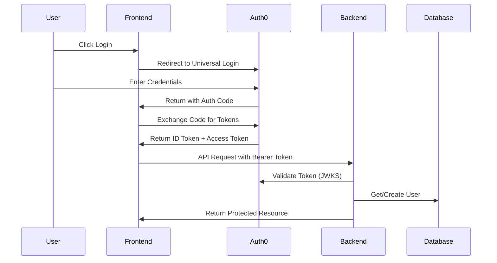

# Technical Specification: Auth0 Integration

## Technical Overview

This specification details the technical implementation of Auth0 authentication integration for both Spring Boot backend and Nuxt.js frontend components.

## Architecture Design

### Component Architecture

```
┌─────────────┐     ┌──────────────┐     ┌─────────────┐
│   Browser   │────▶│   Nuxt.js    │────▶│ Spring Boot │
│             │     │  Sidebase    │     │   Backend   │
└─────────────┘     └──────────────┘     └─────────────┘
       │                    │                     │
       │                    ▼                     ▼
       │            ┌──────────────┐      ┌─────────────┐
       └───────────▶│    Auth0     │      │   JWKS      │
                    │   Service    │◀─────│  Endpoint   │
                    └──────────────┘      └─────────────┘
```

### Authentication Flow Sequence



## Backend Implementation (Spring Boot)

### 1. Dependencies Configuration

```kotlin
// build.gradle.kts
dependencies {
    // OAuth2 Resource Server
    implementation("org.springframework.boot:spring-boot-starter-oauth2-resource-server")
    implementation("org.springframework.security:spring-security-oauth2-jose")
    
    // Remove legacy JWT dependencies
    // REMOVE: implementation("io.jsonwebtoken:jjwt-api")
}
```

### 2. Application Properties

```yaml
# application.yml
spring:
  security:
    oauth2:
      resourceserver:
        jwt:
          issuer-uri: ${AUTH0_ISSUER_URI:https://your-tenant.auth0.com/}
          jwk-set-uri: ${AUTH0_JWKS_URI:https://your-tenant.auth0.com/.well-known/jwks.json}
          audiences: ${AUTH0_AUDIENCE:https://api.astar-management.com}

auth0:
  domain: ${AUTH0_DOMAIN:your-tenant.auth0.com}
  audience: ${AUTH0_AUDIENCE:https://api.astar-management.com}

# JWKS Cache Configuration
jwt:
  jwks:
    cache-size: 10
    cache-ttl: 300000 # 5 minutes in milliseconds
```

### 3. Security Configuration

```kotlin
// SecurityConfig.kt
@Configuration
@EnableWebSecurity
@EnableMethodSecurity(prePostEnabled = true)
class SecurityConfig(
    @Value("\${auth0.audience}") private val audience: String
) {
    
    @Bean
    fun filterChain(http: HttpSecurity): SecurityFilterChain {
        return http
            .cors { cors -> cors.configurationSource(corsConfigurationSource()) }
            .csrf { csrf -> csrf.disable() }
            .sessionManagement { session ->
                session.sessionCreationPolicy(SessionCreationPolicy.STATELESS)
            }
            .authorizeHttpRequests { auth ->
                auth.requestMatchers(
                    "/api/public/**",
                    "/api/health/**",
                    "/swagger-ui/**",
                    "/v3/api-docs/**"
                ).permitAll()
                auth.anyRequest().authenticated()
            }
            .oauth2ResourceServer { oauth2 ->
                oauth2.jwt { jwt ->
                    jwt.decoder(jwtDecoder())
                    jwt.jwtAuthenticationConverter(jwtAuthenticationConverter())
                }
            }
            .exceptionHandling { exceptions ->
                exceptions.authenticationEntryPoint(customAuthenticationEntryPoint())
            }
            .build()
    }
    
    @Bean
    fun jwtDecoder(): JwtDecoder {
        val decoder = JwtDecoders.fromIssuerLocation(issuerUri) as NimbusJwtDecoder
        decoder.setJwtValidator(jwtValidator())
        return decoder
    }
    
    @Bean
    fun jwtValidator(): OAuth2TokenValidator<Jwt> {
        val validators = mutableListOf<OAuth2TokenValidator<Jwt>>()
        validators.add(JwtValidators.createDefaultWithIssuer(issuerUri))
        validators.add(JwtAudienceValidator(audience))
        return DelegatingOAuth2TokenValidator(validators)
    }
}
```

### 4. JWT Authentication Converter

```kotlin
// Auth0JwtAuthenticationConverter.kt
@Component
class Auth0JwtAuthenticationConverter(
    private val userService: UserService
) : Converter<Jwt, AbstractAuthenticationToken> {
    
    override fun convert(jwt: Jwt): AbstractAuthenticationToken {
        val authorities = extractAuthorities(jwt)
        val principal = extractPrincipal(jwt)
        
        // Extract tenant context
        val tenantId = jwt.getClaimAsString("tenant_id")
        if (tenantId != null) {
            TenantContext.setCurrentTenant(tenantId)
        }
        
        // JIT User Provisioning
        val auth0Sub = jwt.subject
        val email = jwt.getClaimAsString("email")
        val name = jwt.getClaimAsString("name")
        
        userService.findOrCreateUser(
            auth0Sub = auth0Sub,
            email = email,
            name = name,
            tenantId = tenantId
        )
        
        return JwtAuthenticationToken(jwt, authorities, name)
    }
    
    private fun extractAuthorities(jwt: Jwt): Collection<GrantedAuthority> {
        // For M002, return basic authenticated user authority only
        // Authorization will be added in M003
        return listOf(SimpleGrantedAuthority("ROLE_USER"))
    }
    
    private fun extractPrincipal(jwt: Jwt): String {
        return jwt.getClaimAsString("email") ?: jwt.subject
    }
}
```

### 5. User Service Implementation

```kotlin
// UserService.kt
@Service
@Transactional
class UserService(
    private val userRepository: UserRepository
) {
    
    fun findOrCreateUser(
        auth0Sub: String,
        email: String?,
        name: String?,
        tenantId: String?
    ): User {
        return userRepository.findByAuth0Sub(auth0Sub)
            ?: userRepository.findByEmail(email!!)
            ?: createNewUser(auth0Sub, email, name, tenantId)
    }
    
    private fun createNewUser(
        auth0Sub: String,
        email: String,
        name: String?,
        tenantId: String?
    ): User {
        val user = User(
            auth0Sub = auth0Sub,
            email = email,
            name = name ?: email.substringBefore("@"),
            tenantId = tenantId ?: deriveTenantFromEmail(email),
            createdAt = Instant.now()
        )
        return userRepository.save(user)
    }
    
    private fun deriveTenantFromEmail(email: String): String {
        // Simple tenant derivation from email domain
        val domain = email.substringAfter("@")
        return domain.replace(".", "_").lowercase()
    }
}
```

### 6. Database Migration

```sql
-- V002__add_auth0_fields.sql
ALTER TABLE users 
ADD COLUMN auth0_sub VARCHAR(255) UNIQUE,
ADD COLUMN picture_url VARCHAR(500),
ADD COLUMN last_login TIMESTAMP;

-- Make password optional for Auth0 users
ALTER TABLE users 
ALTER COLUMN password_hash DROP NOT NULL;

-- Index for faster Auth0 lookups
CREATE INDEX idx_users_auth0_sub ON users(auth0_sub);
CREATE INDEX idx_users_email ON users(email);

-- Update existing users (run separately in migration script)
UPDATE users 
SET auth0_sub = CONCAT('auth0|', id::text) 
WHERE auth0_sub IS NULL;
```

## Frontend Implementation (Nuxt.js + Sidebase)

### 1. Nuxt Configuration

```typescript
// nuxt.config.ts
export default defineNuxtConfig({
  modules: [
    '@sidebase/nuxt-auth',
    '@nuxtjs/tailwindcss',
    '@pinia/nuxt'
  ],
  
  auth: {
    baseURL: process.env.AUTH_ORIGIN || 'http://localhost:3000',
    provider: {
      type: 'oauth',
      clientId: process.env.AUTH0_CLIENT_ID,
      clientSecret: process.env.AUTH0_CLIENT_SECRET,
      wellKnown: `${process.env.AUTH0_ISSUER}/.well-known/openid-configuration`,
      issuer: process.env.AUTH0_ISSUER,
      authorization: {
        params: {
          scope: 'openid profile email offline_access',
          audience: process.env.AUTH0_AUDIENCE,
          prompt: 'login'
        }
      },
      token: {
        params: {
          audience: process.env.AUTH0_AUDIENCE
        }
      },
      checks: ['pkce', 'state'],
      idToken: true,
      profile(profile) {
        return {
          id: profile.sub,
          name: profile.name,
          email: profile.email,
          image: profile.picture
        }
      }
    },
    session: {
      enableRefreshOnWindowFocus: true,
      enableRefreshPeriodically: 300000 // 5 minutes
    },
    globalAppMiddleware: {
      isEnabled: true
    }
  },
  
  runtimeConfig: {
    auth0Domain: process.env.AUTH0_DOMAIN,
    auth0ClientId: process.env.AUTH0_CLIENT_ID,
    auth0ClientSecret: process.env.AUTH0_CLIENT_SECRET,
    auth0Audience: process.env.AUTH0_AUDIENCE,
    public: {
      auth0Domain: process.env.AUTH0_DOMAIN,
      authUrl: process.env.NEXTAUTH_URL || 'http://localhost:3000'
    }
  }
})
```

### 2. Authentication Composable

```typescript
// composables/useAuth.ts
export const useAuth = () => {
  const { status, data: session, signIn, signOut } = useSession()
  
  const user = computed(() => session.value?.user)
  const isAuthenticated = computed(() => status.value === 'authenticated')
  const isLoading = computed(() => status.value === 'loading')
  
  const login = async () => {
    await signIn('auth0', { 
      callbackUrl: '/dashboard' 
    })
  }
  
  const logout = async () => {
    await signOut({ 
      callbackUrl: '/',
      redirect: true 
    })
  }
  
  const getAccessToken = async (): Promise<string | null> => {
    if (!session.value?.accessToken) return null
    
    // Check if token is expired
    const tokenExp = session.value.accessTokenExpires
    if (tokenExp && new Date(tokenExp) < new Date()) {
      // Token expired, trigger refresh
      await refreshNuxtData('session')
    }
    
    return session.value?.accessToken || null
  }
  
  return {
    user: readonly(user),
    isAuthenticated: readonly(isAuthenticated),
    isLoading: readonly(isLoading),
    login,
    logout,
    getAccessToken
  }
}
```

### 3. API Client with Auth

```typescript
// composables/useApi.ts
export const useApi = () => {
  const { getAccessToken } = useAuth()
  
  const apiCall = async <T>(
    url: string,
    options: RequestInit = {}
  ): Promise<T> => {
    const token = await getAccessToken()
    
    const headers = new Headers(options.headers)
    if (token) {
      headers.set('Authorization', `Bearer ${token}`)
    }
    headers.set('Content-Type', 'application/json')
    
    const response = await fetch(`/api${url}`, {
      ...options,
      headers
    })
    
    if (response.status === 401) {
      // Token invalid, trigger re-authentication
      await navigateTo('/api/auth/signin')
      throw new Error('Authentication required')
    }
    
    if (!response.ok) {
      throw new Error(`API error: ${response.statusText}`)
    }
    
    return response.json()
  }
  
  return {
    get: <T>(url: string) => apiCall<T>(url, { method: 'GET' }),
    post: <T>(url: string, body: any) => 
      apiCall<T>(url, { method: 'POST', body: JSON.stringify(body) }),
    put: <T>(url: string, body: any) => 
      apiCall<T>(url, { method: 'PUT', body: JSON.stringify(body) }),
    delete: <T>(url: string) => apiCall<T>(url, { method: 'DELETE' })
  }
}
```

### 4. Protected Route Middleware

```typescript
// middleware/auth.ts
export default defineNuxtRouteMiddleware((to) => {
  const { isAuthenticated, isLoading } = useAuth()
  
  // Skip auth check for public routes
  const publicRoutes = ['/', '/signin', '/about', '/api/auth']
  if (publicRoutes.some(route => to.path.startsWith(route))) {
    return
  }
  
  // Wait for auth status to be determined
  if (isLoading.value) {
    return
  }
  
  // Redirect to login if not authenticated
  if (!isAuthenticated.value) {
    return navigateTo('/api/auth/signin')
  }
})
```

### 5. Login/Logout Components

```vue
<!-- components/AuthButton.vue -->
<template>
  <div>
    <Button v-if="!isAuthenticated" @click="login" :disabled="isLoading">
      <Icon name="mdi:login" class="mr-2" />
      Login
    </Button>
    
    <DropdownMenu v-else>
      <DropdownMenuTrigger>
        <Avatar>
          <AvatarImage :src="user?.image" :alt="user?.name" />
          <AvatarFallback>{{ userInitials }}</AvatarFallback>
        </Avatar>
      </DropdownMenuTrigger>
      
      <DropdownMenuContent>
        <DropdownMenuItem disabled>
          <div class="flex flex-col">
            <span class="font-medium">{{ user?.name }}</span>
            <span class="text-sm text-muted-foreground">{{ user?.email }}</span>
          </div>
        </DropdownMenuItem>
        
        <DropdownMenuSeparator />
        
        <DropdownMenuItem @click="logout">
          <Icon name="mdi:logout" class="mr-2" />
          Logout
        </DropdownMenuItem>
      </DropdownMenuContent>
    </DropdownMenu>
  </div>
</template>

<script setup lang="ts">
const { user, isAuthenticated, isLoading, login, logout } = useAuth()

const userInitials = computed(() => {
  if (!user.value?.name) return '??'
  return user.value.name
    .split(' ')
    .map(n => n[0])
    .join('')
    .toUpperCase()
    .slice(0, 2)
})
</script>
```

## Auth0 Configuration

### 1. Auth0 Tenant Setup

```javascript
// Auth0 Dashboard Configuration
{
  "application": {
    "name": "Astar Management",
    "type": "Single Page Application",
    "allowed_callback_urls": [
      "http://localhost:3000/api/auth/callback/auth0",
      "https://app.astar-management.com/api/auth/callback/auth0"
    ],
    "allowed_logout_urls": [
      "http://localhost:3000",
      "https://app.astar-management.com"
    ],
    "allowed_web_origins": [
      "http://localhost:3000",
      "https://app.astar-management.com"
    ],
    "refresh_token": {
      "rotation_type": "rotating",
      "expiration_type": "expiring",
      "token_lifetime": 604800, // 7 days
      "idle_token_lifetime": 86400 // 1 day
    }
  }
}
```

### 2. Post-Login Action

```javascript
// Auth0 Actions > Post Login
exports.onExecutePostLogin = async (event, api) => {
  // Set tenant_id from app_metadata or derive from email
  let tenantId = event.user.app_metadata?.tenant_id
  
  if (!tenantId && event.user.email) {
    // Derive tenant from email domain
    const domain = event.user.email.split('@')[1]
    tenantId = domain.replace(/\./g, '_').toLowerCase()
    
    // Save to app_metadata for future logins
    api.user.setAppMetadata('tenant_id', tenantId)
  }
  
  // Add tenant_id to tokens
  if (tenantId) {
    api.idToken.setCustomClaim('tenant_id', tenantId)
    api.accessToken.setCustomClaim('tenant_id', tenantId)
  }
  
  // Add email to access token for backend user lookup
  api.accessToken.setCustomClaim('email', event.user.email)
  api.accessToken.setCustomClaim('name', event.user.name)
}
```

## Testing Strategy

### Unit Tests

```kotlin
// Auth0JwtAuthenticationConverterTest.kt
@Test
fun `should extract user from valid JWT`() {
    val jwt = Jwt.withTokenValue("token")
        .header("alg", "RS256")
        .claim("sub", "auth0|123")
        .claim("email", "user@example.com")
        .claim("name", "Test User")
        .claim("tenant_id", "example_com")
        .build()
    
    val authentication = converter.convert(jwt)
    
    assertThat(authentication).isNotNull()
    assertThat(authentication.name).isEqualTo("Test User")
    assertThat(authentication.authorities)
        .contains(SimpleGrantedAuthority("ROLE_USER"))
}
```

### Integration Tests

```typescript
// auth.integration.test.ts
describe('Authentication Flow', () => {
  it('should redirect to Auth0 for login', async () => {
    const { page } = await renderPage('/dashboard')
    
    // Should redirect to login
    expect(page.url()).toContain('/api/auth/signin')
  })
  
  it('should access protected API with valid token', async () => {
    const token = await getValidToken()
    
    const response = await $fetch('/api/user/profile', {
      headers: {
        Authorization: `Bearer ${token}`
      }
    })
    
    expect(response).toBeDefined()
    expect(response.email).toBe('test@example.com')
  })
})
```

## Monitoring and Observability

### Logging

```kotlin
// Add comprehensive logging
@Component
class AuthenticationLogger {
    private val logger = LoggerFactory.getLogger(this::class.java)
    
    @EventListener
    fun handleAuthSuccess(event: AuthenticationSuccessEvent) {
        logger.info("Authentication successful for user: ${event.authentication.name}")
    }
    
    @EventListener
    fun handleAuthFailure(event: AbstractAuthenticationFailureEvent) {
        logger.warn("Authentication failed: ${event.exception.message}")
    }
}
```

### Metrics

```kotlin
// Micrometer metrics for monitoring
@Component
class AuthenticationMetrics(
    private val meterRegistry: MeterRegistry
) {
    fun recordAuthenticationSuccess() {
        meterRegistry.counter("auth.success").increment()
    }
    
    fun recordAuthenticationFailure(reason: String) {
        meterRegistry.counter("auth.failure", "reason", reason).increment()
    }
    
    fun recordTokenValidationTime(duration: Duration) {
        meterRegistry.timer("auth.token.validation").record(duration)
    }
}
```

## Rollback Plan

### Feature Toggle

```kotlin
// application.yml
features:
  auth:
    use-auth0: true
    fallback-to-legacy: false

// SecurityConfig.kt
@ConditionalOnProperty(
    prefix = "features.auth",
    name = ["use-auth0"],
    havingValue = "true"
)
class Auth0SecurityConfig { /* ... */ }

@ConditionalOnProperty(
    prefix = "features.auth",
    name = ["use-auth0"],
    havingValue = "false"
)
class LegacySecurityConfig { /* ... */ }
```

## Environment Configuration

### Development

```env
# .env.development
AUTH0_DOMAIN=dev-astar.auth0.com
AUTH0_CLIENT_ID=dev_client_id
AUTH0_CLIENT_SECRET=dev_client_secret
AUTH0_AUDIENCE=https://api.dev.astar-management.com
AUTH0_ISSUER=https://dev-astar.auth0.com/
```

### Production

```env
# .env.production
AUTH0_DOMAIN=astar.auth0.com
AUTH0_CLIENT_ID=prod_client_id
AUTH0_CLIENT_SECRET=prod_client_secret
AUTH0_AUDIENCE=https://api.astar-management.com
AUTH0_ISSUER=https://astar.auth0.com/
```

---
*Technical Specification Version: 1.0*  
*Created: 2025-01-18*  
*Milestone: M002*