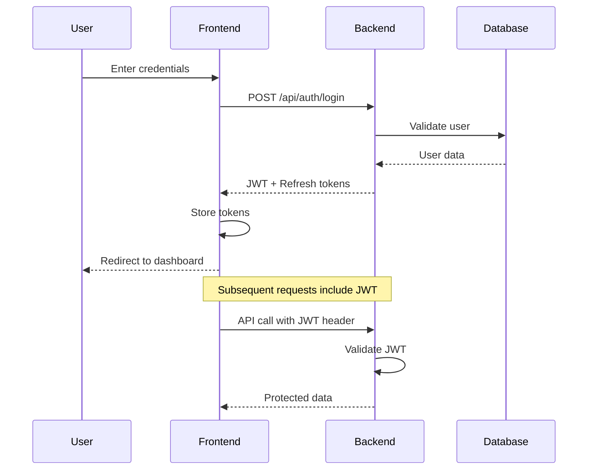

# Milestone 1: MVP Foundation - Authentication & Core Infrastructure

## Overview

**Objective**: Establish the foundational authentication system and core infrastructure that enables secure user access to the Astar Management legal practice management system.

**Duration**: 2-3 weeks (Sprint 1)  
**Priority**: Critical  
**Status**: Active

## Success Criteria

✅ **Primary Goal**: Users can securely log in and access a basic dashboard with proper authentication and authorization.

### Functional Requirements
- [ ] Users can log in with email/password
- [ ] JWT-based authentication with refresh tokens
- [ ] Role-based access control (RBAC) implementation
- [ ] Basic user management (CRUD operations)
- [ ] Secure route protection (frontend + backend)
- [ ] Basic responsive layout with navigation

### Technical Requirements
- [ ] Spring Security configuration with JWT
- [ ] PostgreSQL database with initial schema
- [ ] Nuxt 3 authentication middleware
- [ ] Pinia store for auth state management
- [ ] Storybook component documentation
- [ ] Unit tests for critical auth flows

### Security Requirements
- [ ] Password hashing (bcrypt)
- [ ] JWT token expiration and refresh
- [ ] HTTPS enforcement
- [ ] Basic audit logging for auth events
- [ ] Input validation and sanitization

## Key Features

### 1. Backend Authentication System
**Epic**: Secure authentication infrastructure

#### AUTH-001: Spring Security Configuration
- **Priority**: Critical
- **Estimate**: 3-5 days
- **Description**: Implement Spring Security with JWT authentication
- **Deliverables**:
  - SecurityConfig class with JWT filter chain
  - JWT authentication entry point and access denied handler
  - Security test coverage
  - API endpoint protection verification

#### AUTH-002: JWT Authentication Endpoints
- **Priority**: Critical  
- **Estimate**: 3-5 days
- **Description**: Create login/logout/refresh endpoints with JWT management
- **Deliverables**:
  - `/api/auth/login` endpoint with email/password validation
  - `/api/auth/refresh` endpoint for token renewal
  - JWTService for token generation and validation
  - Authentication API integration tests

#### AUTH-003: User Management API
- **Priority**: High
- **Estimate**: 3-5 days  
- **Description**: Implement user CRUD operations with proper security
- **Deliverables**:
  - User entity with proper validation
  - UserRepository with custom queries
  - UserService with business logic
  - UserController with REST endpoints
  - API integration tests with different user roles

#### AUTH-004: RBAC Permission System
- **Priority**: High
- **Estimate**: 1-2 weeks
- **Description**: Implement role-based access control for legal practice needs
- **Deliverables**:
  - Role and Permission entities
  - @PreAuthorize annotations on controllers
  - Permission hierarchy configuration (lawyer > clerk > client)
  - RBAC integration tests

### 2. Frontend Authentication System
**Epic**: User interface for secure authentication

#### UI-001: Login Screen Implementation
- **Priority**: Critical
- **Estimate**: 1-2 days
- **Description**: Create responsive login form with validation
- **Deliverables**:
  - LoginForm component with email/password fields
  - VeeValidate + Zod schema validation
  - Storybook stories for different states
  - Error display and handling
  - Mobile-responsive design

#### UI-002: Authentication State Management
- **Priority**: Critical
- **Estimate**: 3-5 days
- **Description**: Implement client-side auth state with Pinia
- **Deliverables**:
  - AuthStore with login/logout/refresh actions
  - Token persistence in localStorage/sessionStorage
  - Automatic token refresh mechanism
  - Store unit tests with Vitest

#### UI-003: Route Guards Implementation
- **Priority**: High
- **Estimate**: 1-2 days
- **Description**: Protect routes based on authentication status
- **Deliverables**:
  - `auth.ts` middleware for authenticated routes
  - `rbac.ts` middleware for role-based access
  - Redirect logic for unauthorized access
  - Route guard integration tests

#### UI-004: Basic Layout System
- **Priority**: High
- **Estimate**: 3-5 days
- **Description**: Create foundational layout with navigation
- **Deliverables**:
  - DefaultLayout with header and sidebar
  - Responsive navigation component
  - User menu with logout functionality
  - Mobile-friendly navigation drawer
  - Layout component tests

## Architecture Decisions

### Authentication Flow

### Technology Choices
- **JWT over Sessions**: Stateless authentication for scalability
- **Refresh Tokens**: Security without frequent re-authentication
- **Pinia over Vuex**: Modern state management with TypeScript support
- **VeeValidate + Zod**: Type-safe form validation

## Definition of Done

### Code Quality
- [ ] All TypeScript compilation passes (`bun run typecheck`)
- [ ] Unit tests achieve >80% coverage
- [ ] Storybook stories created for all components
- [ ] ESLint and Prettier formatting applied
- [ ] Kotlin code passes ktlint checks

### Functionality
- [ ] Manual testing completed on desktop and mobile
- [ ] Authentication flow works end-to-end
- [ ] Error scenarios properly handled
- [ ] Performance meets targets (<300ms API responses)

### Documentation
- [ ] API endpoints documented in Swagger
- [ ] Component usage documented in Storybook
- [ ] Architecture decisions recorded in ADRs

### Security Review
- [ ] Security checklist completed
- [ ] Penetration testing of auth endpoints
- [ ] Audit logging verification
- [ ] Input validation testing

## Risk Assessment

### High Risk
- **JWT Implementation Complexity**: Mitigation - Use proven Spring Security patterns
- **Frontend/Backend Integration**: Mitigation - Early integration testing

### Medium Risk  
- **RBAC Complexity**: Mitigation - Start with simple roles, iterate
- **Mobile Responsiveness**: Mitigation - Mobile-first design approach

### Low Risk
- **Performance**: Mitigation - Simple caching strategies
- **User Experience**: Mitigation - Regular stakeholder feedback

## Dependencies

### External Dependencies
- Spring Security 6.x
- PostgreSQL 15 
- Redis (for session storage)
- JWT libraries (jjwt for backend, @vueuse/jwt for frontend)

### Internal Dependencies
- Database schema must be designed first
- Development environment setup completed
- Storybook configuration established

## Success Metrics

### Technical Metrics
- **API Response Time**: <200ms for auth endpoints
- **Test Coverage**: >80% for auth-related code
- **Build Time**: <30 seconds for full frontend build
- **Bundle Size**: <500KB for auth-related frontend code

### User Experience Metrics
- **Login Time**: <3 seconds from form submission to dashboard
- **Error Recovery**: Clear error messages for all failure scenarios
- **Mobile Experience**: Functional on devices >320px width

---

**Next Milestone**: Sprint 2-3 will focus on implementing the core case management system with Kanban board functionality.