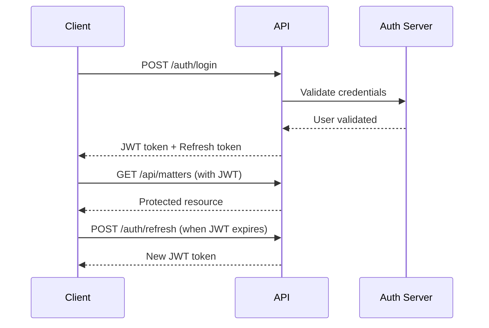

# Authentication API Documentation

## Overview

Aster Management uses JWT-based authentication with refresh tokens for secure API access. All authenticated endpoints require a valid JWT token in the Authorization header.

## Authentication Flow



## Endpoints

### Login

**POST** `/api/v1/auth/login`

Authenticates a user and returns JWT tokens.

#### Request

```typescript
interface LoginRequest {
  email: string
  password: string
  rememberMe?: boolean
}
```

#### Response

```typescript
interface LoginResponse {
  accessToken: string
  refreshToken: string
  user: User
  expiresIn: number // seconds
}
```

#### Example

```bash
curl -X POST http://localhost:8080/api/v1/auth/login \
  -H "Content-Type: application/json" \
  -d '{
    "email": "lawyer@astermanagement.com",
    "password": "securePassword123",
    "rememberMe": true
  }'
```

### Two-Factor Authentication

**POST** `/api/v1/auth/2fa/verify`

Verifies the 2FA code after initial login.

#### Request

```typescript
interface TwoFactorRequest {
  code: string
  token: string // Temporary token from login
}
```

#### Response

```typescript
interface TwoFactorResponse {
  accessToken: string
  refreshToken: string
  user: User
}
```

### Refresh Token

**POST** `/api/v1/auth/refresh`

Refreshes an expired access token using a valid refresh token.

#### Request

```typescript
interface RefreshRequest {
  refreshToken: string
}
```

#### Response

```typescript
interface RefreshResponse {
  accessToken: string
  expiresIn: number
}
```

### Logout

**POST** `/api/v1/auth/logout`

Invalidates the current session and refresh token.

#### Request

```typescript
interface LogoutRequest {
  refreshToken: string
}
```

#### Response

```typescript
interface LogoutResponse {
  success: boolean
  message: string
}
```

### Current User

**GET** `/api/v1/auth/me`

Returns the currently authenticated user's profile.

#### Response

```typescript
interface CurrentUserResponse {
  user: User
  permissions: Permission[]
  roles: Role[]
}
```

## Using Authentication in Nuxt.js

### Auth Store

```typescript
// stores/auth.ts
export const useAuthStore = defineStore('auth', () => {
  const user = ref<User | null>(null)
  const token = ref<string | null>(null)
  const refreshToken = ref<string | null>(null)
  
  const isAuthenticated = computed(() => !!token.value)
  
  const login = async (credentials: LoginRequest) => {
    const { $api } = useNuxtApp()
    const response = await $api<LoginResponse>('/auth/login', {
      method: 'POST',
      body: credentials
    })
    
    token.value = response.accessToken
    refreshToken.value = response.refreshToken
    user.value = response.user
    
    // Store tokens securely
    await setTokens(response.accessToken, response.refreshToken)
    
    return response
  }
  
  const logout = async () => {
    const { $api } = useNuxtApp()
    
    try {
      await $api('/auth/logout', {
        method: 'POST',
        body: { refreshToken: refreshToken.value }
      })
    } finally {
      token.value = null
      refreshToken.value = null
      user.value = null
      await clearTokens()
      await navigateTo('/login')
    }
  }
  
  const refreshAccessToken = async () => {
    const { $api } = useNuxtApp()
    const response = await $api<RefreshResponse>('/auth/refresh', {
      method: 'POST',
      body: { refreshToken: refreshToken.value }
    })
    
    token.value = response.accessToken
    await setAccessToken(response.accessToken)
    
    return response.accessToken
  }
  
  return {
    user: readonly(user),
    token: readonly(token),
    isAuthenticated,
    login,
    logout,
    refreshAccessToken
  }
})
```

### Auth Middleware

```typescript
// middleware/auth.ts
export default defineNuxtRouteMiddleware((to, from) => {
  const { isAuthenticated } = useAuthStore()
  
  if (!isAuthenticated && to.path !== '/login') {
    return navigateTo('/login')
  }
})
```

### Auto-refresh Token

```typescript
// plugins/auth.client.ts
export default defineNuxtPlugin(() => {
  const { token, refreshAccessToken } = useAuthStore()
  
  // Set up auto-refresh
  let refreshTimer: NodeJS.Timeout
  
  const scheduleRefresh = (expiresIn: number) => {
    // Refresh 5 minutes before expiry
    const refreshIn = (expiresIn - 300) * 1000
    
    refreshTimer = setTimeout(async () => {
      try {
        await refreshAccessToken()
      } catch (error) {
        // Redirect to login if refresh fails
        await navigateTo('/login')
      }
    }, refreshIn)
  }
  
  // Watch for token changes
  watch(token, (newToken) => {
    if (newToken) {
      // Decode token to get expiry
      const payload = decodeJWT(newToken)
      const expiresIn = payload.exp - Math.floor(Date.now() / 1000)
      scheduleRefresh(expiresIn)
    } else {
      clearTimeout(refreshTimer)
    }
  })
})
```

## Security Best Practices

### 1. Token Storage

Never store tokens in localStorage. Use secure httpOnly cookies or secure session storage:

```typescript
// utils/auth-storage.ts
export const setTokens = async (accessToken: string, refreshToken: string) => {
  // Use secure cookie storage
  const accessCookie = useCookie('access-token', {
    httpOnly: true,
    secure: true,
    sameSite: 'strict',
    maxAge: 60 * 60 // 1 hour
  })
  
  const refreshCookie = useCookie('refresh-token', {
    httpOnly: true,
    secure: true,
    sameSite: 'strict',
    maxAge: 60 * 60 * 24 * 7 // 7 days
  })
  
  accessCookie.value = accessToken
  refreshCookie.value = refreshToken
}
```

### 2. CSRF Protection

Include CSRF tokens in state-changing requests:

```typescript
// plugins/csrf.client.ts
export default defineNuxtPlugin(() => {
  const csrfToken = useCookie('csrf-token')
  
  $fetch.create({
    onRequest({ options }) {
      if (['POST', 'PUT', 'DELETE', 'PATCH'].includes(options.method?.toUpperCase() || '')) {
        options.headers = {
          ...options.headers,
          'X-CSRF-Token': csrfToken.value
        }
      }
    }
  })
})
```

### 3. Rate Limiting

The API implements rate limiting for authentication endpoints:

- Login: 5 attempts per 15 minutes
- 2FA verification: 3 attempts per 5 minutes
- Password reset: 3 attempts per hour

### 4. Session Management

- Access tokens expire after 1 hour
- Refresh tokens expire after 7 days (30 days with "Remember Me")
- Sessions are invalidated on password change
- Multiple device sessions are supported with individual revocation

## Error Responses

### 401 Unauthorized

```json
{
  "error": {
    "code": "UNAUTHORIZED",
    "message": "Invalid or expired token"
  }
}
```

### 403 Forbidden

```json
{
  "error": {
    "code": "FORBIDDEN",
    "message": "Insufficient permissions"
  }
}
```

### 429 Too Many Requests

```json
{
  "error": {
    "code": "RATE_LIMITED",
    "message": "Too many attempts. Please try again later.",
    "retryAfter": 900
  }
}
```

## Testing Authentication

```typescript
// test/auth.test.ts
import { describe, it, expect } from 'vitest'
import { useAuthStore } from '~/stores/auth'

describe('Authentication', () => {
  it('should login successfully', async () => {
    const { login } = useAuthStore()
    
    const response = await login({
      email: 'test@example.com',
      password: 'password123'
    })
    
    expect(response.accessToken).toBeDefined()
    expect(response.user).toBeDefined()
  })
  
  it('should handle login failure', async () => {
    const { login } = useAuthStore()
    
    await expect(login({
      email: 'invalid@example.com',
      password: 'wrong'
    })).rejects.toThrow('Invalid credentials')
  })
})
```