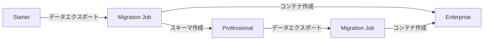

# ハイブリッド型マルチテナントアーキテクチャ設計

## 1. 概要

### 1.1 設計思想
Astar Managementは、組織の規模とセキュリティ要件に応じて3つの分離レベルを提供する**ハイブリッド型マルチテナンシー**を採用します。

### 1.2 3つのプラン

| プラン | 分離レベル | 対象組織 | 価格帯 |
|--------|-----------|----------|--------|
| **Starter** | Shared DB + RLS | 1-10名の小規模組織 | 1,000円〜/月 |
| **Professional** | Dedicated Schema | 10-50名の中規模組織 | 2,000円〜/月 |
| **Enterprise** | Dedicated Container | 50名以上の大規模組織 | 5,000円〜/月 |

## 2. Starterプラン：Shared DB + RLS

### 2.1 アーキテクチャ

```
┌─────────────────────────────────────────────────┐
│              共有データベース                      │
│                                                 │
│  ┌──────────┐  ┌──────────┐  ┌──────────┐    │
│  │ Tenant A │  │ Tenant B │  │ Tenant C │    │
│  └──────────┘  └──────────┘  └──────────┘    │
│        ↓             ↓             ↓           │
│  Row Level Security (RLS) による分離           │
│                                                 │
│  ┌────────────────────────────────────────┐   │
│  │  すべてのテーブルにtenant_idカラム         │   │
│  │  RLSポリシーでテナント間のデータを分離     │   │
│  └────────────────────────────────────────┘   │
└─────────────────────────────────────────────────┘
```

### 2.2 実装詳細

#### RLS設定

```sql
-- テナントコンテキストの設定
CREATE OR REPLACE FUNCTION set_current_tenant(tenant_id UUID)
RETURNS void AS $$
BEGIN
    PERFORM set_config('app.current_tenant_id', tenant_id::text, false);
END;
$$ LANGUAGE plpgsql;

-- RLSポリシー
CREATE POLICY tenant_isolation ON records
    FOR ALL
    USING (
        database_id IN (
            SELECT d.id FROM databases d
            JOIN workspaces w ON d.workspace_id = w.id
            WHERE w.tenant_id = current_setting('app.current_tenant_id')::UUID
        )
    );
```

#### Spring Boot実装

```kotlin
@Component
class TenantContext {
    companion object {
        private val currentTenant = ThreadLocal<UUID>()
        
        fun setTenant(tenantId: UUID) {
            currentTenant.set(tenantId)
        }
        
        fun getTenant(): UUID? = currentTenant.get()
        
        fun clear() = currentTenant.remove()
    }
}

@Component
class TenantInterceptor : HandlerInterceptor {
    override fun preHandle(
        request: HttpServletRequest,
        response: HttpServletResponse,
        handler: Any
    ): Boolean {
        val tenantId = extractTenantId(request)
        TenantContext.setTenant(tenantId)
        
        // データベースセッションにテナントIDを設定
        jdbcTemplate.execute("SELECT set_current_tenant('$tenantId')")
        
        return true
    }
    
    override fun afterCompletion(...) {
        TenantContext.clear()
    }
}
```

### 2.3 メリット・デメリット

**メリット**
- 最もコスト効率的
- リソース使用量が少ない
- 管理が簡単
- 自動スケーリング

**デメリット**
- パフォーマンスの相互影響
- カスタマイズ制限
- セキュリティリスク（共有DB）

## 3. Professionalプラン：Dedicated Schema

### 3.1 アーキテクチャ

```
┌─────────────────────────────────────────────────┐
│              データベースインスタンス              │
│                                                 │
│  ┌──────────────┐  ┌──────────────┐           │
│  │   public     │  │ tenant_abc123 │           │
│  │  (共有)      │  │   (専用)      │           │
│  │              │  │              │           │
│  │ - tenants    │  │ - databases  │           │
│  │ - users      │  │ - records    │           │
│  │ - roles      │  │ - documents  │           │
│  └──────────────┘  └──────────────┘           │
│                                                 │
│  ┌──────────────┐  ┌──────────────┐           │
│  │ tenant_def456│  │ tenant_ghi789│           │
│  │   (専用)      │  │   (専用)      │           │
│  └──────────────┘  └──────────────┘           │
└─────────────────────────────────────────────────┘
```

### 3.2 実装詳細

#### スキーマ管理

```sql
-- テナント用スキーマ作成
CREATE SCHEMA IF NOT EXISTS tenant_${tenant_id};

-- スキーマ内にテーブル作成
SET search_path TO tenant_${tenant_id};

CREATE TABLE databases (
    -- Starterプランと同じ構造
);

CREATE TABLE records (
    -- Starterプランと同じ構造
);
```

#### 動的スキーマ切り替え

```kotlin
@Component
class SchemaRoutingDataSource : AbstractRoutingDataSource() {
    override fun determineCurrentLookupKey(): Any? {
        val tenant = TenantContext.getTenant() ?: return "public"
        return when (getTenantPlan(tenant)) {
            Plan.PROFESSIONAL -> "tenant_$tenant"
            else -> "public"
        }
    }
}

@Configuration
class DataSourceConfig {
    @Bean
    fun dataSource(): DataSource {
        val routingDataSource = SchemaRoutingDataSource()
        
        val dataSources = mutableMapOf<Any, DataSource>()
        dataSources["public"] = createDataSource("public")
        // 動的にテナントスキーマを追加
        
        routingDataSource.setTargetDataSources(dataSources)
        routingDataSource.setDefaultTargetDataSource(dataSources["public"]!!)
        
        return routingDataSource
    }
}
```

### 3.3 メリット・デメリット

**メリット**
- 論理的な完全分離
- カスタムインデックス可能
- パフォーマンス予測可能
- バックアップ・リストアが独立

**デメリット**
- スキーマ管理の複雑性
- マイグレーションの手間
- 中程度のコスト

## 4. Enterpriseプラン：Dedicated Container

### 4.1 アーキテクチャ

```
┌─────────────────────────────────────────────────┐
│              Kubernetes Cluster                 │
│                                                 │
│  ┌────────────────────────────────────────┐    │
│  │         Shared Services                 │    │
│  │  - API Gateway                         │    │
│  │  - Authentication Service              │    │
│  │  - Billing Service                     │    │
│  └────────────────────────────────────────┘    │
│                                                 │
│  ┌──────────────┐  ┌──────────────┐           │
│  │  Tenant A    │  │  Tenant B    │           │
│  │  Container   │  │  Container   │           │
│  │              │  │              │           │
│  │ - App Pod    │  │ - App Pod    │           │
│  │ - DB Pod     │  │ - DB Pod     │           │
│  │ - Redis Pod  │  │ - Redis Pod  │           │
│  └──────────────┘  └──────────────┘           │
└─────────────────────────────────────────────────┘
```

### 4.2 Kubernetes実装

#### テナント用Namespace

```yaml
apiVersion: v1
kind: Namespace
metadata:
  name: tenant-${tenant_id}
  labels:
    tenant: ${tenant_id}
    plan: enterprise
```

#### PostgreSQL StatefulSet

```yaml
apiVersion: apps/v1
kind: StatefulSet
metadata:
  name: postgres
  namespace: tenant-${tenant_id}
spec:
  serviceName: postgres
  replicas: 1
  selector:
    matchLabels:
      app: postgres
  template:
    metadata:
      labels:
        app: postgres
    spec:
      containers:
      - name: postgres
        image: postgres:15
        env:
        - name: POSTGRES_DB
          value: astar_${tenant_id}
        - name: POSTGRES_USER
          valueFrom:
            secretKeyRef:
              name: postgres-secret
              key: username
        volumeMounts:
        - name: postgres-storage
          mountPath: /var/lib/postgresql/data
        resources:
          requests:
            memory: "2Gi"
            cpu: "1"
          limits:
            memory: "4Gi"
            cpu: "2"
  volumeClaimTemplates:
  - metadata:
      name: postgres-storage
    spec:
      accessModes: ["ReadWriteOnce"]
      resources:
        requests:
          storage: 100Gi
```

#### アプリケーションDeployment

```yaml
apiVersion: apps/v1
kind: Deployment
metadata:
  name: app
  namespace: tenant-${tenant_id}
spec:
  replicas: 2
  selector:
    matchLabels:
      app: astar-app
  template:
    metadata:
      labels:
        app: astar-app
    spec:
      containers:
      - name: app
        image: astar/app:latest
        env:
        - name: TENANT_ID
          value: ${tenant_id}
        - name: DB_HOST
          value: postgres.tenant-${tenant_id}.svc.cluster.local
        - name: PLAN_TYPE
          value: enterprise
        resources:
          requests:
            memory: "1Gi"
            cpu: "500m"
          limits:
            memory: "2Gi"
            cpu: "1"
```

### 4.3 メリット・デメリット

**メリット**
- 完全な物理分離
- 最高のセキュリティ
- 完全なカスタマイズ可能
- 専用リソース保証
- SLA保証

**デメリット**
- 最も高コスト
- リソース使用量大
- 管理の複雑性

## 5. プラン移行

### 5.1 アップグレードフロー



### 5.2 移行プロセス

```kotlin
@Service
class TenantMigrationService {
    
    @Transactional
    fun migrateTenant(
        tenantId: UUID,
        fromPlan: Plan,
        toPlan: Plan
    ): MigrationResult {
        // 1. 現在のデータをエクスポート
        val exportedData = exportTenantData(tenantId, fromPlan)
        
        // 2. 新環境を準備
        val newEnvironment = when (toPlan) {
            Plan.PROFESSIONAL -> createDedicatedSchema(tenantId)
            Plan.ENTERPRISE -> deployDedicatedContainer(tenantId)
            else -> throw IllegalArgumentException()
        }
        
        // 3. データをインポート
        importTenantData(tenantId, toPlan, exportedData)
        
        // 4. 検証
        validateMigration(tenantId, fromPlan, toPlan)
        
        // 5. 切り替え
        switchTenantPlan(tenantId, toPlan)
        
        // 6. 旧環境のクリーンアップ
        cleanupOldEnvironment(tenantId, fromPlan)
        
        return MigrationResult.success()
    }
}
```

## 6. 監視とメトリクス

### 6.1 プラン別メトリクス

```yaml
starter_metrics:
  - query_performance_per_tenant
  - row_count_per_tenant
  - storage_usage_per_tenant
  
professional_metrics:
  - schema_size
  - connection_pool_usage
  - index_performance
  
enterprise_metrics:
  - container_resource_usage
  - pod_health
  - persistent_volume_usage
  - network_traffic
```

### 6.2 アラート設定

```yaml
alerts:
  starter:
    - name: high_row_count
      threshold: 1000000
      action: suggest_upgrade
      
  professional:
    - name: schema_size_limit
      threshold: 10GB
      action: notify_admin
      
  enterprise:
    - name: resource_limit_reached
      threshold: 90%
      action: auto_scale
```

## 7. セキュリティ考慮事項

### 7.1 プラン別セキュリティ

| セキュリティ項目 | Starter | Professional | Enterprise |
|-----------------|---------|--------------|------------|
| データ分離 | RLS | スキーマ | 物理分離 |
| 暗号化 | 共有鍵 | 共有鍵 | テナント別鍵 |
| バックアップ | 共有 | 独立 | 独立 |
| 監査ログ | 共有DB | 専用スキーマ | 専用DB |
| ネットワーク分離 | なし | なし | あり |
| カスタムセキュリティ | 制限 | 一部可能 | 完全可能 |

### 7.2 コンプライアンス対応

```yaml
compliance_features:
  gdpr:
    - data_portability: all_plans
    - right_to_deletion: all_plans
    - data_isolation: professional_and_above
    
  hipaa:
    - encryption_at_rest: all_plans
    - audit_logging: all_plans
    - dedicated_infrastructure: enterprise_only
    
  pci_dss:
    - network_segmentation: enterprise_only
    - dedicated_database: enterprise_only
```

## 8. コスト構造

### 8.1 リソース使用量

| リソース | Starter | Professional | Enterprise |
|---------|---------|--------------|------------|
| CPU | 共有 | 共有 | 1-2 vCPU |
| メモリ | 共有 | 共有 | 2-4 GB |
| ストレージ | 共有 | 10GB/テナント | 100GB/テナント |
| バックアップ | 共有 | 独立 | 独立 |

### 8.2 価格モデル

```yaml
pricing:
  starter:
    base: 1000  # 円/月
    per_user: 100
    storage_per_gb: 50
    
  professional:
    base: 2000
    per_user: 200
    storage_per_gb: 100
    custom_domain: 500
    
  enterprise:
    base: 5000
    per_user: 300
    storage_per_gb: 150
    sla_99_9: 10000
    dedicated_support: 20000
```

## まとめ

このハイブリッド型マルチテナントアーキテクチャにより：

1. **柔軟な選択肢**: 組織規模に応じた最適なプラン
2. **スムーズな成長**: プラン間の移行が可能
3. **コスト最適化**: 必要な分離レベルに応じた価格
4. **セキュリティ**: 要件に応じたセキュリティレベル

これにより、スタートアップから大企業まで、あらゆる規模の組織に対応可能です。