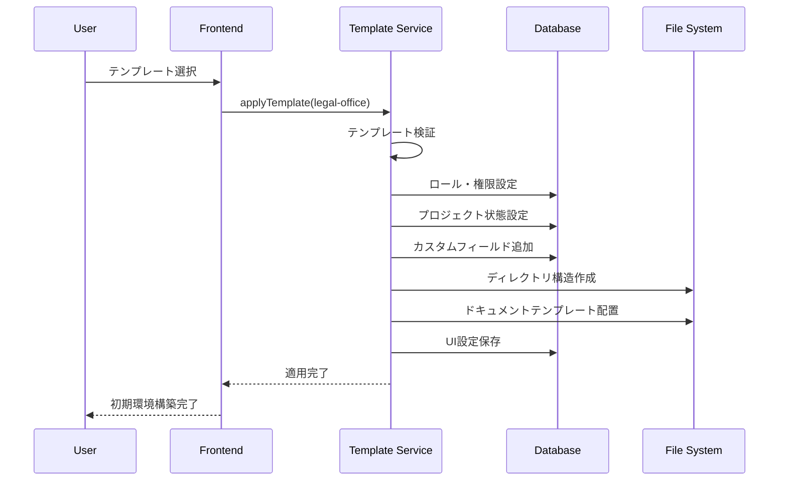

# テンプレートシステム設計書

## 1. 概要

### 1.1 基本思想
**汎用基盤 + 業界特化テンプレート**
- **コード**: 完全に業界非依存、汎用的な実装のみ
- **テンプレート**: 業界特化の設定・スキーマ・ワークフロー・UI

### 1.2 設計原則
1. **分離の原則**: コードとテンプレートの完全分離
2. **拡張性**: 新業界への展開が容易
3. **カスタマイズ性**: 組織ごとの細かい調整が可能
4. **バージョン管理**: テンプレートの更新・ロールバック

## 2. テンプレート構造

### 2.1 テンプレート定義ファイル
```yaml
# /templates/legal-office/template.yaml
metadata:
  name: "Legal Office Template"
  version: "1.2.0"
  industry: "legal"
  description: "法律事務所向けビジネス管理テンプレート"
  author: "Astar Management"
  license: "Proprietary"
  
  # 依存関係
  dependencies:
    core_version: ">=1.0.0"
    required_modules: ["project", "expense", "client", "document"]

# テンプレート同梱ロール定義
# 注意: これらはテンプレートで提供されるロール例であり、初期からシステムに存在するものではない
template_roles:
  - id: "senior-lawyer"
    name: "所長弁護士"
    description: "事務所の最高責任者"
    color: "#8b5cf6"
    permissions: ["*:*"]
    
  - id: "associate-lawyer"
    name: "アソシエイト弁護士"
    description: "雇用弁護士"
    color: "#06b6d4"
    permissions:
      - "project:*"
      - "document:*"
      - "client:read"
      - "client:update"
      - "expense:read"
      
  - id: "paralegal"
    name: "パラリーガル"
    description: "法務補助者"
    color: "#10b981"
    permissions:
      - "project:read"
      - "project:update"
      - "document:*"
      - "expense:*"
      
  - id: "secretary"
    name: "事務員"
    description: "一般事務担当者"
    color: "#f59e0b"
    permissions:
      - "project:read"
      - "client:read"
      - "expense:*"
      - "document:read"
      
  - id: "client"
    name: "依頼者"
    description: "外部顧客"
    color: "#6b7280"
    permissions:
      - "project:read:own"
      - "document:read:own"
      - "billing:read:own"

# ロールインポート設定
role_import_settings:
  auto_import_on_template_install: true
  allow_custom_names: true
  allow_custom_colors: true
  allow_permission_modifications: false  # セキュリティ上、初期インポート時は権限変更不可

# プロジェクト状態定義（法律事務所テンプレート）
project_statuses:
  - id: "new"
    label: "新規"
    description: "案件受付段階"
    color: "#6b7280"
    next_statuses: ["accepted", "rejected"]
    
  - id: "accepted"
    label: "受任"
    description: "正式に案件を受任"
    color: "#3b82f6"
    next_statuses: ["investigation", "completed"]
    
  - id: "investigation"
    label: "調査"
    description: "証拠収集・事実調査"
    color: "#f59e0b"
    next_statuses: ["preparation", "negotiation", "completed"]
    
  - id: "preparation"
    label: "準備"
    description: "裁判準備・書面作成"
    color: "#8b5cf6"
    next_statuses: ["trial", "negotiation", "completed"]
    
  - id: "negotiation"
    label: "交渉"
    description: "和解交渉・示談"
    color: "#06b6d4"
    next_statuses: ["trial", "completed"]
    
  - id: "trial"
    label: "裁判"
    description: "法廷での手続き"
    color: "#dc2626"
    next_statuses: ["completed"]
    
  - id: "completed"
    label: "完了"
    description: "案件終了"
    color: "#10b981"
    next_statuses: []

# プロジェクト優先度定義
project_priorities:
  - id: "urgent"
    label: "緊急"
    color: "#dc2626"
    order: 1
    
  - id: "high"
    label: "高"
    color: "#f59e0b"
    order: 2
    
  - id: "normal"
    label: "通常"
    color: "#6b7280"
    order: 3
    
  - id: "low"
    label: "低"
    color: "#10b981"
    order: 4

# 業界特有のフィールド定義
custom_fields:
  project:
    - name: "case_number"
      label: "事件番号"
      type: "string"
      required: true
      pattern: "^[0-9]{4}-[0-9]{3}$"
      
    - name: "court"
      label: "管轄裁判所"
      type: "select"
      required: false
      options:
        - "東京地方裁判所"
        - "大阪地方裁判所"
        - "名古屋地方裁判所"
        - "福岡地方裁判所"
        
    - name: "case_type"
      label: "事件種別"
      type: "select"
      required: true
      options:
        - "民事"
        - "刑事"
        - "家事"
        - "行政"

  client:
    - name: "client_type"
      label: "依頼者種別"
      type: "select"
      required: true
      options:
        - "個人"
        - "法人"
        
    - name: "consultation_date"
      label: "初回相談日"
      type: "date"
      required: false

# ディレクトリ構造
directory_structure:
  - path: "/cases"
    name: "案件"
    description: "案件関連のドキュメント"
    
  - path: "/clients"
    name: "依頼者"
    description: "依頼者情報"
    
  - path: "/documents"
    name: "書類"
    description: "法務書類・テンプレート"
    
  - path: "/billing"
    name: "請求・実費"
    description: "請求書・実費管理"
    
  - path: "/contracts"
    name: "契約書"
    description: "契約書類"

# ドキュメントテンプレート
document_templates:
  - name: "訴状"
    description: "民事訴訟の訴状テンプレート"
    path: "templates/legal/lawsuit.md"
    category: "裁判書類"
    variables:
      - "plaintiff_name"
      - "defendant_name"
      - "claim_amount"
      - "case_summary"
      
  - name: "準備書面"
    description: "裁判準備書面テンプレート"
    path: "templates/legal/preparation.md"
    category: "裁判書類"
    variables:
      - "case_number"
      - "court_name"
      - "arguments"
      
  - name: "契約書"
    description: "一般的な契約書テンプレート"
    path: "templates/legal/contract.md"
    category: "契約書類"
    variables:
      - "party_a_name"
      - "party_b_name"
      - "contract_terms"

# AIエージェント設定
ai_agents:
  - name: "法務文書作成エージェント"
    description: "法務文書の作成・校正を支援"
    model: "legal-assistant"
    system_prompt: |
      あなたは法律事務所の書類作成を支援するAIエージェントです。
      日本の法律に基づいて、正確で適切な法務文書を作成してください。
    tools:
      - "document_generator"
      - "template_manager"
      - "variable_substitution"
      
  - name: "判例検索エージェント" 
    description: "関連判例の検索・分析"
    model: "case-search"
    system_prompt: |
      判例データベースから関連する判例を検索し、
      事案の類似性と判断基準を分析してください。
    tools:
      - "case_database_search"
      - "similarity_analysis"
      - "precedent_analyzer"

# ワークフロー定義
workflows:
  - name: "新規案件受任フロー"
    description: "新規案件を受任する際の標準プロセス"
    triggers:
      - "project_status_changed:new"
    steps:
      - action: "create_client_folder"
        name: "依頼者フォルダ作成"
        
      - action: "generate_case_number"
        name: "事件番号採番"
        
      - action: "create_contract_document"
        name: "委任契約書作成"
        template: "contract"
        
      - action: "schedule_initial_meeting"
        name: "初回打合せ予定作成"
        
      - action: "notify_team"
        name: "チーム通知"
        recipients: ["associate-lawyer", "paralegal"]

# UI設定
ui_customization:
  # プロジェクト一覧のカラム設定
  project_list_columns:
    - field: "case_number"
      label: "事件番号"
      width: 120
      sortable: true
      
    - field: "title"
      label: "案件名"
      width: 200
      sortable: true
      
    - field: "client_name"
      label: "依頼者"
      width: 150
      sortable: true
      
    - field: "status"
      label: "ステータス"
      width: 100
      sortable: true
      
    - field: "assigned_lawyer"
      label: "担当弁護士"
      width: 120
      sortable: true
      
    - field: "due_date"
      label: "期限"
      width: 100
      sortable: true

  # ダッシュボード設定
  dashboard_widgets:
    - type: "status_summary"
      title: "案件状況サマリー"
      position: { row: 1, col: 1, width: 6, height: 4 }
      
    - type: "recent_projects"
      title: "最近の案件"
      position: { row: 1, col: 7, width: 6, height: 4 }
      
    - type: "expense_summary"
      title: "実費サマリー"
      position: { row: 5, col: 1, width: 4, height: 3 }
      
    - type: "upcoming_deadlines"
      title: "期限迫る案件"
      position: { row: 5, col: 5, width: 8, height: 3 }

# 国際化設定
i18n:
  default_language: "ja"
  supported_languages: ["ja", "en"]
  
  # 業界固有用語の翻訳
  terms:
    ja:
      case: "案件"
      lawyer: "弁護士"
      client: "依頼者"
      lawsuit: "訴訟"
      contract: "契約"
    en:
      case: "Case"
      lawyer: "Lawyer"
      client: "Client"
      lawsuit: "Lawsuit"
      contract: "Contract"

# データ移行設定
migration:
  # 既存システムからのデータインポート設定
  import_mappings:
    - source_system: "kintone"
      mappings:
        - source_field: "案件名"
          target_field: "title"
        - source_field: "依頼者"
          target_field: "client_name"
        - source_field: "状態"
          target_field: "status"
          value_mapping:
            "受付": "new"
            "着手": "accepted"
            "完了": "completed"

# 拡張設定
extensions:
  # 外部システム連携
  integrations:
    - name: "courts_api"
      description: "裁判所システムとの連携"
      enabled: false
      
    - name: "legal_database"
      description: "法律データベース検索"
      enabled: true
      config:
        api_key: "${LEGAL_DB_API_KEY}"
        
  # カスタムフック
  hooks:
    - event: "project_created"
      action: "generate_case_folder"
      
    - event: "project_completed"
      action: "archive_documents"
```

## 3. テンプレート適用メカニズム

### 3.1 適用フロー


### 3.2 実装例
```kotlin
@Service
@Transactional
class TemplateService(
    private val templateRepository: TemplateRepository,
    private val roleService: RoleService,
    private val projectService: ProjectService,
    private val documentService: DocumentService
) {
    fun applyTemplate(tenantId: UUID, templateId: String) {
        val template = loadTemplate(templateId)
        
        // 1. ロール・権限設定
        template.roles.forEach { role ->
            roleService.createRole(tenantId, role)
        }
        
        // 2. プロジェクト設定
        projectService.setupStatuses(tenantId, template.projectStatuses)
        projectService.setupCustomFields(tenantId, template.customFields.project)
        
        // 3. ディレクトリ構造作成
        template.directoryStructure.forEach { dir ->
            documentService.createDirectory(tenantId, dir.path)
        }
        
        // 4. ドキュメントテンプレート配置
        template.documentTemplates.forEach { docTemplate ->
            documentService.installTemplate(tenantId, docTemplate)
        }
        
        // 5. UI設定適用
        uiService.applyCustomization(tenantId, template.uiCustomization)
        
        // 6. AIエージェント設定
        aiService.setupAgents(tenantId, template.aiAgents)
    }
}
```

## 4. テンプレート管理

### 4.1 バージョン管理
```yaml
# テンプレートバージョン管理
versions:
  - version: "1.0.0"
    release_date: "2024-01-15"
    changes:
      - "初期リリース"
      
  - version: "1.1.0"
    release_date: "2024-02-01"
    changes:
      - "AIエージェント機能追加"
      - "新しいドキュメントテンプレート追加"
      
  - version: "1.2.0"
    release_date: "2024-03-01"
    changes:
      - "ワークフロー機能追加"
      - "UI改善"

# 更新ポリシー
update_policy:
  auto_update: false
  breaking_changes_notification: true
  rollback_support: true
```

### 4.2 カスタマイゼーション
```yaml
# 組織固有のカスタマイゼーション
organization_customizations:
  base_template: "legal-office:1.2.0"
  
  # 追加ロール
  additional_roles:
    - id: "intern"
      name: "インターン"
      permissions: ["project:read", "document:read"]
  
  # カスタムフィールド
  custom_fields:
    project:
      - name: "partner_firm"
        label: "協力事務所"
        type: "string"
        
  # UI調整
  ui_overrides:
    primary_color: "#1f2937"
    logo_url: "/custom/logo.png"
```

## 5. 他業界への展開

### 5.1 物流業界テンプレート（例）
```yaml
# /templates/logistics/template.yaml
metadata:
  name: "Logistics Template"
  industry: "logistics"

roles:
  - id: "operations-manager"
    name: "運行管理者"
    permissions: ["*:*"]
    
  - id: "driver"
    name: "ドライバー"
    permissions: ["delivery:*", "expense:create"]

project_statuses:
  - { id: "scheduled", label: "配送予定" }
  - { id: "in_transit", label: "配送中" }
  - { id: "delivered", label: "配送完了" }

custom_fields:
  project:
    - name: "delivery_address"
      label: "配送先住所"
      type: "text"
      required: true
      
    - name: "cargo_weight"
      label: "荷物重量"
      type: "number"
      unit: "kg"
```

### 5.2 不動産管理テンプレート（例）
```yaml
# /templates/real-estate/template.yaml
metadata:
  name: "Real Estate Management Template"
  industry: "real_estate"

project_statuses:
  - { id: "listing", label: "募集中" }
  - { id: "showing", label: "内見対応" }
  - { id: "negotiation", label: "条件交渉" }
  - { id: "contracted", label: "契約済" }

custom_fields:
  project:
    - name: "property_type"
      label: "物件種別"
      type: "select"
      options: ["マンション", "一戸建て", "アパート", "土地"]
      
    - name: "rent_amount"
      label: "賃料"
      type: "number"
      unit: "円"
```

## 6. まとめ

このテンプレートシステムにより：

1. **汎用性**: コードは完全に業界非依存
2. **特化性**: テンプレートで業界ニーズに対応
3. **拡張性**: 新業界への展開が容易
4. **カスタマイズ性**: 組織ごとの微調整が可能
5. **保守性**: テンプレートとコードの分離で保守性向上

**結果**: 真の意味での「汎用ビジネス管理プラットフォーム」を実現