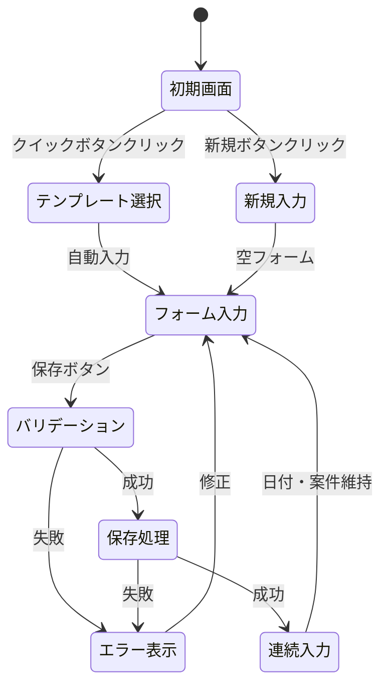
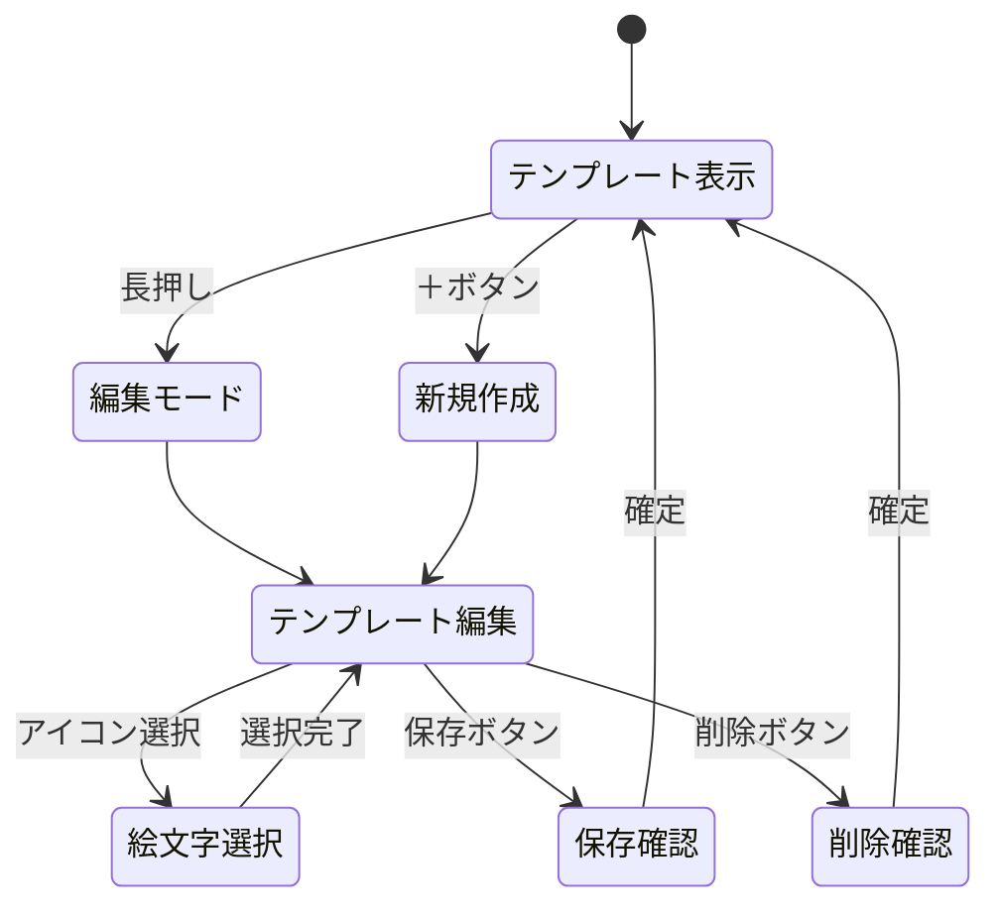
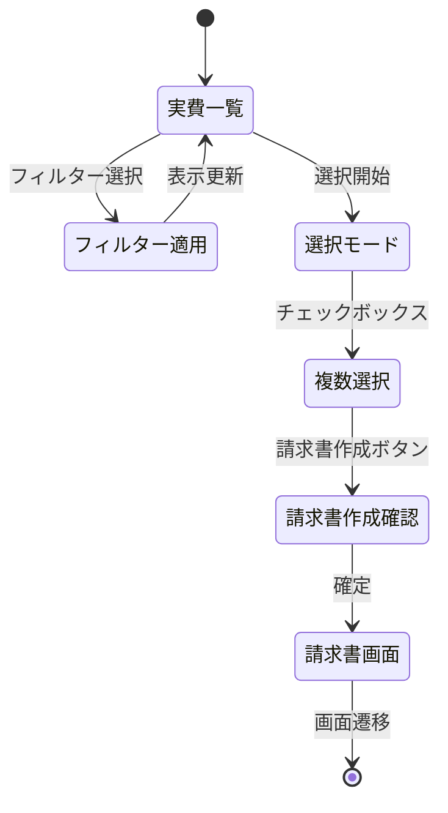

# 報酬管理画面 - 状態遷移・状態管理設計

## 状態遷移設計

### 1. 基本的な実費入力フロー



### 2. テンプレート管理フロー



### 3. 請求書作成への遷移



## 状態管理設計（Pinia Store）

### ExpenseInputStore（実費入力の状態管理）

```typescript
// stores/expenseInput.ts
import { defineStore } from 'pinia'

interface ExpenseInputState {
  // フォーム状態
  currentForm: ExpenseFormData
  isSubmitting: boolean
  errors: Record<string, string>
  
  // 連続入力用の保持データ
  retainedData: {
    date: string
    caseId: string
  }
  
  // UI状態
  inputMode: 'normal' | 'calculator'
  showAdvancedOptions: boolean
  
  // 一時保存
  draft: ExpenseFormData | null
  lastSavedAt: Date | null
}

export const useExpenseInputStore = defineStore('expenseInput', {
  state: (): ExpenseInputState => ({
    currentForm: createEmptyForm(),
    isSubmitting: false,
    errors: {},
    retainedData: {
      date: new Date().toISOString().split('T')[0],
      caseId: ''
    },
    inputMode: 'normal',
    showAdvancedOptions: false,
    draft: null,
    lastSavedAt: null
  }),

  getters: {
    isValid: (state) => {
      return state.currentForm.amount > 0 &&
             state.currentForm.description &&
             state.currentForm.caseId
    },
    
    hasChanges: (state) => {
      return JSON.stringify(state.currentForm) !== JSON.stringify(state.draft)
    }
  },

  actions: {
    // テンプレートから初期化
    initFromTemplate(template: ExpenseTemplate) {
      this.currentForm = {
        ...createEmptyForm(),
        description: template.defaultDescription,
        accountCode: template.accountCode,
        ...this.retainedData // 日付と案件は維持
      }
    },
    
    // フォーム送信
    async submitForm() {
      if (!this.isValid) return
      
      this.isSubmitting = true
      this.errors = {}
      
      try {
        const { createExpense } = useExpensesStore()
        await createExpense(this.currentForm)
        
        // 連続入力のためのリセット
        this.resetForContinuous()
        
        // 成功通知
        const { showToast } = useUIStore()
        showToast({
          type: 'success',
          title: '保存しました',
          description: `${this.currentForm.description} ¥${this.currentForm.amount.toLocaleString()}`
        })
        
        return true
      } catch (error) {
        this.handleError(error)
        return false
      } finally {
        this.isSubmitting = false
      }
    },
    
    // 連続入力用リセット
    resetForContinuous() {
      // 日付と案件を保持
      this.retainedData = {
        date: this.currentForm.date,
        caseId: this.currentForm.caseId
      }
      
      // フォームをリセット
      this.currentForm = {
        ...createEmptyForm(),
        ...this.retainedData
      }
      
      // UIもリセット
      this.showAdvancedOptions = false
    },
    
    // 完全リセット
    resetAll() {
      this.currentForm = createEmptyForm()
      this.retainedData = {
        date: new Date().toISOString().split('T')[0],
        caseId: ''
      }
      this.errors = {}
      this.showAdvancedOptions = false
    },
    
    // 自動保存
    saveDraft() {
      this.draft = { ...this.currentForm }
      this.lastSavedAt = new Date()
      
      // LocalStorageにも保存
      if (process.client) {
        localStorage.setItem('expense_draft', JSON.stringify(this.draft))
      }
    },
    
    // 下書き復元
    restoreDraft() {
      if (process.client) {
        const saved = localStorage.getItem('expense_draft')
        if (saved) {
          this.draft = JSON.parse(saved)
          this.currentForm = { ...this.draft }
        }
      }
    },
    
    // エラーハンドリング
    handleError(error: any) {
      if (error.data?.errors) {
        this.errors = error.data.errors
      } else {
        const { showToast } = useUIStore()
        showToast({
          type: 'error',
          title: 'エラーが発生しました',
          description: error.message || '保存に失敗しました'
        })
      }
    }
  }
})

// ヘルパー関数
function createEmptyForm(): ExpenseFormData {
  return {
    amount: 0,
    date: new Date().toISOString().split('T')[0],
    description: '',
    caseId: '',
    expenseType: 'case',
    accountCode: '',
    paymentMethod: 'cash',
    memo: '',
    hasWithholding: false,
    withholdingAmount: 0
  }
}
```

### ExpenseTemplateStore（テンプレート管理）

```typescript
// stores/expenseTemplate.ts
export const useExpenseTemplateStore = defineStore('expenseTemplate', {
  state: () => ({
    templates: [] as ExpenseTemplate[],
    isLoading: false,
    editingTemplate: null as ExpenseTemplate | null,
    showEmojiPicker: false
  }),

  getters: {
    // 使用頻度順
    sortedTemplates: (state) => {
      return [...state.templates].sort((a, b) => b.usageCount - a.usageCount)
    },
    
    // よく使う上位6個
    frequentTemplates: (state) => {
      return state.sortedTemplates.slice(0, 6)
    }
  },

  actions: {
    async fetchTemplates() {
      if (this.templates.length > 0) return
      
      this.isLoading = true
      try {
        const { data } = await $fetch('/api/v1/expense-templates')
        this.templates = data
      } finally {
        this.isLoading = false
      }
    },
    
    async createTemplate(template: Partial<ExpenseTemplate>) {
      const { data } = await $fetch('/api/v1/expense-templates', {
        method: 'POST',
        body: template
      })
      
      this.templates.push(data)
      return data
    },
    
    async updateTemplate(id: string, updates: Partial<ExpenseTemplate>) {
      const { data } = await $fetch(`/api/v1/expense-templates/${id}`, {
        method: 'PUT',
        body: updates
      })
      
      const index = this.templates.findIndex(t => t.id === id)
      if (index > -1) {
        this.templates[index] = data
      }
      
      return data
    },
    
    async deleteTemplate(id: string) {
      await $fetch(`/api/v1/expense-templates/${id}`, {
        method: 'DELETE'
      })
      
      const index = this.templates.findIndex(t => t.id === id)
      if (index > -1) {
        this.templates.splice(index, 1)
      }
    },
    
    // 使用回数をインクリメント
    incrementUsage(id: string) {
      const template = this.templates.find(t => t.id === id)
      if (template) {
        template.usageCount++
      }
    }
  }
})
```

## 自動保存とリカバリー

```typescript
// composables/useAutoSave.ts
export const useAutoSave = () => {
  const store = useExpenseInputStore()
  
  // 入力変更を監視して自動保存
  watchDebounced(
    () => store.currentForm,
    () => {
      if (store.hasChanges) {
        store.saveDraft()
      }
    },
    { debounce: 1000, deep: true }
  )
  
  // ページ離脱時の警告
  onBeforeUnmount(() => {
    if (store.hasChanges && store.currentForm.amount > 0) {
      const confirmed = window.confirm('入力中のデータがあります。保存せずに離れますか？')
      if (!confirmed) {
        return false
      }
    }
  })
  
  // 初期化時に下書き復元
  onMounted(() => {
    store.restoreDraft()
  })
}
```

## エラー状態の管理

```typescript
// types/expense.ts
interface ExpenseError {
  field: string
  message: string
  code: string
}

// バリデーションルール
const validationRules = {
  amount: [
    { required: true, message: '金額を入力してください' },
    { min: 1, message: '金額は1円以上で入力してください' },
    { max: 99999999, message: '金額が大きすぎます' }
  ],
  date: [
    { required: true, message: '日付を選択してください' },
    { maxDate: new Date(), message: '未来の日付は選択できません' }
  ],
  description: [
    { required: true, message: '摘要を入力してください' },
    { maxLength: 200, message: '摘要は200文字以内で入力してください' }
  ],
  caseId: [
    { requiredIf: (form) => form.expenseType === 'case', message: '案件を選択してください' }
  ]
}
```

## モバイル対応の状態管理

```typescript
// stores/expenseMobile.ts
export const useExpenseMobileStore = defineStore('expenseMobile', {
  state: () => ({
    isSwipeDeleteEnabled: true,
    touchStartX: 0,
    swipingItemId: null as string | null,
    networkStatus: 'online' as 'online' | 'offline'
  }),

  actions: {
    // オフライン時の処理
    async syncOfflineData() {
      if (this.networkStatus === 'offline') return
      
      const offlineQueue = await getOfflineQueue()
      for (const item of offlineQueue) {
        try {
          await this.processOfflineItem(item)
        } catch (error) {
          console.error('Sync failed for item:', item.id)
        }
      }
    }
  }
})
```