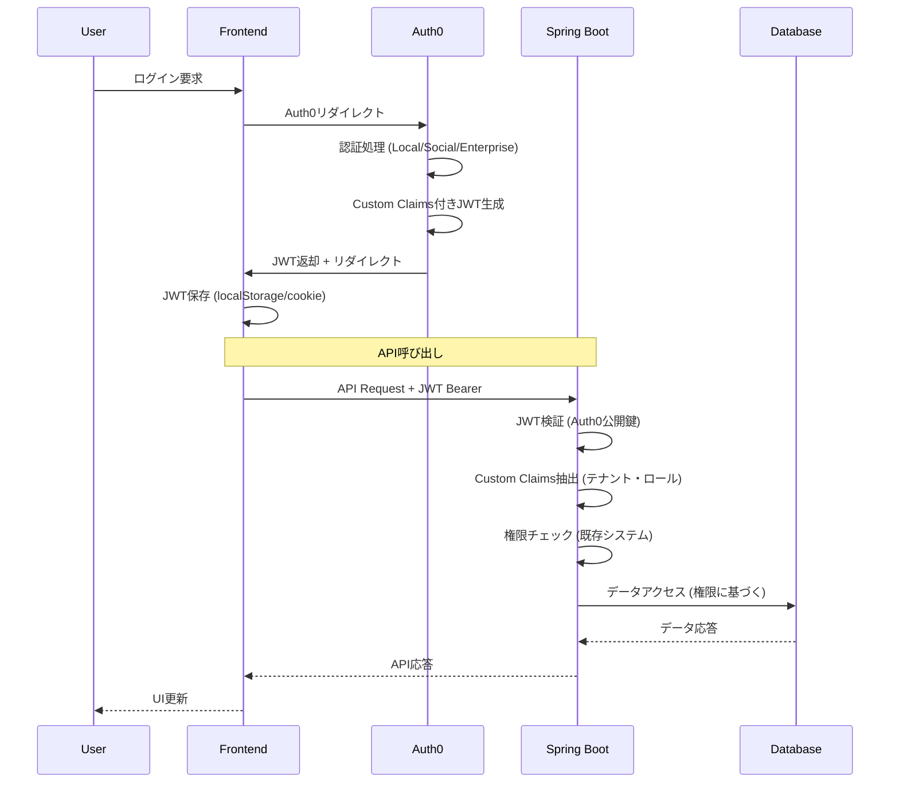

# Auth0委託認証アーキテクチャ設計書

## 1. 設計思想

### 1.1 基本原則
**認証委託による開発速度最優先** - 汎用ビジネス管理プラットフォームの迅速な実現
- **認証処理完全委託**: Auth0に認証・セッション管理・MFA等を委託
- **検証専門化**: Spring Bootは JWT検証と認可のみに特化
- **権限システム継続**: 動的ロール・リソースベース権限は自社実装を維持
- **開発速度優先**: 認証機能開発を3-4週間短縮

### 1.2 委託範囲
**Auth0委託範囲**:
- ユーザー認証（Email/Password、Social Login、Enterprise SSO）
- セッション管理・ライフサイクル
- 多要素認証（MFA）
- パスワード管理・リセット
- JWT発行・更新

**自社実装継続**:
- 権限チェック・認可ロジック
- 動的ロールシステム
- リソースベース権限
- テナント管理
- ビジネスロジック

## 2. アーキテクチャ概要

### 2.1 システム構成図
```
┌─────────────────────────────────────────────────────────────┐
│                    Frontend Layer                          │
│      Nuxt.js 3 + Auth0 SDK + 認証ストア                    │
└─────────────────────┬───────────────────────────────────────┘
                      │ Auth0 Redirect
┌─────────────────────┴───────────────────────────────────────┐
│                   Auth0 (SaaS)                             │
│  ┌─────────────┐  ┌─────────────┐  ┌─────────────────┐     │
│  │   Local     │  │   Social    │  │   Enterprise   │     │
│  │   Auth      │  │   Login     │  │   SSO (SAML)   │     │
│  └─────────────┘  └─────────────┘  └─────────────────┘     │
│           │                │                │               │
│  ┌─────────────────────────────────────────────────────┐   │
│  │        JWT Token 発行・管理・更新                    │   │
│  └─────────────────────────────────────────────────────┘   │
└─────────────────────┬───────────────────────────────────────┘
                      │ JWT Bearer Token
┌─────────────────────┴───────────────────────────────────────┐
│              Spring Boot (軽量化)                           │
│  ┌─────────────┐  ┌─────────────┐  ┌─────────────────┐     │
│  │ JWT検証     │  │ 権限チェック │  │ テナント管理     │     │
│  │ (Auth0専用) │  │ (既存継続)  │  │ (既存継続)     │     │
│  └─────────────┘  └─────────────┘  └─────────────────┘     │
└─────────────────────┬───────────────────────────────────────┘
                      │
┌─────────────────────┴───────────────────────────────────────┐
│                PostgreSQL (簡素化)                         │
│   roles, permissions, tenants (認証テーブル大幅削除)        │
└─────────────────────────────────────────────────────────────┘
```

### 2.2 フロー詳細


## 3. Auth0統合設計

### 3.1 Auth0設定構造
```javascript
// Auth0 Post-Login Action
exports.onExecutePostLogin = async (event, api) => {
  try {
    const email = event.user.email
    const auth0UserId = event.user.user_id
    
    // 1. テナント特定
    const tenantResponse = await fetch(`${API_BASE_URL}/api/auth/tenant-by-email`, {
      method: 'POST',
      headers: {
        'Content-Type': 'application/json',
        'Authorization': `Bearer ${MANAGEMENT_API_TOKEN}`
      },
      body: JSON.stringify({ email })
    })
    
    if (!tenantResponse.ok) {
      api.access.deny('テナントが見つかりません')
      return
    }
    
    const tenant = await tenantResponse.json()
    
    // 2. ユーザー情報取得・作成
    const userResponse = await fetch(`${API_BASE_URL}/api/auth/user-by-auth0-id`, {
      method: 'POST',
      headers: {
        'Content-Type': 'application/json',
        'Authorization': `Bearer ${MANAGEMENT_API_TOKEN}`
      },
      body: JSON.stringify({
        auth0UserId,
        tenantId: tenant.id,
        email,
        name: event.user.name || event.user.nickname,
        picture: event.user.picture
      })
    })
    
    const user = await userResponse.json()
    
    // 3. ユーザーロール取得
    const rolesResponse = await fetch(`${API_BASE_URL}/api/auth/user-roles`, {
      method: 'POST',
      headers: {
        'Content-Type': 'application/json',
        'Authorization': `Bearer ${MANAGEMENT_API_TOKEN}`
      },
      body: JSON.stringify({
        userId: user.id,
        tenantId: tenant.id
      })
    })
    
    const roles = await rolesResponse.json()
    
    // 4. Custom Claims設定
    const namespace = 'https://astar-management.com/'
    api.accessToken.setCustomClaim(`${namespace}tenant_id`, tenant.id)
    api.accessToken.setCustomClaim(`${namespace}tenant_slug`, tenant.slug)
    api.accessToken.setCustomClaim(`${namespace}user_id`, user.id)
    api.accessToken.setCustomClaim(`${namespace}roles`, roles.map(r => r.name))
    api.accessToken.setCustomClaim(`${namespace}plan`, tenant.planType)
    
    // 5. ID Tokenにも追加（フロントエンド用）
    api.idToken.setCustomClaim(`${namespace}tenant_slug`, tenant.slug)
    api.idToken.setCustomClaim(`${namespace}display_name`, user.displayName)
    
  } catch (error) {
    console.error('Auth0 Action Error:', error)
    api.access.deny('認証処理中にエラーが発生しました')
  }
}
```

### 3.2 JWT構造詳細
```json
{
  "header": {
    "alg": "RS256",
    "typ": "JWT",
    "kid": "auth0-key-id"
  },
  "payload": {
    "iss": "https://astar-dev.auth0.com/",
    "sub": "auth0|64f2e1234567890abcdef",
    "aud": ["astar-management-api", "https://astar-dev.auth0.com/userinfo"],
    "iat": 1708093200,
    "exp": 1708096800,
    "azp": "frontend-spa-client-id",
    "scope": "openid profile email",
    
    // Custom Claims (API用)
    "https://astar-management.com/tenant_id": "550e8400-e29b-41d4-a716-446655440000",
    "https://astar-management.com/tenant_slug": "law-firm-abc",
    "https://astar-management.com/user_id": "user-uuid-in-our-db",
    "https://astar-management.com/roles": ["プロジェクトマネージャー", "経理担当"],
    "https://astar-management.com/plan": "professional"
  }
}
```

## 4. Spring Boot統合実装

### 4.1 Auth0専用JWT検証器
```kotlin
@Configuration
@ConfigurationProperties(prefix = "auth0")
data class Auth0Properties(
    var domain: String = "",
    var audience: String = "",
    var namespace: String = "https://astar-management.com/"
)

@Component
class Auth0JwtValidator(
    private val auth0Properties: Auth0Properties
) {
    
    private val jwkProvider = JwkProviderBuilder(auth0Properties.domain)
        .cached(5, 24, TimeUnit.HOURS)
        .rateLimited(10, 1, TimeUnit.MINUTES)
        .build()
    
    fun validateToken(token: String): JwtClaims {
        try {
            val jwt = JWT.decode(token)
            val jwk = jwkProvider.get(jwt.keyId)
            val algorithm = Algorithm.RSA256(jwk.publicKey as RSAPublicKey, null)
            
            val verifier = JWT.require(algorithm)
                .withIssuer("https://${auth0Properties.domain}/")
                .withAudience(auth0Properties.audience)
                .acceptLeeway(10) // 10秒の時間差許容
                .build()
                
            val verified = verifier.verify(token)
            
            return JwtClaims(
                auth0UserId = verified.subject,
                tenantId = UUID.fromString(verified.getClaim("${auth0Properties.namespace}tenant_id").asString()),
                tenantSlug = verified.getClaim("${auth0Properties.namespace}tenant_slug").asString(),
                userId = UUID.fromString(verified.getClaim("${auth0Properties.namespace}user_id").asString()),
                roles = verified.getClaim("${auth0Properties.namespace}roles").asList(String::class.java),
                plan = verified.getClaim("${auth0Properties.namespace}plan").asString(),
                email = verified.getClaim("email")?.asString(),
                name = verified.getClaim("name")?.asString()
            )
        } catch (e: JWTVerificationException) {
            throw InvalidTokenException("JWT validation failed: ${e.message}")
        } catch (e: JwkException) {
            throw InvalidTokenException("JWK retrieval failed: ${e.message}")
        }
    }
}

data class JwtClaims(
    val auth0UserId: String,
    val tenantId: UUID,
    val tenantSlug: String,
    val userId: UUID,
    val roles: List<String>,
    val plan: String,
    val email: String? = null,
    val name: String? = null
)
```

### 4.2 Security設定簡素化
```kotlin
@Configuration
@EnableWebSecurity
@EnableMethodSecurity
class SecurityConfig(
    private val auth0JwtValidator: Auth0JwtValidator
) {
    
    @Bean
    fun securityFilterChain(http: HttpSecurity): SecurityFilterChain {
        return http
            .sessionManagement { session ->
                session.sessionCreationPolicy(SessionCreationPolicy.STATELESS)
            }
            .csrf { csrf -> csrf.disable() }
            .authorizeHttpRequests { auth ->
                auth
                    .requestMatchers("/api/auth/callback", "/api/health").permitAll()
                    .requestMatchers("/api/**").authenticated()
                    .anyRequest().permitAll()
            }
            .addFilterBefore(auth0JwtFilter(), UsernamePasswordAuthenticationFilter::class.java)
            .build()
    }
    
    @Bean
    fun auth0JwtFilter(): Auth0JwtFilter {
        return Auth0JwtFilter(auth0JwtValidator)
    }
}

@Component
class Auth0JwtFilter(
    private val jwtValidator: Auth0JwtValidator
) : OncePerRequestFilter() {
    
    override fun doFilterInternal(
        request: HttpServletRequest,
        response: HttpServletResponse,
        filterChain: FilterChain
    ) {
        try {
            val token = extractToken(request)
            if (token != null) {
                val claims = jwtValidator.validateToken(token)
                val authentication = Auth0Authentication(claims)
                SecurityContextHolder.getContext().authentication = authentication
                
                // テナントコンテキスト設定
                TenantContext.setTenantId(claims.tenantId)
                TenantContext.setUserId(claims.userId)
            }
        } catch (e: InvalidTokenException) {
            logger.warn("Invalid JWT token: ${e.message}")
            // 認証失敗時は何もせず、後続で401エラーになる
        }
        
        filterChain.doFilter(request, response)
    }
    
    private fun extractToken(request: HttpServletRequest): String? {
        val bearerToken = request.getHeader("Authorization")
        return if (bearerToken != null && bearerToken.startsWith("Bearer ")) {
            bearerToken.substring(7)
        } else null
    }
}

class Auth0Authentication(
    private val claims: JwtClaims
) : AbstractAuthenticationToken(emptyList()) {
    
    init {
        isAuthenticated = true
    }
    
    override fun getCredentials(): Any = claims
    override fun getPrincipal(): Any = claims.userId
    
    fun getTenantId(): UUID = claims.tenantId
    fun getUserId(): UUID = claims.userId
    fun getRoles(): List<String> = claims.roles
    fun getPlan(): String = claims.plan
}
```

### 4.3 API連携エンドポイント
```kotlin
@RestController
@RequestMapping("/api/auth")
class AuthCallbackController(
    private val userService: UserService,
    private val tenantService: TenantService,
    private val roleService: RoleService
) {
    
    @PostMapping("/tenant-by-email")
    fun getTenantByEmail(@RequestBody request: TenantByEmailRequest): TenantResponse {
        val domain = request.email.split("@")[1]
        val tenant = tenantService.findByEmailDomain(domain)
            ?: throw TenantNotFoundException("テナントが見つかりません: $domain")
        
        return TenantResponse(
            id = tenant.id,
            slug = tenant.slug,
            name = tenant.name,
            planType = tenant.planType
        )
    }
    
    @PostMapping("/user-by-auth0-id")
    fun getUserByAuth0Id(@RequestBody request: UserByAuth0IdRequest): UserResponse {
        val user = userService.findByAuth0UserId(request.auth0UserId)
            ?: userService.createFromAuth0(
                auth0UserId = request.auth0UserId,
                tenantId = request.tenantId,
                email = request.email,
                name = request.name,
                picture = request.picture
            )
        
        return UserResponse(
            id = user.id,
            email = user.email,
            name = user.name,
            displayName = user.displayName
        )
    }
    
    @PostMapping("/user-roles")
    fun getUserRoles(@RequestBody request: UserRolesRequest): List<RoleResponse> {
        val roles = roleService.getUserRoles(request.userId, request.tenantId)
        return roles.map { role ->
            RoleResponse(
                id = role.id,
                name = role.name,
                description = role.description,
                color = role.color
            )
        }
    }
}

// DTOs
data class TenantByEmailRequest(val email: String)
data class TenantResponse(val id: UUID, val slug: String, val name: String, val planType: String)

data class UserByAuth0IdRequest(
    val auth0UserId: String,
    val tenantId: UUID,
    val email: String,
    val name: String,
    val picture: String?
)
data class UserResponse(val id: UUID, val email: String, val name: String, val displayName: String?)

data class UserRolesRequest(val userId: UUID, val tenantId: UUID)
data class RoleResponse(val id: UUID, val name: String, val description: String?, val color: String)
```

## 5. フロントエンド統合（Sidebase Auth + Auth0）

### 5.1 Nuxt.js設定（Sidebase Auth経由）
```typescript
// nuxt.config.ts
export default defineNuxtConfig({
  modules: [
    '@sidebase/nuxt-auth'
  ],
  
  auth: {
    baseURL: process.env.AUTH_ORIGIN,
    provider: {
      type: 'authjs'
    }
  },
  
  runtimeConfig: {
    authSecret: process.env.NUXT_AUTH_SECRET,
    
    auth0ClientId: process.env.AUTH0_CLIENT_ID,
    auth0ClientSecret: process.env.AUTH0_CLIENT_SECRET,
    auth0Domain: process.env.AUTH0_DOMAIN,
    auth0Audience: process.env.AUTH0_AUDIENCE,
    
    public: {
      authUrl: process.env.NUXT_PUBLIC_AUTH_URL || 'http://localhost:3000/api/auth'
    }
  },
  
  ssr: true, // Sidebase Auth supports SSR
  
  css: ['~/assets/css/main.css']
})

// server/api/auth/[...].ts - Auth.js設定
import { NuxtAuthHandler } from '#auth'
import Auth0Provider from 'next-auth/providers/auth0'

export default NuxtAuthHandler({
  secret: useRuntimeConfig().authSecret,
  
  providers: [
    Auth0Provider({
      clientId: useRuntimeConfig().auth0ClientId,
      clientSecret: useRuntimeConfig().auth0ClientSecret,
      issuer: `https://${useRuntimeConfig().auth0Domain}`,
      authorization: {
        params: {
          audience: useRuntimeConfig().auth0Audience,
          scope: 'openid profile email'
        }
      }
    })
  ],
  
  callbacks: {
    // Auth0のCustom ClaimsをSessionに組み込み
    async jwt({ token, account }) {
      if (account?.access_token) {
        token.accessToken = account.access_token
        
        // Auth0のCustom Claimsを抽出
        const namespace = 'https://astar-management.com/'
        token.tenantId = token[`${namespace}tenant_id`]
        token.tenantSlug = token[`${namespace}tenant_slug`]
        token.userId = token[`${namespace}user_id`]
        token.roles = token[`${namespace}roles`] || []
        token.plan = token[`${namespace}plan`]
      }
      
      return token
    },
    
    async session({ session, token }) {
      // JWTからSessionにCustom Claimsを移行
      session.accessToken = token.accessToken
      session.tenantId = token.tenantId
      session.tenantSlug = token.tenantSlug
      session.userId = token.userId
      session.roles = token.roles
      session.plan = token.plan
      
      return session
    }
  },
  
  pages: {
    signIn: '/signin',
    error: '/auth/error'
  }
})
```

### 5.2 認証ストア実装（Sidebase Auth対応）
```typescript
// stores/auth.ts
export const useAuthStore = defineStore('auth', () => {
  const { data: session, status, signIn, signOut } = useAuth()
  
  // 認証状態
  const isAuthenticated = computed(() => status.value === 'authenticated')
  const isLoading = computed(() => status.value === 'loading')
  const user = computed(() => session.value?.user || null)
  
  // テナント情報を取得（Sessionから）
  const tenant = computed(() => {
    if (!session.value) return null
    return {
      id: session.value.tenantId,
      slug: session.value.tenantSlug,
      plan: session.value.plan
    }
  })
  
  // ユーザーロール情報
  const userRoles = computed(() => {
    return session.value?.roles || []
  })
  
  // ログイン（テナント指定可能）
  const login = async (tenantSlug?: string, returnTo?: string) => {
    const callbackUrl = returnTo || '/dashboard'
    
    await signIn('auth0', { 
      callbackUrl,
      // Auth0のlogin_hintでテナント指定
      ...(tenantSlug && { login_hint: `tenant:${tenantSlug}` })
    })
  }
  
  // ログアウト
  const logout = async () => {
    await signOut({ 
      callbackUrl: window.location.origin 
    })
  }
  
  // API用トークン取得（SessionのacccessTokenを使用）
  const getApiToken = async () => {
    if (!session.value?.accessToken) {
      throw new Error('Access token not available')
    }
    
    return session.value.accessToken as string
  }
  
  // セッション更新
  const refreshSession = async () => {
    // Sidebase Authが自動的にセッションを更新
    await refresh()
  }
  
  return {
    // State
    user: readonly(user),
    tenant: readonly(tenant),
    userRoles: readonly(userRoles),
    isAuthenticated: readonly(isAuthenticated),
    isLoading: readonly(isLoading),
    
    // Actions
    login,
    logout,
    getApiToken,
    refreshSession
  }
})

// composables/useApi.ts
export function useApi() {
  const { getApiToken } = useAuthStore()
  
  const apiCall = async <T>(url: string, options: RequestInit = {}): Promise<T> => {
    const token = await getApiToken()
    
    const response = await fetch(url, {
      ...options,
      headers: {
        'Content-Type': 'application/json',
        'Authorization': `Bearer ${token}`,
        ...options.headers
      }
    })
    
    if (!response.ok) {
      if (response.status === 401) {
        // 認証エラー時は再ログインを促す
        await navigateTo('/signin')
        throw new Error('認証が必要です')
      }
      throw new Error(`API Error: ${response.status}`)
    }
    
    return response.json()
  }
  
  return { apiCall }
}

// types/auth.d.ts - TypeScript型定義拡張
declare module 'next-auth' {
  interface Session {
    accessToken?: string
    tenantId?: string
    tenantSlug?: string
    userId?: string
    roles?: string[]
    plan?: string
  }
  
  interface JWT {
    accessToken?: string
    tenantId?: string
    tenantSlug?: string
    userId?: string
    roles?: string[]
    plan?: string
  }
}
```

### 5.3 認証ガード・ミドルウェア（Sidebase Auth対応）
```typescript
// middleware/auth.ts
export default defineNuxtRouteMiddleware((to, from) => {
  const { status } = useAuth()
  
  // 認証が必要なページで未認証の場合
  if (status.value === 'unauthenticated') {
    return navigateTo('/signin')
  }
})

// middleware/tenant.ts
export default defineNuxtRouteMiddleware((to, from) => {
  const { data: session } = useAuth()
  
  if (session.value && !session.value.tenantSlug) {
    // テナント情報がない場合はエラーページへ
    throw createError({
      statusCode: 403,
      statusMessage: 'テナント情報が見つかりません'
    })
  }
})

// pages/signin.vue - ログインページ
<template>
  <div class="min-h-screen flex items-center justify-center bg-gray-50">
    <div class="max-w-md w-full space-y-8">
      <div>
        <h2 class="mt-6 text-center text-3xl font-extrabold text-gray-900">
          Astar Management
        </h2>
        <p class="mt-2 text-center text-sm text-gray-600">
          アカウントにサインインしてください
        </p>
      </div>
      
      <div class="mt-8 space-y-6">
        <button
          @click="handleLogin"
          :disabled="isLoading"
          class="group relative w-full flex justify-center py-2 px-4 border border-transparent text-sm font-medium rounded-md text-white bg-indigo-600 hover:bg-indigo-700 focus:outline-none focus:ring-2 focus:ring-offset-2 focus:ring-indigo-500 disabled:opacity-50"
        >
          <span v-if="!isLoading">サインイン</span>
          <span v-else>処理中...</span>
        </button>
        
        <div v-if="error" class="text-red-600 text-sm text-center">
          {{ error }}
        </div>
      </div>
    </div>
  </div>
</template>

<script setup lang="ts">
definePageMeta({
  auth: false,
  layout: false
})

const { signIn, status } = useAuth()
const route = useRoute()

const isLoading = computed(() => status.value === 'loading')
const error = ref<string | null>(null)

const handleLogin = async () => {
  try {
    error.value = null
    const callbackUrl = (route.query.callbackUrl as string) || '/dashboard'
    
    await signIn('auth0', { callbackUrl })
  } catch (err) {
    console.error('Login error:', err)
    error.value = 'ログインに失敗しました。再度お試しください。'
  }
}

// URLクエリからエラーを検出
onMounted(() => {
  if (route.query.error) {
    switch (route.query.error) {
      case 'callback_failed':
        error.value = '認証処理に失敗しました。'
        break
      case 'access_denied':
        error.value = 'アクセスが拒否されました。'
        break
      default:
        error.value = '認証エラーが発生しました。'
    }
  }
})
</script>

// pages/auth/error.vue - 認証エラーページ
<template>
  <div class="min-h-screen flex items-center justify-center bg-gray-50">
    <div class="max-w-md w-full text-center">
      <h1 class="text-3xl font-bold text-red-600 mb-4">認証エラー</h1>
      <p class="text-gray-600 mb-8">{{ errorMessage }}</p>
      
      <div class="space-y-4">
        <button
          @click="handleRetry"
          class="w-full bg-indigo-600 text-white py-2 px-4 rounded-md hover:bg-indigo-700"
        >
          再試行
        </button>
        
        <button
          @click="navigateTo('/')"
          class="w-full bg-gray-600 text-white py-2 px-4 rounded-md hover:bg-gray-700"
        >
          ホームへ戻る
        </button>
      </div>
    </div>
  </div>
</template>

<script setup lang="ts">
definePageMeta({
  auth: false,
  layout: false
})

const route = useRoute()
const { signIn } = useAuth()

const errorMessage = computed(() => {
  const error = route.query.error as string
  
  switch (error) {
    case 'Configuration':
      return '認証設定に問題があります。管理者にお問い合わせください。'
    case 'AccessDenied':
      return 'アクセスが拒否されました。権限を確認してください。'
    case 'Verification':
      return 'メール認証が完了していません。'
    default:
      return '認証処理中にエラーが発生しました。'
  }
})

const handleRetry = async () => {
  await signIn('auth0', { callbackUrl: '/dashboard' })
}
</script>
```

## 6. 運用・監視

### 6.1 Auth0監視設定
```javascript
// Auth0 Post-Login Action - ログ・監視
exports.onExecutePostLogin = async (event, api) => {
  // ... 既存のロジック ...
  
  // 監視用ログ出力
  console.log(JSON.stringify({
    type: 'AUTH_SUCCESS',
    auth0_user_id: event.user.user_id,
    tenant_id: tenant.id,
    login_method: event.connection.name,
    ip_address: event.request.ip,
    user_agent: event.request.userAgent,
    timestamp: new Date().toISOString()
  }))
}

// Auth0 Post-Login Action - エラー監視
exports.onExecutePostLogin = async (event, api) => {
  try {
    // ... メインロジック ...
  } catch (error) {
    // エラーログ
    console.error(JSON.stringify({
      type: 'AUTH_ERROR',
      auth0_user_id: event.user.user_id,
      error_message: error.message,
      stack_trace: error.stack,
      timestamp: new Date().toISOString()
    }))
    
    api.access.deny('認証処理中にエラーが発生しました')
  }
}
```

### 6.2 Spring Boot監視
```kotlin
@Component
class Auth0MetricsCollector {
    
    private val jwtValidationCounter = Counter.build()
        .name("auth0_jwt_validation_total")
        .help("Total number of JWT validations")
        .labelNames("result")
        .register()
    
    private val jwtValidationDuration = Histogram.build()
        .name("auth0_jwt_validation_duration_seconds")
        .help("JWT validation duration")
        .register()
    
    fun recordJwtValidation(success: Boolean, duration: Duration) {
        jwtValidationCounter.labels(if (success) "success" else "failure").inc()
        jwtValidationDuration.observe(duration.toMillis() / 1000.0)
    }
}

@EventListener
class AuthEventListener(
    private val metricsCollector: Auth0MetricsCollector
) {
    
    @EventListener
    fun handleJwtValidation(event: JwtValidationEvent) {
        metricsCollector.recordJwtValidation(event.success, event.duration)
        
        if (!event.success) {
            logger.warn("JWT validation failed: ${event.error}")
        }
    }
}
```

## 7. セキュリティ考慮事項

### 7.1 JWT検証強化
```kotlin
@Component
class EnhancedJwtValidator(
    private val auth0JwtValidator: Auth0JwtValidator,
    private val redisTemplate: RedisTemplate<String, String>
) {
    
    fun validateTokenWithBlacklist(token: String): JwtClaims {
        val jwt = JWT.decode(token)
        val jti = jwt.getClaim("jti")?.asString()
        
        // JTI blacklist check
        if (jti != null && redisTemplate.hasKey("blacklist:$jti")) {
            throw InvalidTokenException("Token has been revoked")
        }
        
        return auth0JwtValidator.validateToken(token)
    }
    
    fun revokeToken(token: String) {
        val jwt = JWT.decode(token)
        val jti = jwt.getClaim("jti")?.asString()
        val exp = jwt.expiresAt
        
        if (jti != null && exp != null) {
            val ttl = Duration.between(Instant.now(), exp.toInstant())
            if (ttl.isPositive) {
                redisTemplate.opsForValue().set(
                    "blacklist:$jti", 
                    "revoked", 
                    ttl
                )
            }
        }
    }
}
```

### 7.2 レート制限・セキュリティ
```kotlin
@Component
class SecurityEnhancer {
    
    @EventListener
    fun handleFailedAuthentication(event: AuthenticationFailureEvent) {
        val ipAddress = getClientIpAddress()
        val key = "failed_auth:$ipAddress"
        
        val failures = redisTemplate.opsForValue().increment(key) ?: 1
        redisTemplate.expire(key, Duration.ofMinutes(15))
        
        if (failures >= 5) {
            logger.warn("Multiple authentication failures from IP: $ipAddress")
            // IP制限ロジック
        }
    }
    
    @EventListener
    fun handleSuspiciousActivity(event: SuspiciousActivityEvent) {
        // 異常なアクセスパターンの検知
        alertService.sendSecurityAlert(
            SecurityAlert.SUSPICIOUS_ACTIVITY,
            event.details
        )
    }
}
```

## 8. まとめ

この設計により：

1. **開発速度大幅向上**: 認証機能開発3-4週間削減
2. **システム簡素化**: Spring Bootコード約30%削減、認証テーブル5個削除
3. **セキュリティ向上**: Auth0の専門的セキュリティ対策に委託
4. **権限システム継続**: 動的ロール・リソースベース権限の柔軟性維持
5. **運用コスト削減**: 認証基盤の保守・監査が不要

**結果**: 汎用ビジネス管理プラットフォームの迅速な実現と、エンタープライズレベルのセキュリティを両立