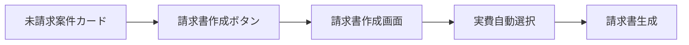
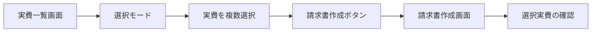

# 報酬管理画面 - 請求書作成連携設計

## 請求書作成への連携フロー

### 1. 連携パターン

#### パターン1: 案件単位での請求書作成
最も一般的なフロー。特定案件の未請求実費をまとめて請求書を作成。



#### パターン2: 複数実費選択からの請求書作成
詳細な制御が必要な場合。個別に実費を選択して請求書を作成。



### 2. データ受け渡し方法

#### URLパラメータ方式
```typescript
// 案件単位
/invoices/new?caseId=case_001&type=expenses

// 個別選択
/invoices/new?expenseIds=exp_001,exp_002,exp_003

// 複合
/invoices/new?caseId=case_001&expenseIds=exp_001,exp_002&includeUnbilled=true
```

#### セッションストレージ方式（大量データ時）
```typescript
// 実費選択画面
const selectedExpenses = [...] // 選択された実費
sessionStorage.setItem('invoice_expenses', JSON.stringify({
  expenses: selectedExpenses,
  timestamp: Date.now(),
  source: 'expense_list'
}))
navigateTo('/invoices/new?session=true')

// 請求書作成画面
const sessionData = sessionStorage.getItem('invoice_expenses')
if (sessionData) {
  const { expenses, timestamp } = JSON.parse(sessionData)
  // 5分以内のデータのみ有効
  if (Date.now() - timestamp < 5 * 60 * 1000) {
    loadExpenses(expenses)
  }
  sessionStorage.removeItem('invoice_expenses')
}
```

### 3. UI実装

#### 3.1 案件単位の請求書作成ボタン
```vue
<!-- components/expenses/InvoiceCreateButton.vue -->
<template>
  <Button
    :variant="variant"
    :size="size"
    @click="handleCreateInvoice"
    :disabled="isCreating"
  >
    <FileText class="h-4 w-4 mr-2" />
    {{ isCreating ? '作成中...' : '請求書作成' }}
  </Button>
</template>

<script setup lang="ts">
interface Props {
  caseId: string
  expenseIds?: string[]
  variant?: 'default' | 'outline' | 'ghost'
  size?: 'sm' | 'default' | 'lg'
}

const props = withDefaults(defineProps<Props>(), {
  variant: 'outline',
  size: 'sm'
})

const isCreating = ref(false)

const handleCreateInvoice = async () => {
  isCreating.value = true
  
  try {
    // 未請求実費の確認
    if (!props.expenseIds) {
      const { data } = await $fetch(`/api/v1/cases/${props.caseId}/expenses`, {
        params: { unbilled: true }
      })
      
      if (data.length === 0) {
        const { showToast } = useUIStore()
        showToast({
          type: 'warning',
          title: '未請求の実費がありません'
        })
        return
      }
      
      // 確認ダイアログ
      const confirmed = await confirm({
        title: '請求書を作成しますか？',
        description: `${data.length}件の実費（合計 ¥${data.reduce((sum, e) => sum + e.amount, 0).toLocaleString()}）を請求書に含めます。`
      })
      
      if (!confirmed) return
    }
    
    // 請求書作成画面へ遷移
    const params = new URLSearchParams()
    params.append('caseId', props.caseId)
    params.append('type', 'expenses')
    if (props.expenseIds) {
      params.append('expenseIds', props.expenseIds.join(','))
    }
    
    await navigateTo(`/invoices/new?${params.toString()}`)
  } finally {
    isCreating.value = false
  }
}
</script>
```

#### 3.2 複数選択モード
```vue
<!-- components/expenses/ExpenseSelectionList.vue -->
<template>
  <div class="expense-selection-list">
    <!-- 選択モードツールバー -->
    <div v-if="isSelectionMode" class="selection-toolbar">
      <Checkbox
        v-model="isAllSelected"
        @update:modelValue="toggleAllSelection"
      />
      <span class="selection-count">
        {{ selectedExpenses.length }}件選択
        （¥{{ selectedTotal.toLocaleString() }}）
      </span>
      <div class="selection-actions">
        <Button
          variant="default"
          size="sm"
          @click="createInvoiceFromSelection"
          :disabled="selectedExpenses.length === 0"
        >
          請求書作成
        </Button>
        <Button
          variant="outline"
          size="sm"
          @click="cancelSelection"
        >
          キャンセル
        </Button>
      </div>
    </div>
    
    <!-- 実費リスト -->
    <div class="expense-items">
      <div
        v-for="expense in expenses"
        :key="expense.id"
        class="expense-item"
        :class="{ 'selected': isSelected(expense.id) }"
      >
        <Checkbox
          v-if="isSelectionMode"
          :modelValue="isSelected(expense.id)"
          @update:modelValue="toggleSelection(expense.id)"
        />
        
        <ExpenseListItem
          :expense="expense"
          @click="handleItemClick(expense)"
        />
      </div>
    </div>
  </div>
</template>

<script setup lang="ts">
const props = defineProps<{
  expenses: Expense[]
}>()

const isSelectionMode = ref(false)
const selectedIds = ref<Set<string>>(new Set())

const selectedExpenses = computed(() => 
  props.expenses.filter(e => selectedIds.value.has(e.id))
)

const selectedTotal = computed(() => 
  selectedExpenses.value.reduce((sum, e) => sum + e.amount, 0)
)

const isAllSelected = computed({
  get: () => selectedIds.value.size === props.expenses.length && props.expenses.length > 0,
  set: (value) => {
    if (value) {
      props.expenses.forEach(e => selectedIds.value.add(e.id))
    } else {
      selectedIds.value.clear()
    }
  }
})

const toggleSelection = (id: string) => {
  if (selectedIds.value.has(id)) {
    selectedIds.value.delete(id)
  } else {
    selectedIds.value.add(id)
  }
}

const isSelected = (id: string) => selectedIds.value.has(id)

const createInvoiceFromSelection = async () => {
  if (selectedExpenses.value.length === 0) return
  
  // 複数案件にまたがる場合の確認
  const caseIds = new Set(selectedExpenses.value.map(e => e.caseId))
  if (caseIds.size > 1) {
    const confirmed = await confirm({
      title: '複数案件の実費が含まれています',
      description: '複数の案件の実費を1つの請求書にまとめますか？'
    })
    if (!confirmed) return
  }
  
  // セッションストレージに保存（大量データ対応）
  sessionStorage.setItem('invoice_expenses', JSON.stringify({
    expenses: selectedExpenses.value,
    timestamp: Date.now(),
    source: 'expense_selection'
  }))
  
  await navigateTo('/invoices/new?session=true')
}

const cancelSelection = () => {
  isSelectionMode.value = false
  selectedIds.value.clear()
}

const handleItemClick = (expense: Expense) => {
  if (isSelectionMode.value) {
    toggleSelection(expense.id)
  } else {
    // 通常モードでは編集
    editExpense(expense)
  }
}
</script>

<style scoped>
.selection-toolbar {
  @apply sticky top-0 z-10 bg-background border-b p-3
         flex items-center gap-3;
}

.selection-count {
  @apply flex-1 text-sm;
}

.selection-actions {
  @apply flex gap-2;
}

.expense-item {
  @apply flex items-center gap-3 p-2 border-b
         hover:bg-accent cursor-pointer;
  
  &.selected {
    @apply bg-accent;
  }
}
</style>
```

### 4. 請求書作成画面での実費受け取り

```vue
<!-- pages/invoices/new.vue -->
<script setup lang="ts">
const route = useRoute()

// パラメータから実費情報を取得
const initializeExpenses = async () => {
  const { caseId, expenseIds, session } = route.query
  
  let expenses: Expense[] = []
  
  if (session === 'true') {
    // セッションストレージから取得
    const sessionData = sessionStorage.getItem('invoice_expenses')
    if (sessionData) {
      const { expenses: sessionExpenses, timestamp } = JSON.parse(sessionData)
      // 5分以内のデータのみ有効
      if (Date.now() - timestamp < 5 * 60 * 1000) {
        expenses = sessionExpenses
      }
      sessionStorage.removeItem('invoice_expenses')
    }
  } else if (expenseIds) {
    // IDリストから取得
    const ids = String(expenseIds).split(',')
    const { data } = await $fetch('/api/v1/expenses', {
      params: { ids: ids.join(',') }
    })
    expenses = data
  } else if (caseId) {
    // 案件の未請求実費を取得
    const { data } = await $fetch(`/api/v1/cases/${caseId}/expenses`, {
      params: { unbilled: true }
    })
    expenses = data
  }
  
  // 請求書フォームに実費を設定
  invoiceForm.expenses = expenses
  invoiceForm.items = convertExpensesToInvoiceItems(expenses)
}

onMounted(() => {
  initializeExpenses()
})
</script>
```

### 5. 状態管理

```typescript
// stores/invoiceCreation.ts
export const useInvoiceCreationStore = defineStore('invoiceCreation', {
  state: () => ({
    sourceExpenses: [] as Expense[],
    invoiceItems: [] as InvoiceItem[],
    caseId: null as string | null,
    clientId: null as string | null,
  }),
  
  actions: {
    setExpenses(expenses: Expense[]) {
      this.sourceExpenses = expenses
      this.invoiceItems = this.convertToInvoiceItems(expenses)
      
      // 案件・クライアント情報を抽出
      if (expenses.length > 0) {
        this.caseId = expenses[0].caseId
        this.clientId = expenses[0].clientId
      }
    },
    
    convertToInvoiceItems(expenses: Expense[]): InvoiceItem[] {
      // 勘定科目ごとにグループ化
      const grouped = groupBy(expenses, 'accountCode')
      
      return Object.entries(grouped).map(([accountCode, items]) => ({
        type: 'expense',
        description: `${items[0].accountName}（${items.length}件）`,
        quantity: 1,
        unitPrice: items.reduce((sum, e) => sum + e.amount, 0),
        amount: items.reduce((sum, e) => sum + e.amount, 0),
        hasWithholding: false,
        expenseIds: items.map(e => e.id)
      }))
    },
    
    clearState() {
      this.$reset()
    }
  }
})
```

### 6. 実費の請求済みマーキング

請求書作成後、含まれた実費を請求済みとしてマークする。

```typescript
// 請求書保存時
const saveInvoice = async (invoiceData: InvoiceFormData) => {
  const { data: invoice } = await $fetch('/api/v1/invoices', {
    method: 'POST',
    body: invoiceData
  })
  
  // 実費を請求済みにマーク
  if (invoiceData.expenseIds?.length) {
    await $fetch('/api/v1/expenses/mark-as-billed', {
      method: 'POST',
      body: {
        expenseIds: invoiceData.expenseIds,
        invoiceId: invoice.id
      }
    })
  }
  
  return invoice
}
```