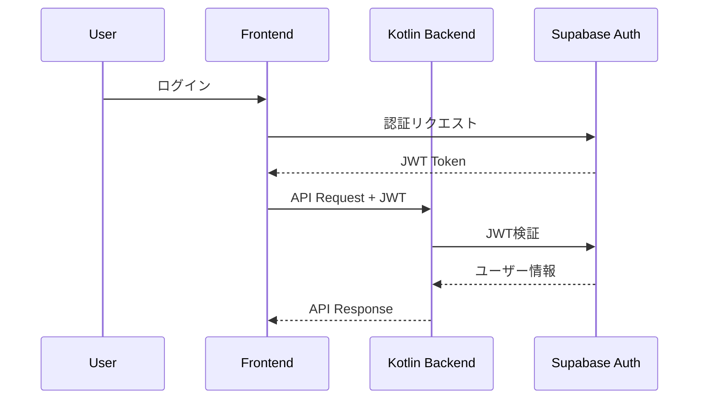

# Astar Management 全体設計レビュー

## 1. プロジェクト概要

### 1.1 システム概要
- **プロダクト名**: Astar Management (アスター・マネジメント)
- **対象**: 小中規模法律事務所（1-10名）のDX実現
- **フェーズ**: MVP開発段階

### 1.2 主要機能（実装優先順位）
**Phase 1 (優先実装)**:
1. **案件管理**: カンバン形式 & テーブル形式での進捗可視化
2. **実費管理**: 簡単な入力フォームと多角的な統計機能

**Phase 2 (後期実装)**:
1. **顧客管理**: 時系列での顧客対応履歴
2. **文書管理**: VSCode風書類編集とテンプレート変数埋め込み

## 2. 技術スタック選定

### 2.1 アーキテクチャ概要
```
┌─────────────────────────────────────────────────────┐
│                   Frontend (Vue.js)                  │
│  - Nuxt 3 + TypeScript                              │
│  - Pinia (State Management)                         │
│  - shadcn/ui + Tailwind CSS                        │
│  - i18n (日本語/英語)                              │
└─────────────────────────────────────────────────────┘
                            ↓
┌─────────────────────────────────────────────────────┐
│              Backend (Kotlin Spring Boot)            │
│  - Spring WebFlux (Reactive)                        │
│  - JWT認証 (Supabase Auth連携)                      │
│  - RESTful API                                     │
│  - Flyway (マイグレーション)                       │
└─────────────────────────────────────────────────────┘
                            ↓
┌─────────────────────────────────────────────────────┐
│          Database & Auth (Supabase)                  │
│  - PostgreSQL + Row Level Security                  │
│  - Supabase Auth (認証)                            │
│  - Supabase Storage (ファイル)                     │
│  - Multi-tenant (Shared DB + RLS)                  │
└─────────────────────────────────────────────────────┘
```

### 2.2 技術選定の理由

#### Supabase Auth採用の決定的要因
1. **開発速度**: 認証基盤の構築が不要
2. **セキュリティ**: 業界標準の認証実装
3. **マルチテナント**: RLSによる確実なデータ分離
4. **コスト効率**: MVPフェーズでの低コスト運用

#### Kotlin採用の理由
1. **型安全性**: Null安全性によるバグ削減
2. **Java互換**: 既存のJavaライブラリ活用可能
3. **モダン言語**: コルーチン、拡張関数等
4. **Spring Boot**: 成熟したエコシステム

## 3. 認証・権限設計

### 3.1 認証フロー


### 3.2 権限モデル
- **Discord風**: ロールは権限の集合体
- **基本ロール**: admin, lawyer, paralegal, member
- **将来拡張**: テナント毎のカスタムロール対応

### 3.3 マルチテナント実装
- **Shared Database + RLS**: MVPでの最適解
- **tenant_id**: 全テーブルで管理
- **自動フィルタリング**: RLSポリシーで実現

## 4. 実費管理システム設計

### 4.1 データモデル設計の変更点

#### 残高管理の再設計
**Before**: 各レコードで累計残高を保持
```sql
-- 問題: N件の再計算が必要
expenses (
  id, date, amount, balance -- 累計残高
)
```

**After**: 月次サマリーテーブル
```sql
-- 解決: O(1)での残高取得
expense_monthly_balances (
  year_month, opening_balance, 
  total_income, total_expense, closing_balance
)
```

### 4.2 主要機能

#### 入力方式（優先順位順）
1. **モバイル単発入力**: 外出先での即時入力
2. **CSV一括取込**: クレジットカード明細等
   - テーブル形式
   - カードスワイプ形式（単語帳風）
3. **PC一括入力**: 月次締め作業

#### タグシステム
- **2階層**: テナントタグ / 個人タグ
- **柔軟性**: 絵文字対応、カラーコード
- **使用統計**: 頻度によるサジェスト

### 4.3 API設計の特徴

#### N+1問題の回避
```json
// 関連データを埋め込んだレスポンス
{
  "expense": {
    "id": "exp-001",
    "case": { "id": "case-001", "name": "A社案件" },
    "tags": [
      { "id": "tag-001", "name": "🚄 出張" }
    ]
  }
}
```

#### 長期ファイル保持
- **30日間保持**: 月末まとめ入力対応
- **事前アップロード**: 実費作成前に可能
- **自動サムネイル**: 画像の確認用

## 5. エラーハンドリング戦略

### 5.1 エラーレスポンス設計
```kotlin
// 開発環境: 詳細情報付き
{
  "error": {
    "code": "EXPENSE_VALIDATION_ERROR",
    "debug": { "stackTrace": "..." }
  }
}

// 本番環境: エラーIDのみ
{
  "error": {
    "code": "EXPENSE_VALIDATION_ERROR",
    "errorId": "err-550e8400"
  }
}
```

### 5.2 リトライ戦略
- **ネットワークエラー**: 3回リトライ（間隔0）
- **業務エラー**: リトライなし
- **レート制限**: 適切な待機時間

## 6. データベースマイグレーション戦略

### 6.1 段階的移行
```
MVP: Supabase Migrations (高速開発)
  ↓
Production: Flyway (エンタープライズ標準)
```

### 6.2 マイグレーション原則
- **Forward-only**: ロールバック不可
- **小さな変更**: 1マイグレーション1目的
- **安全な変更**: NOT NULL追加は2段階

## 7. 開発優先順位とタイムライン

### Phase 1 (MVP - 3ヶ月)
1. **Month 1**: 基盤構築
   - Kotlin Backend セットアップ
   - Supabase Auth連携
   - 基本的なCRUD API

2. **Month 2**: 実費管理機能
   - 単発入力画面
   - CSV取込機能
   - 基本的な集計

3. **Month 3**: UI/UX改善
   - モバイル最適化
   - エラーハンドリング
   - パフォーマンス調整

### Phase 2 (拡張 - 3ヶ月)
- 案件管理のカンバン
- 顧客管理機能
- 高度な分析機能

## 8. リスクと対策

### 8.1 技術的リスク
| リスク | 影響度 | 対策 |
|--------|--------|------|
| Supabase制限 | 中 | 早期にFlywayへ移行準備 |
| パフォーマンス | 高 | 月次サマリーで対処済み |
| セキュリティ | 高 | RLS + JWT二重防御 |

### 8.2 ビジネスリスク
| リスク | 影響度 | 対策 |
|--------|--------|------|
| 機能過多 | 高 | MVP機能に集中 |
| UX複雑化 | 中 | モバイルファースト |
| 採用障壁 | 低 | 段階的導入サポート |

## 9. 成功指標（KPI）

### 技術指標
- API応答時間: < 200ms (95%ile)
- エラー率: < 0.1%
- 可用性: 99.9%

### ビジネス指標
- 月次締め時間: 50%削減
- データ入力ミス: 80%削減
- ユーザー満足度: 4.0以上/5.0

## 10. 次のアクション

### 即時着手項目
1. Kotlinプロジェクトの初期セットアップ
2. Supabase環境の構築
3. CI/CDパイプラインの設定

### 設計レビュー項目
1. APIエンドポイントの最終確認
2. データベーススキーマの検証
3. セキュリティ監査の準備

## 11. 結論

本設計は以下の原則に基づいて策定されました：

1. **Simple over Easy**: 過度な抽象化を避ける
2. **開発速度優先**: MVPでの価値検証
3. **段階的成長**: 将来の拡張性確保
4. **業界標準準拠**: 保守性の確保

これらの設計により、3ヶ月でのMVPリリースと、その後の段階的な機能拡張が可能となります。