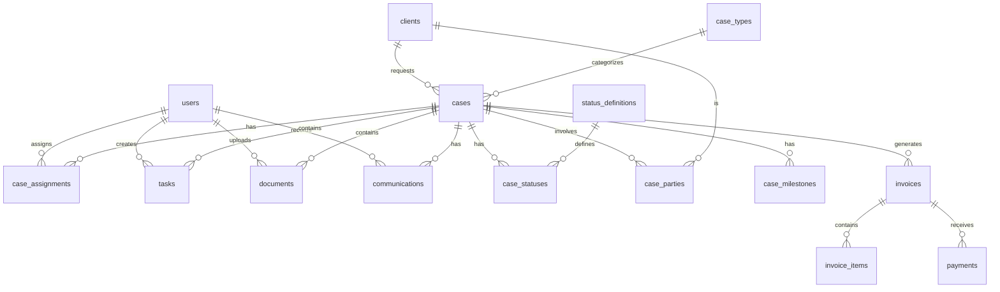

# データモデル設計書

## 1. 設計方針

### 1.1 基本原則
- **正規化**: 第3正規形を基本とし、パフォーマンスを考慮して適切に非正規化
- **拡張性**: 将来の機能追加を考慮した柔軟な設計
- **監査対応**: 全テーブルに監査用カラムを追加
- **論理削除**: 物理削除は行わず、deleted_atフラグで管理
- **履歴管理**: 重要な変更は履歴テーブルで管理

### 1.2 命名規則
- **テーブル名**: 複数形、snake_case（例: cases, users, documents）
- **カラム名**: snake_case
- **主キー**: id (UUID型)
- **外部キー**: 参照テーブル名の単数形_id（例: case_id, user_id）
- **日時**: _at suffix（例: created_at, updated_at）
- **フラグ**: is_ prefix（例: is_active, is_primary）

### 1.3 共通カラム
```sql
-- 全テーブルに含める監査カラム
id UUID PRIMARY KEY DEFAULT gen_random_uuid(),
created_at TIMESTAMP NOT NULL DEFAULT CURRENT_TIMESTAMP,
created_by UUID NOT NULL,
updated_at TIMESTAMP NOT NULL DEFAULT CURRENT_TIMESTAMP,
updated_by UUID NOT NULL,
deleted_at TIMESTAMP,
deleted_by UUID,
version INTEGER NOT NULL DEFAULT 0  -- 楽観的ロック用
```

## 2. ER図



## 3. テーブル定義（最終決定版）

### 3.1 ユーザー管理

#### users（ユーザー）
```sql
CREATE TABLE users (
    id UUID PRIMARY KEY DEFAULT gen_random_uuid(),
    email VARCHAR(255) UNIQUE NOT NULL,
    password_hash VARCHAR(255) NOT NULL,
    name VARCHAR(100) NOT NULL,
    name_kana VARCHAR(100),
    role VARCHAR(50) NOT NULL, -- 'admin', 'lawyer', 'clerk'
    phone VARCHAR(20),
    is_active BOOLEAN DEFAULT TRUE,
    last_login_at TIMESTAMP,
    two_factor_enabled BOOLEAN DEFAULT FALSE,
    two_factor_secret VARCHAR(255),
    -- 共通カラム
    created_at TIMESTAMP NOT NULL DEFAULT CURRENT_TIMESTAMP,
    created_by UUID NOT NULL,
    updated_at TIMESTAMP NOT NULL DEFAULT CURRENT_TIMESTAMP,
    updated_by UUID NOT NULL,
    deleted_at TIMESTAMP,
    deleted_by UUID,
    version INTEGER NOT NULL DEFAULT 0
);

CREATE INDEX idx_users_email ON users(email) WHERE deleted_at IS NULL;
CREATE INDEX idx_users_role ON users(role) WHERE deleted_at IS NULL;
```

#### user_sessions（セッション）
```sql
CREATE TABLE user_sessions (
    id UUID PRIMARY KEY DEFAULT gen_random_uuid(),
    user_id UUID NOT NULL,
    token_hash VARCHAR(255) UNIQUE NOT NULL,
    ip_address INET,
    user_agent TEXT,
    expires_at TIMESTAMP NOT NULL,
    created_at TIMESTAMP NOT NULL DEFAULT CURRENT_TIMESTAMP,
    FOREIGN KEY (user_id) REFERENCES users(id)
);

CREATE INDEX idx_user_sessions_token ON user_sessions(token_hash);
CREATE INDEX idx_user_sessions_expires ON user_sessions(expires_at);
```

### 3.2 顧客管理

#### clients（顧客）
```sql
CREATE TABLE clients (
    id UUID PRIMARY KEY DEFAULT gen_random_uuid(),
    client_code VARCHAR(50) UNIQUE NOT NULL,
    name VARCHAR(255) NOT NULL,
    name_kana VARCHAR(255),
    client_type VARCHAR(50) NOT NULL, -- 'individual', 'corporate'
    -- 個人の場合
    birth_date DATE,
    gender VARCHAR(10),
    -- 法人の場合
    company_name VARCHAR(255),
    representative_name VARCHAR(100),
    -- 共通
    email VARCHAR(255),
    phone VARCHAR(20),
    mobile VARCHAR(20),
    fax VARCHAR(20),
    postal_code VARCHAR(10),
    address TEXT,
    notes TEXT,
    -- 共通カラム
    created_at TIMESTAMP NOT NULL DEFAULT CURRENT_TIMESTAMP,
    created_by UUID NOT NULL,
    updated_at TIMESTAMP NOT NULL DEFAULT CURRENT_TIMESTAMP,
    updated_by UUID NOT NULL,
    deleted_at TIMESTAMP,
    deleted_by UUID,
    version INTEGER NOT NULL DEFAULT 0
);

CREATE INDEX idx_clients_code ON clients(client_code) WHERE deleted_at IS NULL;
CREATE INDEX idx_clients_name ON clients(name) WHERE deleted_at IS NULL;
```

### 3.3 案件管理（タグベース統一設計）

#### tag_categories（タグカテゴリー）
```sql
CREATE TABLE tag_categories (
    id UUID PRIMARY KEY DEFAULT gen_random_uuid(),
    tenant_id UUID NOT NULL,
    code VARCHAR(50) NOT NULL,
    name VARCHAR(100) NOT NULL,
    is_exclusive BOOLEAN DEFAULT FALSE,  -- 排他的（1つしか選べない）
    is_required BOOLEAN DEFAULT FALSE,   -- 必須
    display_order INTEGER NOT NULL DEFAULT 0,
    created_at TIMESTAMP NOT NULL DEFAULT CURRENT_TIMESTAMP,
    
    CONSTRAINT unique_category_per_tenant UNIQUE (tenant_id, code)
);
```

#### tags（統一タグテーブル）
```sql
CREATE TABLE tags (
    id UUID PRIMARY KEY DEFAULT gen_random_uuid(),
    tenant_id UUID NOT NULL,
    category_id UUID REFERENCES tag_categories(id) ON DELETE CASCADE,
    name VARCHAR(100) NOT NULL,
    color VARCHAR(7) DEFAULT '#808080',
    display_order INTEGER DEFAULT 0,
    last_used_at TIMESTAMP,
    created_by UUID NOT NULL,
    created_at TIMESTAMP NOT NULL DEFAULT CURRENT_TIMESTAMP,
    
    CONSTRAINT unique_tag_per_category UNIQUE (tenant_id, category_id, name)
);
```

#### cases（案件）
```sql
CREATE TABLE cases (
    id UUID PRIMARY KEY DEFAULT gen_random_uuid(),
    -- 案件番号（フォーマット: YYYY-MM-NNN）
    case_number_year INTEGER NOT NULL,
    case_number_month INTEGER NOT NULL,
    case_number_sequence INTEGER NOT NULL,
    title VARCHAR(255) NOT NULL,
    case_type_id UUID NOT NULL,
    client_id UUID NOT NULL,
    opponent_name VARCHAR(255),
    opponent_attorney VARCHAR(255),
    court_name VARCHAR(255),
    case_court_number VARCHAR(100),
    current_status VARCHAR(50) NOT NULL,
    accepted_date DATE NOT NULL,
    closed_date DATE,
    summary TEXT,
    internal_notes TEXT,
    fee_structure TEXT, -- 報酬体系の説明
    retainer_fee DECIMAL(12, 2), -- 着手金
    success_fee_rate DECIMAL(5, 2), -- 成功報酬率
    -- 共通カラム
    created_at TIMESTAMP NOT NULL DEFAULT CURRENT_TIMESTAMP,
    created_by UUID NOT NULL,
    updated_at TIMESTAMP NOT NULL DEFAULT CURRENT_TIMESTAMP,
    updated_by UUID NOT NULL,
    deleted_at TIMESTAMP,
    deleted_by UUID,
    version INTEGER NOT NULL DEFAULT 0,
    FOREIGN KEY (case_type_id) REFERENCES case_types(id),
    FOREIGN KEY (client_id) REFERENCES clients(id)
);

CREATE INDEX idx_cases_number ON cases(case_number) WHERE deleted_at IS NULL;
CREATE INDEX idx_cases_client ON cases(client_id) WHERE deleted_at IS NULL;
CREATE INDEX idx_cases_status ON cases(current_status) WHERE deleted_at IS NULL;
CREATE INDEX idx_cases_accepted ON cases(accepted_date) WHERE deleted_at IS NULL;
```

#### case_parties（案件関係者）
```sql
CREATE TABLE case_parties (
    id UUID PRIMARY KEY DEFAULT gen_random_uuid(),
    case_id UUID NOT NULL,
    party_type VARCHAR(50) NOT NULL, -- 'client', 'opponent', 'witness', 'other'
    name VARCHAR(255) NOT NULL,
    name_kana VARCHAR(255),
    role VARCHAR(100),
    contact_info TEXT,
    notes TEXT,
    -- 共通カラム
    created_at TIMESTAMP NOT NULL DEFAULT CURRENT_TIMESTAMP,
    created_by UUID NOT NULL,
    updated_at TIMESTAMP NOT NULL DEFAULT CURRENT_TIMESTAMP,
    updated_by UUID NOT NULL,
    deleted_at TIMESTAMP,
    deleted_by UUID,
    version INTEGER NOT NULL DEFAULT 0,
    FOREIGN KEY (case_id) REFERENCES cases(id)
);

CREATE INDEX idx_case_parties_case ON case_parties(case_id) WHERE deleted_at IS NULL;
```

#### case_assignments（案件担当者）
```sql
CREATE TABLE case_assignments (
    id UUID PRIMARY KEY DEFAULT gen_random_uuid(),
    case_id UUID NOT NULL,
    user_id UUID NOT NULL,
    role VARCHAR(50) NOT NULL, -- 'primary_lawyer', 'support_lawyer', 'clerk'
    assigned_date DATE NOT NULL,
    unassigned_date DATE,
    is_active BOOLEAN DEFAULT TRUE,
    notes TEXT,
    -- 共通カラム
    created_at TIMESTAMP NOT NULL DEFAULT CURRENT_TIMESTAMP,
    created_by UUID NOT NULL,
    updated_at TIMESTAMP NOT NULL DEFAULT CURRENT_TIMESTAMP,
    updated_by UUID NOT NULL,
    deleted_at TIMESTAMP,
    deleted_by UUID,
    version INTEGER NOT NULL DEFAULT 0,
    FOREIGN KEY (case_id) REFERENCES cases(id),
    FOREIGN KEY (user_id) REFERENCES users(id),
    UNIQUE(case_id, user_id, role) WHERE deleted_at IS NULL
);

CREATE INDEX idx_case_assignments_case ON case_assignments(case_id) WHERE deleted_at IS NULL;
CREATE INDEX idx_case_assignments_user ON case_assignments(user_id) WHERE deleted_at IS NULL;
```

#### status_definitions（ステータス定義）
```sql
CREATE TABLE status_definitions (
    id UUID PRIMARY KEY DEFAULT gen_random_uuid(),
    code VARCHAR(50) UNIQUE NOT NULL,
    name VARCHAR(100) NOT NULL,
    category VARCHAR(50) NOT NULL, -- 'initial', 'progress', 'final'
    color VARCHAR(7) NOT NULL, -- HEXカラーコード
    display_order INTEGER NOT NULL,
    is_active BOOLEAN DEFAULT TRUE,
    created_at TIMESTAMP NOT NULL DEFAULT CURRENT_TIMESTAMP,
    updated_at TIMESTAMP NOT NULL DEFAULT CURRENT_TIMESTAMP
);
```

#### case_statuses（案件ステータス履歴）
```sql
CREATE TABLE case_statuses (
    id UUID PRIMARY KEY DEFAULT gen_random_uuid(),
    case_id UUID NOT NULL,
    status_code VARCHAR(50) NOT NULL,
    changed_date TIMESTAMP NOT NULL,
    reason TEXT,
    notes TEXT,
    -- 共通カラム
    created_at TIMESTAMP NOT NULL DEFAULT CURRENT_TIMESTAMP,
    created_by UUID NOT NULL,
    FOREIGN KEY (case_id) REFERENCES cases(id)
);

CREATE INDEX idx_case_statuses_case ON case_statuses(case_id);
CREATE INDEX idx_case_statuses_date ON case_statuses(changed_date);
```

#### case_milestones（マイルストーン）
```sql
CREATE TABLE case_milestones (
    id UUID PRIMARY KEY DEFAULT gen_random_uuid(),
    case_id UUID NOT NULL,
    milestone_name VARCHAR(255) NOT NULL,
    milestone_type VARCHAR(50) NOT NULL, -- 'court_date', 'deadline', 'internal'
    scheduled_date DATE NOT NULL,
    completed_date DATE,
    is_completed BOOLEAN DEFAULT FALSE,
    description TEXT,
    alert_days_before INTEGER DEFAULT 3,
    -- 共通カラム
    created_at TIMESTAMP NOT NULL DEFAULT CURRENT_TIMESTAMP,
    created_by UUID NOT NULL,
    updated_at TIMESTAMP NOT NULL DEFAULT CURRENT_TIMESTAMP,
    updated_by UUID NOT NULL,
    deleted_at TIMESTAMP,
    deleted_by UUID,
    version INTEGER NOT NULL DEFAULT 0,
    FOREIGN KEY (case_id) REFERENCES cases(id)
);

CREATE INDEX idx_case_milestones_case ON case_milestones(case_id) WHERE deleted_at IS NULL;
CREATE INDEX idx_case_milestones_date ON case_milestones(scheduled_date) WHERE deleted_at IS NULL;
```

### 3.4 タスク管理

#### tasks（タスク）
```sql
CREATE TABLE tasks (
    id UUID PRIMARY KEY DEFAULT gen_random_uuid(),
    case_id UUID NOT NULL,
    parent_task_id UUID,
    title VARCHAR(255) NOT NULL,
    description TEXT,
    assignee_id UUID NOT NULL,
    priority VARCHAR(20) NOT NULL, -- 'high', 'medium', 'low'
    status VARCHAR(50) NOT NULL, -- 'todo', 'in_progress', 'done', 'cancelled'
    due_date DATE,
    completed_date TIMESTAMP,
    estimated_hours DECIMAL(5, 2),
    actual_hours DECIMAL(5, 2),
    -- 共通カラム
    created_at TIMESTAMP NOT NULL DEFAULT CURRENT_TIMESTAMP,
    created_by UUID NOT NULL,
    updated_at TIMESTAMP NOT NULL DEFAULT CURRENT_TIMESTAMP,
    updated_by UUID NOT NULL,
    deleted_at TIMESTAMP,
    deleted_by UUID,
    version INTEGER NOT NULL DEFAULT 0,
    FOREIGN KEY (case_id) REFERENCES cases(id),
    FOREIGN KEY (parent_task_id) REFERENCES tasks(id),
    FOREIGN KEY (assignee_id) REFERENCES users(id)
);

CREATE INDEX idx_tasks_case ON tasks(case_id) WHERE deleted_at IS NULL;
CREATE INDEX idx_tasks_assignee ON tasks(assignee_id) WHERE deleted_at IS NULL;
CREATE INDEX idx_tasks_status ON tasks(status) WHERE deleted_at IS NULL;
CREATE INDEX idx_tasks_due ON tasks(due_date) WHERE deleted_at IS NULL;
```

### 3.5 書類管理

#### documents（書類）
```sql
CREATE TABLE documents (
    id UUID PRIMARY KEY DEFAULT gen_random_uuid(),
    case_id UUID NOT NULL,
    document_number VARCHAR(100) UNIQUE NOT NULL,
    title VARCHAR(255) NOT NULL,
    document_type VARCHAR(50) NOT NULL, -- 'court', 'contract', 'evidence', 'memo', 'other'
    file_name VARCHAR(255) NOT NULL,
    file_path TEXT NOT NULL,
    file_size BIGINT NOT NULL,
    mime_type VARCHAR(100) NOT NULL,
    document_date DATE,
    is_confidential BOOLEAN DEFAULT FALSE,
    description TEXT,
    tags TEXT[], -- PostgreSQL配列型
    -- 共通カラム
    created_at TIMESTAMP NOT NULL DEFAULT CURRENT_TIMESTAMP,
    created_by UUID NOT NULL,
    updated_at TIMESTAMP NOT NULL DEFAULT CURRENT_TIMESTAMP,
    updated_by UUID NOT NULL,
    deleted_at TIMESTAMP,
    deleted_by UUID,
    version INTEGER NOT NULL DEFAULT 0,
    FOREIGN KEY (case_id) REFERENCES cases(id)
);

CREATE INDEX idx_documents_case ON documents(case_id) WHERE deleted_at IS NULL;
CREATE INDEX idx_documents_type ON documents(document_type) WHERE deleted_at IS NULL;
CREATE INDEX idx_documents_tags ON documents USING GIN(tags) WHERE deleted_at IS NULL;
```

#### document_versions（書類バージョン）
```sql
CREATE TABLE document_versions (
    id UUID PRIMARY KEY DEFAULT gen_random_uuid(),
    document_id UUID NOT NULL,
    version_number INTEGER NOT NULL,
    file_path TEXT NOT NULL,
    file_size BIGINT NOT NULL,
    change_summary TEXT,
    created_at TIMESTAMP NOT NULL DEFAULT CURRENT_TIMESTAMP,
    created_by UUID NOT NULL,
    FOREIGN KEY (document_id) REFERENCES documents(id)
);

CREATE INDEX idx_document_versions_doc ON document_versions(document_id);
```

### 3.6 コミュニケーション管理

#### communications（コミュニケーション履歴）
```sql
CREATE TABLE communications (
    id UUID PRIMARY KEY DEFAULT gen_random_uuid(),
    case_id UUID NOT NULL,
    communication_type VARCHAR(50) NOT NULL, -- 'email', 'phone', 'meeting', 'letter', 'fax'
    direction VARCHAR(20) NOT NULL, -- 'inbound', 'outbound'
    subject VARCHAR(255),
    summary TEXT NOT NULL,
    occurred_at TIMESTAMP NOT NULL,
    duration_minutes INTEGER, -- 電話・会議の場合
    participants TEXT[],
    attachments JSONB, -- 添付ファイル情報
    -- 共通カラム
    created_at TIMESTAMP NOT NULL DEFAULT CURRENT_TIMESTAMP,
    created_by UUID NOT NULL,
    updated_at TIMESTAMP NOT NULL DEFAULT CURRENT_TIMESTAMP,
    updated_by UUID NOT NULL,
    deleted_at TIMESTAMP,
    deleted_by UUID,
    version INTEGER NOT NULL DEFAULT 0,
    FOREIGN KEY (case_id) REFERENCES cases(id)
);

CREATE INDEX idx_communications_case ON communications(case_id) WHERE deleted_at IS NULL;
CREATE INDEX idx_communications_date ON communications(occurred_at) WHERE deleted_at IS NULL;
CREATE INDEX idx_communications_type ON communications(communication_type) WHERE deleted_at IS NULL;
```

### 3.7 報酬・請求管理

#### invoices（請求書）
```sql
CREATE TABLE invoices (
    id UUID PRIMARY KEY DEFAULT gen_random_uuid(),
    invoice_number VARCHAR(50) UNIQUE NOT NULL,
    case_id UUID NOT NULL,
    client_id UUID NOT NULL,
    invoice_type VARCHAR(50) NOT NULL, -- 'retainer', 'progress', 'success', 'expense'
    issue_date DATE NOT NULL,
    due_date DATE NOT NULL,
    subtotal DECIMAL(12, 2) NOT NULL,
    tax_amount DECIMAL(12, 2) NOT NULL,
    total_amount DECIMAL(12, 2) NOT NULL,
    status VARCHAR(50) NOT NULL, -- 'draft', 'sent', 'paid', 'overdue', 'cancelled'
    paid_date DATE,
    notes TEXT,
    -- 共通カラム
    created_at TIMESTAMP NOT NULL DEFAULT CURRENT_TIMESTAMP,
    created_by UUID NOT NULL,
    updated_at TIMESTAMP NOT NULL DEFAULT CURRENT_TIMESTAMP,
    updated_by UUID NOT NULL,
    deleted_at TIMESTAMP,
    deleted_by UUID,
    version INTEGER NOT NULL DEFAULT 0,
    FOREIGN KEY (case_id) REFERENCES cases(id),
    FOREIGN KEY (client_id) REFERENCES clients(id)
);

CREATE INDEX idx_invoices_number ON invoices(invoice_number) WHERE deleted_at IS NULL;
CREATE INDEX idx_invoices_case ON invoices(case_id) WHERE deleted_at IS NULL;
CREATE INDEX idx_invoices_client ON invoices(client_id) WHERE deleted_at IS NULL;
CREATE INDEX idx_invoices_status ON invoices(status) WHERE deleted_at IS NULL;
```

#### invoice_items（請求明細）
```sql
CREATE TABLE invoice_items (
    id UUID PRIMARY KEY DEFAULT gen_random_uuid(),
    invoice_id UUID NOT NULL,
    item_type VARCHAR(50) NOT NULL, -- 'fee', 'expense', 'other'
    description TEXT NOT NULL,
    quantity DECIMAL(10, 2) NOT NULL DEFAULT 1,
    unit_price DECIMAL(12, 2) NOT NULL,
    amount DECIMAL(12, 2) NOT NULL,
    tax_rate DECIMAL(5, 2) NOT NULL DEFAULT 10.0,
    display_order INTEGER NOT NULL,
    created_at TIMESTAMP NOT NULL DEFAULT CURRENT_TIMESTAMP,
    FOREIGN KEY (invoice_id) REFERENCES invoices(id)
);

CREATE INDEX idx_invoice_items_invoice ON invoice_items(invoice_id);
```

#### payments（入金）
```sql
CREATE TABLE payments (
    id UUID PRIMARY KEY DEFAULT gen_random_uuid(),
    invoice_id UUID NOT NULL,
    payment_date DATE NOT NULL,
    amount DECIMAL(12, 2) NOT NULL,
    payment_method VARCHAR(50) NOT NULL, -- 'bank_transfer', 'cash', 'check', 'other'
    reference_number VARCHAR(100),
    notes TEXT,
    -- 共通カラム
    created_at TIMESTAMP NOT NULL DEFAULT CURRENT_TIMESTAMP,
    created_by UUID NOT NULL,
    updated_at TIMESTAMP NOT NULL DEFAULT CURRENT_TIMESTAMP,
    updated_by UUID NOT NULL,
    deleted_at TIMESTAMP,
    deleted_by UUID,
    version INTEGER NOT NULL DEFAULT 0,
    FOREIGN KEY (invoice_id) REFERENCES invoices(id)
);

CREATE INDEX idx_payments_invoice ON payments(invoice_id) WHERE deleted_at IS NULL;
CREATE INDEX idx_payments_date ON payments(payment_date) WHERE deleted_at IS NULL;
```

#### expenses（経費）
```sql
CREATE TABLE expenses (
    id UUID PRIMARY KEY DEFAULT gen_random_uuid(),
    case_id UUID NOT NULL,
    expense_date DATE NOT NULL,
    expense_type VARCHAR(50) NOT NULL, -- 'transportation', 'copying', 'postage', 'court_fee', 'other'
    description TEXT NOT NULL,
    amount DECIMAL(12, 2) NOT NULL,
    is_billable BOOLEAN DEFAULT TRUE,
    invoice_id UUID,
    receipt_path TEXT,
    -- 共通カラム
    created_at TIMESTAMP NOT NULL DEFAULT CURRENT_TIMESTAMP,
    created_by UUID NOT NULL,
    updated_at TIMESTAMP NOT NULL DEFAULT CURRENT_TIMESTAMP,
    updated_by UUID NOT NULL,
    deleted_at TIMESTAMP,
    deleted_by UUID,
    version INTEGER NOT NULL DEFAULT 0,
    FOREIGN KEY (case_id) REFERENCES cases(id),
    FOREIGN KEY (invoice_id) REFERENCES invoices(id)
);

CREATE INDEX idx_expenses_case ON expenses(case_id) WHERE deleted_at IS NULL;
CREATE INDEX idx_expenses_date ON expenses(expense_date) WHERE deleted_at IS NULL;
CREATE INDEX idx_expenses_billable ON expenses(is_billable) WHERE deleted_at IS NULL;
```

### 3.8 システム管理

#### audit_logs（監査ログ）
```sql
CREATE TABLE audit_logs (
    id UUID PRIMARY KEY DEFAULT gen_random_uuid(),
    table_name VARCHAR(100) NOT NULL,
    record_id UUID NOT NULL,
    action VARCHAR(50) NOT NULL, -- 'create', 'update', 'delete', 'view'
    changes JSONB,
    user_id UUID NOT NULL,
    ip_address INET,
    user_agent TEXT,
    created_at TIMESTAMP NOT NULL DEFAULT CURRENT_TIMESTAMP
);

CREATE INDEX idx_audit_logs_table ON audit_logs(table_name);
CREATE INDEX idx_audit_logs_record ON audit_logs(record_id);
CREATE INDEX idx_audit_logs_user ON audit_logs(user_id);
CREATE INDEX idx_audit_logs_date ON audit_logs(created_at);
```

#### system_settings（システム設定）
```sql
CREATE TABLE system_settings (
    id UUID PRIMARY KEY DEFAULT gen_random_uuid(),
    setting_key VARCHAR(100) UNIQUE NOT NULL,
    setting_value TEXT NOT NULL,
    setting_type VARCHAR(50) NOT NULL, -- 'string', 'number', 'boolean', 'json'
    description TEXT,
    is_encrypted BOOLEAN DEFAULT FALSE,
    created_at TIMESTAMP NOT NULL DEFAULT CURRENT_TIMESTAMP,
    updated_at TIMESTAMP NOT NULL DEFAULT CURRENT_TIMESTAMP,
    updated_by UUID NOT NULL
);

CREATE INDEX idx_system_settings_key ON system_settings(setting_key);
```

## 4. インデックス戦略

### 4.1 基本方針
- 主キーには自動的にインデックスが作成される
- 外部キーには原則インデックスを作成
- WHERE句で頻繁に使用されるカラムにインデックスを作成
- 論理削除を考慮し、deleted_at IS NULLを含む部分インデックスを使用

### 4.2 複合インデックス
```sql
-- 案件検索用
CREATE INDEX idx_cases_search ON cases(case_number, title, current_status) 
WHERE deleted_at IS NULL;

-- タスク一覧用
CREATE INDEX idx_tasks_list ON tasks(case_id, status, due_date) 
WHERE deleted_at IS NULL;

-- 請求書管理用
CREATE INDEX idx_invoices_management ON invoices(status, due_date) 
WHERE deleted_at IS NULL AND status != 'paid';
```

## 5. ビュー定義

### 5.1 案件サマリービュー
```sql
CREATE VIEW v_case_summary AS
SELECT 
    c.id,
    c.case_number,
    c.title,
    ct.name as case_type_name,
    cl.name as client_name,
    c.current_status,
    sd.name as status_name,
    c.accepted_date,
    c.closed_date,
    COUNT(DISTINCT t.id) as task_count,
    COUNT(DISTINCT d.id) as document_count,
    COUNT(DISTINCT cm.id) as communication_count,
    MAX(cm.occurred_at) as last_communication_date
FROM cases c
    JOIN case_types ct ON c.case_type_id = ct.id
    JOIN clients cl ON c.client_id = cl.id
    LEFT JOIN status_definitions sd ON c.current_status = sd.code
    LEFT JOIN tasks t ON c.id = t.case_id AND t.deleted_at IS NULL
    LEFT JOIN documents d ON c.id = d.case_id AND d.deleted_at IS NULL
    LEFT JOIN communications cm ON c.id = cm.case_id AND cm.deleted_at IS NULL
WHERE c.deleted_at IS NULL
GROUP BY c.id, c.case_number, c.title, ct.name, cl.name, 
         c.current_status, sd.name, c.accepted_date, c.closed_date;
```

### 5.2 ユーザー担当案件ビュー
```sql
CREATE VIEW v_user_cases AS
SELECT 
    u.id as user_id,
    u.name as user_name,
    u.role as user_role,
    c.id as case_id,
    c.case_number,
    c.title,
    c.current_status,
    ca.role as assignment_role,
    ca.assigned_date
FROM users u
    JOIN case_assignments ca ON u.id = ca.user_id
    JOIN cases c ON ca.case_id = c.id
WHERE u.deleted_at IS NULL 
    AND ca.deleted_at IS NULL 
    AND c.deleted_at IS NULL
    AND ca.is_active = TRUE;
```

## 6. トリガー定義

### 6.1 更新日時自動更新
```sql
CREATE OR REPLACE FUNCTION update_updated_at()
RETURNS TRIGGER AS $$
BEGIN
    NEW.updated_at = CURRENT_TIMESTAMP;
    RETURN NEW;
END;
$$ LANGUAGE plpgsql;

-- 各テーブルに適用
CREATE TRIGGER update_cases_updated_at 
    BEFORE UPDATE ON cases
    FOR EACH ROW
    EXECUTE FUNCTION update_updated_at();
```

### 6.2 案件ステータス履歴自動記録
```sql
CREATE OR REPLACE FUNCTION record_case_status_change()
RETURNS TRIGGER AS $$
BEGIN
    IF OLD.current_status != NEW.current_status THEN
        INSERT INTO case_statuses (
            case_id, 
            status_code, 
            changed_date, 
            created_by
        ) VALUES (
            NEW.id,
            NEW.current_status,
            CURRENT_TIMESTAMP,
            NEW.updated_by
        );
    END IF;
    RETURN NEW;
END;
$$ LANGUAGE plpgsql;

CREATE TRIGGER case_status_history 
    AFTER UPDATE ON cases
    FOR EACH ROW
    EXECUTE FUNCTION record_case_status_change();
```

## 7. パーティショニング戦略

### 7.1 監査ログのパーティショニング
```sql
-- 月単位でパーティショニング
CREATE TABLE audit_logs_2024_01 PARTITION OF audit_logs
FOR VALUES FROM ('2024-01-01') TO ('2024-02-01');

CREATE TABLE audit_logs_2024_02 PARTITION OF audit_logs
FOR VALUES FROM ('2024-02-01') TO ('2024-03-01');
```

## 8. データ移行計画

### 8.1 初期データ
```sql
-- 案件種別
INSERT INTO case_types (code, name, category, display_order) VALUES
('civil_general', '民事一般', 'civil', 1),
('civil_damages', '損害賠償', 'civil', 2),
('civil_contract', '契約紛争', 'civil', 3),
('criminal_general', '刑事一般', 'criminal', 4),
('family_divorce', '離婚', 'family', 5),
('family_inheritance', '相続', 'family', 6),
('corporate_general', '企業法務一般', 'corporate', 7);

-- ステータス定義
INSERT INTO status_definitions (code, name, category, color, display_order) VALUES
('consultation', '相談中', 'initial', '#gray', 1),
('accepted', '受任', 'initial', '#blue', 2),
('preparing', '準備中', 'progress', '#yellow', 3),
('in_progress', '進行中', 'progress', '#green', 4),
('negotiating', '和解交渉中', 'progress', '#orange', 5),
('completed', '完了', 'final', '#purple', 6),
('on_hold', '保留', 'final', '#red', 7);
```

## 9. パフォーマンスチューニング

### 9.1 統計情報の更新
```sql
-- 定期的な統計情報更新
ANALYZE cases;
ANALYZE case_assignments;
ANALYZE tasks;
```

### 9.2 バキューム設定
```sql
-- 自動バキュームの設定
ALTER TABLE cases SET (autovacuum_vacuum_scale_factor = 0.1);
ALTER TABLE audit_logs SET (autovacuum_vacuum_scale_factor = 0.05);
```

## 10. セキュリティ考慮事項

### 10.1 行レベルセキュリティ
```sql
-- 案件へのアクセス制御
CREATE POLICY case_access_policy ON cases
    FOR ALL
    USING (
        deleted_at IS NULL AND (
            -- 管理者は全て見れる
            current_user_role() = 'admin' OR
            -- 担当者は自分の案件のみ
            id IN (
                SELECT case_id FROM case_assignments 
                WHERE user_id = current_user_id() 
                AND is_active = TRUE
            )
        )
    );

ALTER TABLE cases ENABLE ROW LEVEL SECURITY;
```

### 10.2 暗号化
- パスワードはbcryptでハッシュ化
- 機密フラグが立っている書類は暗号化して保存
- 監査ログは改ざん防止のためハッシュチェーンを実装