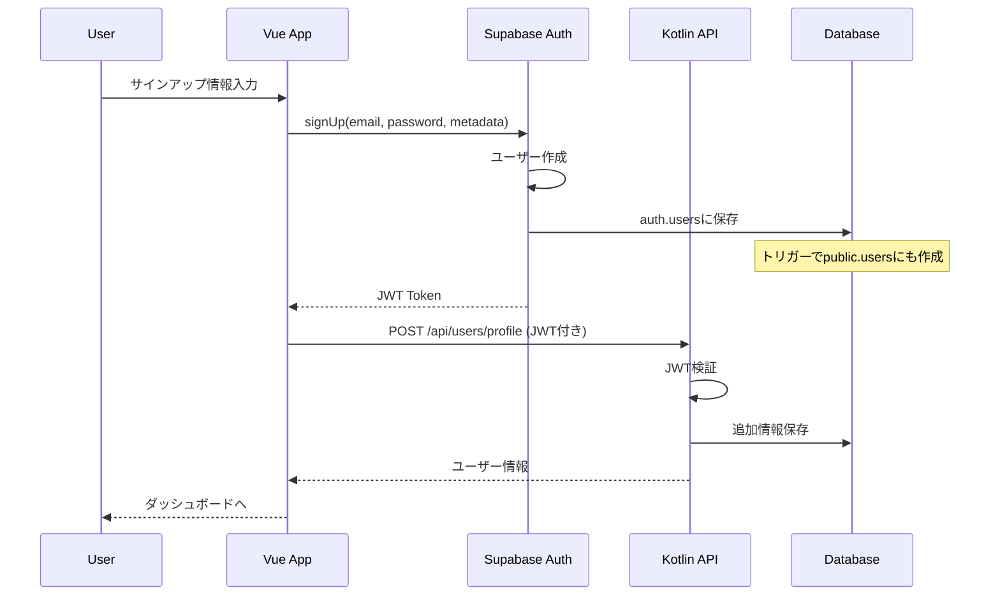
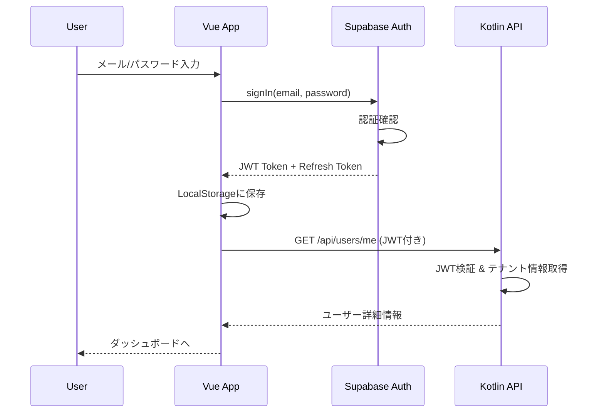

# Supabase Auth + Kotlin ハイブリッドアーキテクチャ設計書

## 1. アーキテクチャ概要

### 1.1 システム構成図
```
┌─────────────────┐
│   Vue.js App    │
│  (Frontend)     │
└────────┬────────┘
         │ 
    ┌────┴────┐
    │         │
    ▼         ▼
┌─────────┐ ┌──────────────┐
│Supabase │ │ Kotlin API   │
│  Auth   │ │   Server     │
└────┬────┘ └──────┬───────┘
     │             │
     │  JWT Token  │
     └──────┬──────┘
            ▼
    ┌───────────────┐
    │  PostgreSQL   │
    │ (Supabase DB) │
    └───────────────┘
```

### 1.2 責任分担

**Supabase Auth**
- ユーザー認証（サインアップ、サインイン）
- パスワード管理
- JWT発行
- セッション管理

**Kotlin API Server**
- ビジネスロジック
- 認可（権限チェック）
- データ検証
- API実装

**Supabase DB (PostgreSQL)**
- データ永続化
- RLS（Row Level Security）
- リアルタイム更新（将来）

## 2. 認証フロー

### 2.1 サインアップフロー


### 2.2 サインインフロー


## 3. JWT Token構造

### 3.1 Supabase標準JWT
```json
{
  "sub": "user-uuid",
  "email": "user@example.com",
  "role": "authenticated",
  "aud": "authenticated",
  "iat": 1234567890,
  "exp": 1234571490
}
```

### 3.2 カスタムクレーム追加（RLSで使用）
```sql
-- Supabase側でJWTに追加する関数
CREATE OR REPLACE FUNCTION custom_access_token_hook(event jsonb)
RETURNS jsonb AS $$
DECLARE
  claims jsonb;
  user_info record;
BEGIN
  claims := event->'claims';
  
  -- ユーザー情報取得
  SELECT tenant_id, role INTO user_info
  FROM public.users
  WHERE id = (event->>'user_id')::uuid;
  
  -- カスタムクレーム追加
  claims := jsonb_set(claims, '{tenant_id}', to_jsonb(user_info.tenant_id));
  claims := jsonb_set(claims, '{app_role}', to_jsonb(user_info.role));
  
  RETURN jsonb_set(event, '{claims}', claims);
END;
$$ LANGUAGE plpgsql;
```

## 4. Kotlin API設計

### 4.1 認証ミドルウェア
```kotlin
// JWTの検証とユーザー情報の取得
@Component
class SupabaseAuthFilter : OncePerRequestFilter() {
    override fun doFilterInternal(
        request: HttpServletRequest,
        response: HttpServletResponse,
        filterChain: FilterChain
    ) {
        val token = extractToken(request)
        if (token != null) {
            val claims = verifySupabaseToken(token)
            val auth = SupabaseAuthentication(
                userId = claims["sub"] as String,
                tenantId = claims["tenant_id"] as String,
                role = claims["app_role"] as String,
                email = claims["email"] as String
            )
            SecurityContextHolder.getContext().authentication = auth
        }
        filterChain.doFilter(request, response)
    }
}
```

### 4.2 API エンドポイント設計
```yaml
# 認証不要
POST   /api/auth/callback      # Supabase認証後のコールバック
GET    /api/health             # ヘルスチェック

# 認証必要
GET    /api/users/me           # 現在のユーザー情報
PUT    /api/users/me           # プロフィール更新

# 実費管理（認証必要）
GET    /api/expenses           # 実費一覧
POST   /api/expenses           # 実費作成
GET    /api/expenses/{id}      # 実費詳細
PUT    /api/expenses/{id}      # 実費更新
DELETE /api/expenses/{id}      # 実費削除

# 管理者のみ
GET    /api/admin/users        # ユーザー一覧
POST   /api/admin/invitations  # 招待作成
```

## 5. セキュリティ設計

### 5.1 多層防御
1. **Supabase Auth**: 認証
2. **Kotlin API**: JWT検証 + 認可
3. **PostgreSQL RLS**: データレベルの保護

### 5.2 JWT検証フロー
```kotlin
@Service
class JwtValidationService(
    private val supabaseClient: SupabaseClient
) {
    fun validateToken(token: String): JwtClaims {
        // 1. JWT署名検証
        val jwt = JWT.decode(token)
        val verifier = JWT.require(algorithm)
            .withIssuer(supabaseUrl)
            .build()
        
        // 2. 有効期限チェック
        if (jwt.expiresAt.before(Date())) {
            throw TokenExpiredException()
        }
        
        // 3. ユーザー存在確認（キャッシュ利用）
        val userId = jwt.subject
        val user = userCache.get(userId) ?: fetchUser(userId)
        
        return JwtClaims(
            userId = userId,
            tenantId = user.tenantId,
            role = user.role
        )
    }
}
```

## 6. データベース連携

### 6.1 RLSポリシー（簡略版）
```sql
-- JWTのtenant_idを使用したRLS
CREATE POLICY "tenant_isolation" ON expenses
  USING (tenant_id = current_setting('request.jwt.claims')::json->>'tenant_id');
```

### 6.2 Kotlin側でのテナント分離
```kotlin
@Component
class TenantFilter : HandlerInterceptor {
    override fun preHandle(
        request: HttpServletRequest,
        response: HttpServletResponse,
        handler: Any
    ): Boolean {
        val auth = SecurityContextHolder.getContext().authentication
        if (auth is SupabaseAuthentication) {
            // スレッドローカルにテナントID設定
            TenantContext.setTenantId(auth.tenantId)
        }
        return true
    }
}
```

## 7. エラーハンドリング

### 7.1 認証エラー
- 401 Unauthorized: トークンなし/無効
- 403 Forbidden: 権限不足
- 419 Token Expired: トークン期限切れ

### 7.2 自動リトライ（フロントエンド）
```typescript
// Refresh Tokenを使った自動更新
const refreshAuth = async () => {
  const { data, error } = await supabase.auth.refreshSession()
  if (error) throw error
  return data.session.access_token
}
```

## 8. 開発手順（MVP向け）

### Phase 1: 基盤構築（3日）
1. Supabaseプロジェクト作成
2. 認証テーブル作成
3. Kotlin認証フィルター実装
4. 基本的なAPIエンドポイント

### Phase 2: 実費機能統合（5日）
1. 実費テーブル作成
2. CRUD API実装
3. フロントエンド統合
4. E2Eテスト

### Phase 3: 本番準備（2日）
1. セキュリティ強化
2. ログ・監視設定
3. デプロイ設定

## 9. 注意点とベストプラクティス

1. **JWT有効期限**: 1時間（セキュリティとUXのバランス）
2. **Refresh Token**: 30日（長期ログイン対応）
3. **CORS設定**: 本番環境では厳密に
4. **ログ**: 認証イベントは全て記録
5. **キャッシュ**: ユーザー情報は5分キャッシュ