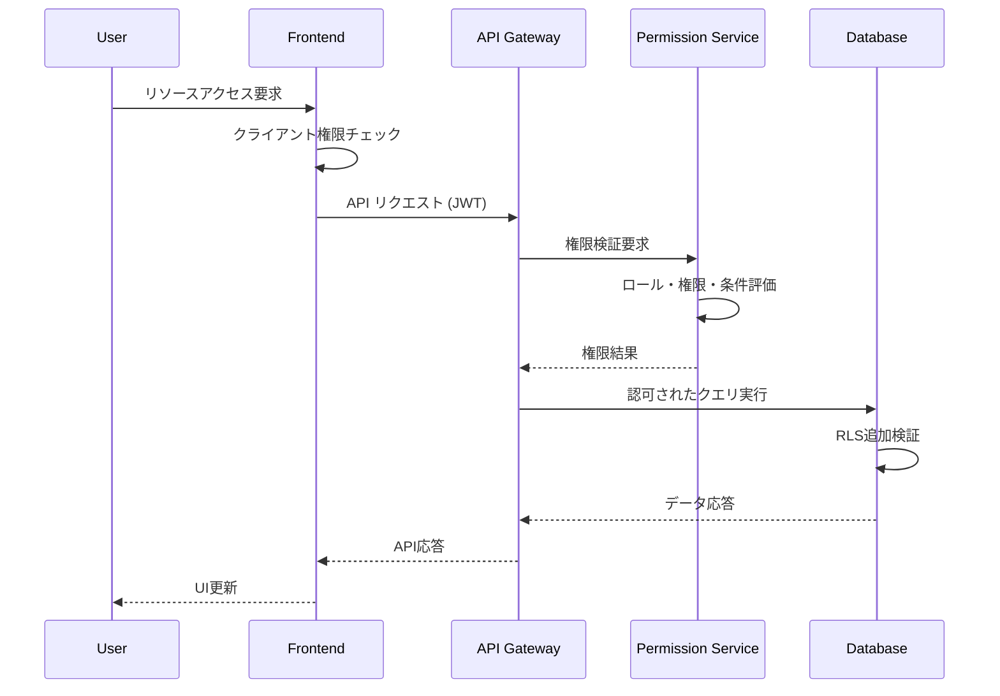

# 権限管理システム設計書

## 1. 設計思想

### 1.1 汎用プラットフォームアプローチ
**完全動的権限システム** - 業界に依存しない汎用設計
- **固定権限なし**: システムには事前定義された権限は存在しない
- **リソース連動**: ユーザーが作成するリソースに基づく動的権限生成
- **業界非依存**: 特定業界用語を使用しない完全汎用設計
- **テンプレート活用**: 業界特化要素は外部テンプレートで提供

### 1.2 統合アーキテクチャ
この権限システムは以下の設計書と統合して動作します：

1. **[Discord風動的ロールシステム](./dynamic-role-system-design.md)**
   - 事前定義ロールなし、完全動的作成
   - テンプレートロールインポート機能
   - 複数ロール付与サポート

2. **[柔軟権限システム](./flexible-permission-system.md)**
   - リソースベース動的権限生成
   - フィールドレベル細かい制御
   - 条件指定アクセス制御

3. **[汎用認証アーキテクチャ](./generic-auth-architecture.md)**
   - ベンダー中立認証基盤
   - ハイブリッドマルチテナンシー対応
   - エンタープライズセキュリティ機能

## 2. 権限システムの全体像

### 2.1 権限モデル
```
User → Role(s) → Permission(s) → Resource + Action + Scope + Condition
```

**例**:
```
田中太郎 → [プロジェクトマネージャー] → [database.projects.write.team] → プロジェクトデータベースをチーム範囲で編集可能
```

### 2.2 権限の動的生成
ユーザーがリソースを作成すると自動的に対応する権限が生成されます：

```yaml
# ユーザーが「顧客管理」データベースを作成
↓
# 自動生成される権限セット
permissions:
  - resource: "database:customer-management"
    actions: ["read", "write", "delete", "share", "export"]
    scopes: ["own", "team", "workspace", "all"]
    
# 結果: 24個の権限が自動生成
# database:customer-management:read:own
# database:customer-management:read:team
# database:customer-management:read:workspace
# database:customer-management:read:all
# database:customer-management:write:own
# ... (以下同様)
```

### 2.3 業界テンプレートとの連携
```yaml
# 汎用システム（業界非依存）
core_permissions:
  resource_types: ["database", "document", "folder", "workspace"]
  actions: ["read", "write", "delete", "share", "export", "manage"]
  scopes: ["own", "team", "workspace", "all"]

# 業界テンプレート適用例（法律事務所）
template_application:
  database_mapping:
    "案件管理": "database:case-management"
    "顧客管理": "database:client-management"
  
  role_permissions:
    "シニアパートナー": ["*:*:*:all"]
    "アソシエイト": ["database:*:read,write:team"]
    "依頼者": ["database:case-management:read:own"]
```

## 3. 実装アーキテクチャ

### 3.1 レイヤー構造
```
┌─────────────────────────────────────┐
│        UI Permission Layer         │ ← フロントエンド権限チェック
├─────────────────────────────────────┤
│       API Permission Guard         │ ← API レベル権限検証
├─────────────────────────────────────┤
│      Business Logic Layer          │ ← ビジネスロジック実行
├─────────────────────────────────────┤
│    Database Security Layer         │ ← RLS + 動的権限チェック
└─────────────────────────────────────┘
```

### 3.2 権限チェックフロー


## 4. セキュリティ原則

### 4.1 多層防御
1. **UI層**: 不要なUI要素の非表示
2. **API層**: エンドポイント単位での権限チェック
3. **ビジネスロジック層**: 操作前の詳細権限検証
4. **データベース層**: RLSによる最終防御線

### 4.2 ゼロトラスト原則
- **すべてのアクセスを検証**: 内部リクエストも含めて全チェック
- **最小権限の原則**: 必要最小限の権限のみ付与
- **継続的検証**: セッション中も定期的な権限再チェック
- **コンテキスト評価**: 時間・場所・デバイス等の要因も考慮

## 5. 設定例

### 5.1 汎用組織での権限設定
```yaml
# 一般的なビジネス組織
organization: "Generic Business Corp"
roles:
  - name: "CEO"
    permissions: ["*:*:*:all"]
    
  - name: "部門長"
    permissions: 
      - "database:*:*:workspace"
      - "document:*:*:workspace"
    
  - name: "チームリーダー"
    permissions:
      - "database:*:read,write:team"
      - "document:*:read,write:team"
    
  - name: "メンバー"
    permissions:
      - "database:*:read:team"
      - "database:*:write:own"
      - "document:*:read:team"
      - "document:*:write:own"
```

### 5.2 カスタム権限設定
```yaml
# ユーザー定義のカスタムロール
custom_roles:
  - name: "データアナリスト"
    permissions:
      - "database:*:read:all"
      - "database:*:export:all"
    conditions:
      field_restrictions:
        denied_fields: ["salary", "personal_notes"]
  
  - name: "外部監査人"
    permissions:
      - "database:financial:read:all"
    conditions:
      time_based:
        allowed_periods: ["2024-01-01", "2024-12-31"]
      value_filter:
        status_filter: ["approved", "finalized"]
```

## 6. 移行戦略

### 6.1 既存システムからの移行
従来の固定ロールシステムから動的システムへの移行：

```yaml
migration_steps:
  1. 現在のロール分析:
    - 既存ロールの権限範囲特定
    - リソースアクセスパターン分析
    
  2. 動的権限マッピング:
    - 固定権限 → リソースベース権限変換
    - ロール → 動的ロール移行
    
  3. テンプレート適用:
    - 業界テンプレートのインポート
    - カスタマイズの適用
    
  4. 段階的切り替え:
    - パイロットユーザーでテスト
    - 全ユーザーへの展開
```

### 6.2 互換性保持
移行期間中の既存システムとの互換性：

```yaml
compatibility_layer:
  legacy_role_mapping:
    "admin" → "システム管理者"
    "manager" → "マネージャー"
    "user" → "一般ユーザー"
  
  permission_translation:
    "expense.create" → "database:expenses:write:own"
    "report.view" → "database:reports:read:team"
```

## 7. 監査・コンプライアンス

### 7.1 権限変更履歴
```sql
-- 権限変更監査ログ
CREATE TABLE permission_audit_log (
  id UUID PRIMARY KEY DEFAULT gen_random_uuid(),
  tenant_id UUID NOT NULL,
  
  -- 変更対象
  target_type VARCHAR(20) NOT NULL, -- 'role', 'user', 'resource'
  target_id UUID NOT NULL,
  
  -- 変更内容
  change_type VARCHAR(20) NOT NULL, -- 'grant', 'revoke', 'modify'
  permission_details JSONB NOT NULL,
  
  -- 実行者情報
  performed_by UUID NOT NULL,
  performed_at TIMESTAMPTZ DEFAULT NOW(),
  
  -- 承認情報
  approved_by UUID,
  approval_reason TEXT,
  
  -- コンテキスト
  ip_address INET,
  user_agent TEXT
);
```

### 7.2 定期的な権限レビュー
```yaml
review_schedule:
  quarterly_review:
    - 全ユーザーの権限棚卸し
    - 未使用権限の特定・削除
    - 過剰権限の検出・調整
  
  annual_review:
    - ロール定義の見直し
    - 権限体系の最適化
    - セキュリティポリシー更新
```

## 8. まとめ

この権限管理システムは：

1. **完全な業界非依存性**: 特定業界用語を一切使用しない
2. **動的リソース対応**: ユーザー作成リソースに自動対応
3. **きめ細かい制御**: フィールド・値・時間レベルでの制御
4. **テンプレート活用**: 業界特化は外部テンプレートで対応
5. **拡張性**: 新機能・業界への容易な対応

**結果**: 真の汎用ビジネス管理プラットフォームにふさわしい権限システムを実現

詳細な実装については以下の専門設計書を参照：
- [Discord風動的ロールシステム設計書](./dynamic-role-system-design.md)
- [柔軟権限システム設計書](./flexible-permission-system.md)
- [汎用認証アーキテクチャ設計書](./generic-auth-architecture.md)