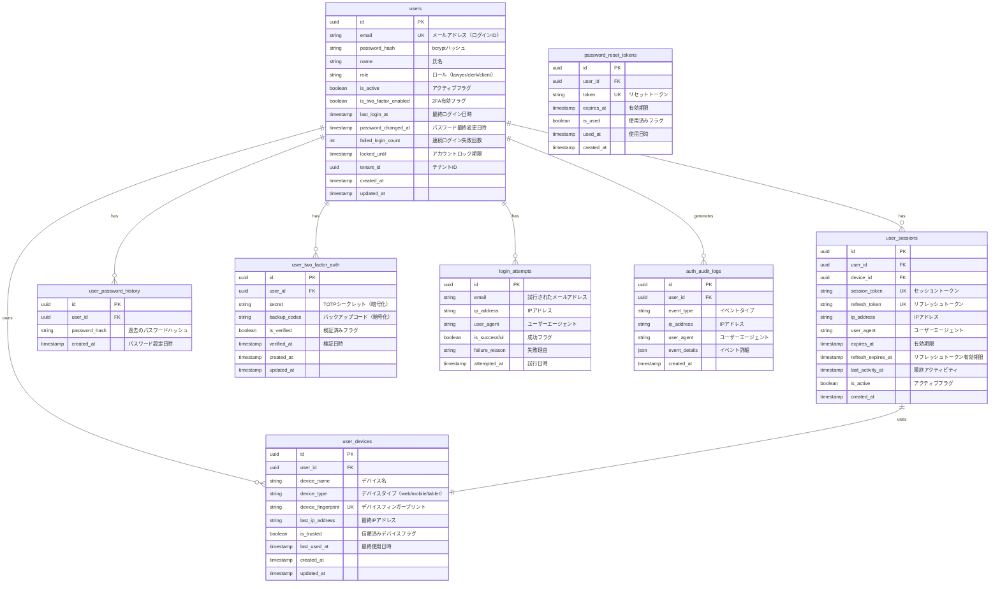

# 認証システム データベース設計

## 概要

法律事務所向け高セキュリティ認証システムのデータベース設計です。
複数デバイスからのログイン、パスワード履歴管理、監査ログの1年保持を実現します。

## ERD（Entity Relationship Diagram）



## テーブル詳細設計

### 1. users（ユーザー）

```sql
CREATE TABLE users (
    id UUID PRIMARY KEY DEFAULT gen_random_uuid(),
    email VARCHAR(255) NOT NULL UNIQUE,
    password_hash VARCHAR(255) NOT NULL,
    name VARCHAR(255) NOT NULL,
    role VARCHAR(50) NOT NULL CHECK (role IN ('lawyer', 'clerk', 'client', 'admin')),
    is_active BOOLEAN NOT NULL DEFAULT true,
    is_two_factor_enabled BOOLEAN NOT NULL DEFAULT false,
    last_login_at TIMESTAMP,
    password_changed_at TIMESTAMP NOT NULL DEFAULT CURRENT_TIMESTAMP,
    failed_login_count INTEGER NOT NULL DEFAULT 0,
    locked_until TIMESTAMP,
    tenant_id UUID NOT NULL,
    created_at TIMESTAMP NOT NULL DEFAULT CURRENT_TIMESTAMP,
    updated_at TIMESTAMP NOT NULL DEFAULT CURRENT_TIMESTAMP,
    
    INDEX idx_users_email (email),
    INDEX idx_users_tenant_id (tenant_id),
    INDEX idx_users_role (role)
);

-- メールアドレスの大文字小文字を区別しない
CREATE UNIQUE INDEX idx_users_email_lower ON users (LOWER(email));
```

### 2. user_sessions（セッション）

```sql
CREATE TABLE user_sessions (
    id UUID PRIMARY KEY DEFAULT gen_random_uuid(),
    user_id UUID NOT NULL REFERENCES users(id) ON DELETE CASCADE,
    device_id UUID NOT NULL REFERENCES user_devices(id) ON DELETE CASCADE,
    session_token VARCHAR(255) NOT NULL UNIQUE,
    refresh_token VARCHAR(255) NOT NULL UNIQUE,
    ip_address INET NOT NULL,
    user_agent TEXT,
    expires_at TIMESTAMP NOT NULL,
    refresh_expires_at TIMESTAMP NOT NULL,
    last_activity_at TIMESTAMP NOT NULL DEFAULT CURRENT_TIMESTAMP,
    is_active BOOLEAN NOT NULL DEFAULT true,
    created_at TIMESTAMP NOT NULL DEFAULT CURRENT_TIMESTAMP,
    
    INDEX idx_sessions_user_id (user_id),
    INDEX idx_sessions_token (session_token),
    INDEX idx_sessions_refresh (refresh_token),
    INDEX idx_sessions_expires (expires_at)
);

-- 期限切れセッションの自動削除
CREATE INDEX idx_sessions_cleanup ON user_sessions (expires_at) 
WHERE is_active = true;
```

### 3. user_devices（デバイス管理）

```sql
CREATE TABLE user_devices (
    id UUID PRIMARY KEY DEFAULT gen_random_uuid(),
    user_id UUID NOT NULL REFERENCES users(id) ON DELETE CASCADE,
    device_name VARCHAR(255) NOT NULL,
    device_type VARCHAR(50) NOT NULL CHECK (device_type IN ('web', 'mobile', 'tablet', 'desktop')),
    device_fingerprint VARCHAR(255) NOT NULL UNIQUE,
    last_ip_address INET,
    is_trusted BOOLEAN NOT NULL DEFAULT false,
    last_used_at TIMESTAMP NOT NULL DEFAULT CURRENT_TIMESTAMP,
    created_at TIMESTAMP NOT NULL DEFAULT CURRENT_TIMESTAMP,
    updated_at TIMESTAMP NOT NULL DEFAULT CURRENT_TIMESTAMP,
    
    INDEX idx_devices_user_id (user_id),
    INDEX idx_devices_fingerprint (device_fingerprint),
    UNIQUE KEY uk_user_device (user_id, device_fingerprint)
);
```

### 4. user_password_history（パスワード履歴）

```sql
CREATE TABLE user_password_history (
    id UUID PRIMARY KEY DEFAULT gen_random_uuid(),
    user_id UUID NOT NULL REFERENCES users(id) ON DELETE CASCADE,
    password_hash VARCHAR(255) NOT NULL,
    created_at TIMESTAMP NOT NULL DEFAULT CURRENT_TIMESTAMP,
    
    INDEX idx_password_history_user_id (user_id),
    INDEX idx_password_history_created (created_at)
);

-- 各ユーザーごとに最新5件のみ保持するトリガー
CREATE OR REPLACE FUNCTION limit_password_history()
RETURNS TRIGGER AS $$
BEGIN
    DELETE FROM user_password_history
    WHERE user_id = NEW.user_id
    AND id NOT IN (
        SELECT id FROM user_password_history
        WHERE user_id = NEW.user_id
        ORDER BY created_at DESC
        LIMIT 5
    );
    RETURN NEW;
END;
$$ LANGUAGE plpgsql;

CREATE TRIGGER trigger_limit_password_history
AFTER INSERT ON user_password_history
FOR EACH ROW
EXECUTE FUNCTION limit_password_history();
```

### 5. user_two_factor_auth（2要素認証）

```sql
CREATE TABLE user_two_factor_auth (
    id UUID PRIMARY KEY DEFAULT gen_random_uuid(),
    user_id UUID NOT NULL UNIQUE REFERENCES users(id) ON DELETE CASCADE,
    secret TEXT NOT NULL, -- 暗号化して保存
    backup_codes TEXT, -- JSON配列、暗号化して保存
    is_verified BOOLEAN NOT NULL DEFAULT false,
    verified_at TIMESTAMP,
    created_at TIMESTAMP NOT NULL DEFAULT CURRENT_TIMESTAMP,
    updated_at TIMESTAMP NOT NULL DEFAULT CURRENT_TIMESTAMP,
    
    INDEX idx_2fa_user_id (user_id)
);
```

### 6. login_attempts（ログイン試行）

```sql
CREATE TABLE login_attempts (
    id UUID PRIMARY KEY DEFAULT gen_random_uuid(),
    email VARCHAR(255) NOT NULL,
    ip_address INET NOT NULL,
    user_agent TEXT,
    is_successful BOOLEAN NOT NULL,
    failure_reason VARCHAR(255),
    attempted_at TIMESTAMP NOT NULL DEFAULT CURRENT_TIMESTAMP,
    
    INDEX idx_attempts_email (email),
    INDEX idx_attempts_ip (ip_address),
    INDEX idx_attempts_time (attempted_at)
);

-- 30日以上古いログイン試行を自動削除
CREATE INDEX idx_attempts_cleanup ON login_attempts (attempted_at);
```

### 7. auth_audit_logs（認証監査ログ）

```sql
CREATE TABLE auth_audit_logs (
    id UUID PRIMARY KEY DEFAULT gen_random_uuid(),
    user_id UUID REFERENCES users(id) ON DELETE SET NULL,
    event_type VARCHAR(100) NOT NULL,
    ip_address INET,
    user_agent TEXT,
    event_details JSONB,
    created_at TIMESTAMP NOT NULL DEFAULT CURRENT_TIMESTAMP,
    
    INDEX idx_audit_user_id (user_id),
    INDEX idx_audit_event_type (event_type),
    INDEX idx_audit_created_at (created_at)
);

-- イベントタイプの例
-- LOGIN_SUCCESS: ログイン成功
-- LOGIN_FAILED: ログイン失敗
-- LOGOUT: ログアウト
-- PASSWORD_CHANGED: パスワード変更
-- PASSWORD_RESET_REQUESTED: パスワードリセット要求
-- PASSWORD_RESET_COMPLETED: パスワードリセット完了
-- TWO_FACTOR_ENABLED: 2FA有効化
-- TWO_FACTOR_DISABLED: 2FA無効化
-- ACCOUNT_LOCKED: アカウントロック
-- ACCOUNT_UNLOCKED: アカウントロック解除
-- SESSION_EXTENDED: セッション延長
-- DEVICE_ADDED: デバイス追加
-- DEVICE_REMOVED: デバイス削除

-- パーティショニング設定（月次）
CREATE TABLE auth_audit_logs_2024_01 PARTITION OF auth_audit_logs
FOR VALUES FROM ('2024-01-01') TO ('2024-02-01');
```

### 8. password_reset_tokens（パスワードリセットトークン）

```sql
CREATE TABLE password_reset_tokens (
    id UUID PRIMARY KEY DEFAULT gen_random_uuid(),
    user_id UUID NOT NULL REFERENCES users(id) ON DELETE CASCADE,
    token VARCHAR(255) NOT NULL UNIQUE,
    expires_at TIMESTAMP NOT NULL,
    is_used BOOLEAN NOT NULL DEFAULT false,
    used_at TIMESTAMP,
    created_at TIMESTAMP NOT NULL DEFAULT CURRENT_TIMESTAMP,
    
    INDEX idx_reset_token (token),
    INDEX idx_reset_user_id (user_id),
    INDEX idx_reset_expires (expires_at)
);

-- 期限切れトークンの自動削除
CREATE INDEX idx_reset_cleanup ON password_reset_tokens (expires_at) 
WHERE is_used = false;
```

## セキュリティ実装

### 1. パスワードハッシュ化

```typescript
// bcryptを使用（コスト係数12）
import bcrypt from 'bcrypt'

const SALT_ROUNDS = 12

export const hashPassword = async (password: string): Promise<string> => {
  return await bcrypt.hash(password, SALT_ROUNDS)
}

export const verifyPassword = async (
  password: string, 
  hash: string
): Promise<boolean> => {
  return await bcrypt.compare(password, hash)
}
```

### 2. セッショントークン生成

```typescript
import crypto from 'crypto'

export const generateSessionToken = (): string => {
  return crypto.randomBytes(32).toString('base64url')
}

export const generateRefreshToken = (): string => {
  return crypto.randomBytes(48).toString('base64url')
}
```

### 3. 暗号化（2FAシークレット等）

```typescript
import { createCipheriv, createDecipheriv, randomBytes } from 'crypto'

const ALGORITHM = 'aes-256-gcm'
const KEY = Buffer.from(process.env.ENCRYPTION_KEY!, 'base64')

export const encrypt = (text: string): string => {
  const iv = randomBytes(16)
  const cipher = createCipheriv(ALGORITHM, KEY, iv)
  
  let encrypted = cipher.update(text, 'utf8', 'hex')
  encrypted += cipher.final('hex')
  
  const authTag = cipher.getAuthTag()
  
  return iv.toString('hex') + ':' + authTag.toString('hex') + ':' + encrypted
}

export const decrypt = (encryptedData: string): string => {
  const parts = encryptedData.split(':')
  const iv = Buffer.from(parts[0], 'hex')
  const authTag = Buffer.from(parts[1], 'hex')
  const encrypted = parts[2]
  
  const decipher = createDecipheriv(ALGORITHM, KEY, iv)
  decipher.setAuthTag(authTag)
  
  let decrypted = decipher.update(encrypted, 'hex', 'utf8')
  decrypted += decipher.final('utf8')
  
  return decrypted
}
```

## インデックス戦略

### 1. 認証パフォーマンス最適化

```sql
-- ログイン時の検索最適化
CREATE INDEX idx_users_email_active ON users (email, is_active) 
WHERE is_active = true;

-- セッション検証最適化
CREATE INDEX idx_sessions_active ON user_sessions (session_token, is_active, expires_at) 
WHERE is_active = true;

-- デバイス検証最適化
CREATE INDEX idx_devices_active ON user_devices (device_fingerprint, user_id) 
WHERE is_trusted = true;
```

### 2. 監査ログ検索最適化

```sql
-- ユーザー別イベント検索
CREATE INDEX idx_audit_user_events ON auth_audit_logs (user_id, event_type, created_at DESC);

-- 期間別イベント検索
CREATE INDEX idx_audit_date_range ON auth_audit_logs (created_at DESC, event_type);

-- IP別不審アクセス検索
CREATE INDEX idx_audit_ip_failed ON auth_audit_logs (ip_address, event_type) 
WHERE event_type IN ('LOGIN_FAILED', 'ACCOUNT_LOCKED');
```

## データ保持ポリシー

### 1. 自動削除設定

```sql
-- ログイン試行履歴（30日）
CREATE OR REPLACE FUNCTION cleanup_old_login_attempts()
RETURNS void AS $$
BEGIN
    DELETE FROM login_attempts 
    WHERE attempted_at < CURRENT_TIMESTAMP - INTERVAL '30 days';
END;
$$ LANGUAGE plpgsql;

-- 期限切れセッション
CREATE OR REPLACE FUNCTION cleanup_expired_sessions()
RETURNS void AS $$
BEGIN
    UPDATE user_sessions 
    SET is_active = false 
    WHERE expires_at < CURRENT_TIMESTAMP AND is_active = true;
    
    DELETE FROM user_sessions 
    WHERE expires_at < CURRENT_TIMESTAMP - INTERVAL '7 days';
END;
$$ LANGUAGE plpgsql;

-- 使用済みパスワードリセットトークン
CREATE OR REPLACE FUNCTION cleanup_used_reset_tokens()
RETURNS void AS $$
BEGIN
    DELETE FROM password_reset_tokens 
    WHERE (is_used = true AND used_at < CURRENT_TIMESTAMP - INTERVAL '7 days')
    OR (expires_at < CURRENT_TIMESTAMP - INTERVAL '7 days');
END;
$$ LANGUAGE plpgsql;
```

### 2. 定期実行ジョブ

```sql
-- pg_cronを使用した定期実行
SELECT cron.schedule('cleanup-login-attempts', '0 3 * * *', 
    'SELECT cleanup_old_login_attempts()');

SELECT cron.schedule('cleanup-sessions', '*/30 * * * *', 
    'SELECT cleanup_expired_sessions()');

SELECT cron.schedule('cleanup-reset-tokens', '0 4 * * *', 
    'SELECT cleanup_used_reset_tokens()');
```

## セキュリティ監視

### 1. 不審なアクセスパターン検出

```sql
-- 短時間での大量ログイン失敗
CREATE VIEW suspicious_login_patterns AS
SELECT 
    ip_address,
    COUNT(*) as attempt_count,
    COUNT(DISTINCT email) as unique_emails,
    MIN(attempted_at) as first_attempt,
    MAX(attempted_at) as last_attempt
FROM login_attempts
WHERE 
    is_successful = false
    AND attempted_at > CURRENT_TIMESTAMP - INTERVAL '1 hour'
GROUP BY ip_address
HAVING COUNT(*) > 10;

-- 異常なセッション活動
CREATE VIEW suspicious_session_activity AS
SELECT 
    u.email,
    COUNT(DISTINCT s.ip_address) as unique_ips,
    COUNT(DISTINCT d.device_fingerprint) as unique_devices,
    MAX(s.created_at) as latest_session
FROM users u
JOIN user_sessions s ON u.id = s.user_id
JOIN user_devices d ON s.device_id = d.id
WHERE 
    s.created_at > CURRENT_TIMESTAMP - INTERVAL '24 hours'
    AND s.is_active = true
GROUP BY u.id, u.email
HAVING COUNT(DISTINCT s.ip_address) > 5;
```

### 2. アラート設定

```typescript
// 不審なアクセスを検知してアラート
export const checkSuspiciousActivity = async () => {
  // 1時間以内に同一IPから10回以上のログイン失敗
  const suspiciousIPs = await db.query(`
    SELECT * FROM suspicious_login_patterns
  `)
  
  if (suspiciousIPs.length > 0) {
    await sendSecurityAlert('MULTIPLE_LOGIN_FAILURES', suspiciousIPs)
  }
  
  // 24時間以内に5つ以上の異なるIPからのログイン
  const suspiciousSessions = await db.query(`
    SELECT * FROM suspicious_session_activity
  `)
  
  if (suspiciousSessions.length > 0) {
    await sendSecurityAlert('MULTIPLE_IP_LOGINS', suspiciousSessions)
  }
}
```