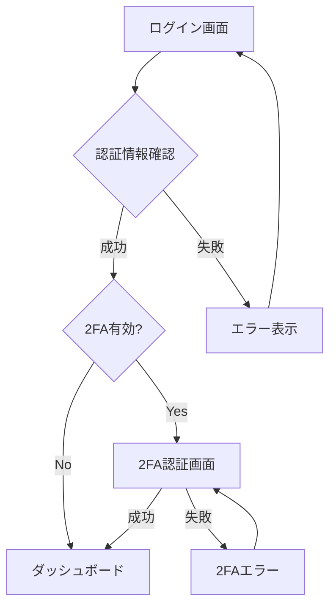

# 認証関連画面設計

## 概要

法律事務所向けの高セキュリティ認証システムの画面設計です。メールアドレス + パスワード認証に加え、TOTP方式の2要素認証を実装します。

## 認証フロー



## 1. ログイン画面

### 1.1 画面レイアウト

```vue
<template>
  <div class="auth-container">
    <div class="auth-card">
      <!-- ロゴ・タイトル -->
      <div class="auth-header">
        
        <h1 class="auth-title">Aster Management</h1>
        <p class="auth-subtitle">法律事務所管理システム</p>
      </div>
      
      <!-- ログインフォーム -->
      <Card class="auth-form-card">
        <CardContent class="p-6">
          <form @submit.prevent="handleLogin" class="space-y-4">
            <!-- メールアドレス -->
            <div class="space-y-2">
              <Label for="email">メールアドレス</Label>
              <Input
                id="email"
                v-model="credentials.email"
                type="email"
                placeholder="user@example.com"
                :disabled="isLoading"
                autocomplete="username"
                required
              />
              <span v-if="errors.email" class="error-text">
                {{ errors.email }}
              </span>
            </div>
            
            <!-- パスワード -->
            <div class="space-y-2">
              <div class="flex items-center justify-between">
                <Label for="password">パスワード</Label>
                <NuxtLink 
                  to="/auth/forgot-password" 
                  class="text-sm text-primary hover:underline"
                >
                  パスワードを忘れた方
                </NuxtLink>
              </div>
              <div class="relative">
                <Input
                  id="password"
                  v-model="credentials.password"
                  :type="showPassword ? 'text' : 'password'"
                  placeholder="••••••••"
                  :disabled="isLoading"
                  autocomplete="current-password"
                  required
                />
                <button
                  type="button"
                  @click="showPassword = !showPassword"
                  class="absolute right-3 top-1/2 -translate-y-1/2"
                >
                  <Eye v-if="!showPassword" class="h-4 w-4 text-muted-foreground" />
                  <EyeOff v-else class="h-4 w-4 text-muted-foreground" />
                </button>
              </div>
              <span v-if="errors.password" class="error-text">
                {{ errors.password }}
              </span>
            </div>
            
            <!-- ログイン状態を保持 -->
            <div class="flex items-center space-x-2">
              <Checkbox 
                id="remember"
                v-model="rememberMe"
                :disabled="isLoading"
              />
              <Label for="remember" class="text-sm cursor-pointer">
                ログイン状態を保持する
              </Label>
            </div>
            
            <!-- エラーメッセージ -->
            <Alert v-if="loginError" variant="destructive">
              <AlertCircle class="h-4 w-4" />
              <AlertDescription>
                {{ loginError }}
              </AlertDescription>
            </Alert>
            
            <!-- ログインボタン -->
            <Button 
              type="submit" 
              class="w-full"
              :disabled="isLoading || !isValid"
            >
              <Loader2 v-if="isLoading" class="h-4 w-4 mr-2 animate-spin" />
              ログイン
            </Button>
          </form>
        </CardContent>
      </Card>
      
      <!-- セキュリティ注意事項 -->
      <div class="auth-footer">
        <p class="text-xs text-muted-foreground text-center">
          このシステムは認証されたユーザーのみ利用可能です。<br>
          不正アクセスは法的措置の対象となります。
        </p>
      </div>
    </div>
  </div>
</template>

<script setup lang="ts">
import { ref, computed } from 'vue'
import { z } from 'zod'

// バリデーションスキーマ
const loginSchema = z.object({
  email: z.string().email('有効なメールアドレスを入力してください'),
  password: z.string().min(1, 'パスワードを入力してください')
})

const credentials = ref({
  email: '',
  password: ''
})

const showPassword = ref(false)
const rememberMe = ref(false)
const isLoading = ref(false)
const loginError = ref('')
const errors = ref<Record<string, string>>({})

// バリデーション
const isValid = computed(() => {
  try {
    loginSchema.parse(credentials.value)
    return true
  } catch {
    return false
  }
})

// ログイン処理
const handleLogin = async () => {
  // バリデーション
  try {
    loginSchema.parse(credentials.value)
    errors.value = {}
  } catch (error) {
    if (error instanceof z.ZodError) {
      errors.value = error.flatten().fieldErrors
        .reduce((acc, [key, value]) => ({ ...acc, [key]: value?.[0] }), {})
    }
    return
  }
  
  isLoading.value = true
  loginError.value = ''
  
  try {
    const { requiresTwoFactor } = await $fetch('/api/v1/auth/login', {
      method: 'POST',
      body: {
        email: credentials.value.email,
        password: credentials.value.password,
        rememberMe: rememberMe.value
      }
    })
    
    if (requiresTwoFactor) {
      // 2FA認証画面へ
      await navigateTo('/auth/two-factor')
    } else {
      // ダッシュボードへ
      await navigateTo('/dashboard')
    }
  } catch (error: any) {
    if (error.statusCode === 401) {
      loginError.value = 'メールアドレスまたはパスワードが正しくありません'
    } else if (error.statusCode === 429) {
      loginError.value = 'ログイン試行回数が上限に達しました。しばらくしてから再度お試しください'
    } else {
      loginError.value = 'ログインに失敗しました。しばらくしてから再度お試しください'
    }
  } finally {
    isLoading.value = false
  }
}
</script>

<style scoped>
.auth-container {
  @apply min-h-screen flex items-center justify-center bg-gray-50 dark:bg-gray-900 px-4 py-8;
}

.auth-card {
  @apply w-full max-w-md space-y-6;
}

.auth-header {
  @apply text-center;
}

.auth-logo {
  @apply h-12 w-12 mx-auto mb-4;
}

.auth-title {
  @apply text-2xl font-bold;
}

.auth-subtitle {
  @apply text-muted-foreground;
}

.auth-form-card {
  @apply shadow-lg;
}

.error-text {
  @apply text-sm text-destructive;
}
</style>
```

## 2. 2要素認証画面

### 2.1 TOTP認証画面

```vue
<template>
  <div class="auth-container">
    <div class="auth-card">
      <!-- ヘッダー -->
      <div class="auth-header">
        <Shield class="h-12 w-12 mx-auto mb-4 text-primary" />
        <h1 class="auth-title">2段階認証</h1>
        <p class="auth-subtitle">
          認証アプリに表示されている6桁のコードを入力してください
        </p>
      </div>
      
      <!-- 認証フォーム -->
      <Card class="auth-form-card">
        <CardContent class="p-6">
          <form @submit.prevent="handleVerify" class="space-y-4">
            <!-- 認証コード入力 -->
            <div class="space-y-2">
              <Label for="code">認証コード</Label>
              <div class="flex gap-2 justify-center">
                <Input
                  v-for="(_, index) in 6"
                  :key="index"
                  :ref="el => codeInputs[index] = el"
                  v-model="codeDigits[index]"
                  type="text"
                  inputmode="numeric"
                  pattern="[0-9]"
                  maxlength="1"
                  class="w-12 h-12 text-center text-lg font-mono"
                  @input="handleCodeInput(index)"
                  @keydown="handleKeyDown($event, index)"
                  @paste="handlePaste"
                  :disabled="isLoading"
                />
              </div>
              <p v-if="error" class="text-sm text-destructive text-center">
                {{ error }}
              </p>
            </div>
            
            <!-- バックアップコードオプション -->
            <div class="text-center">
              <button
                type="button"
                @click="showBackupCode = !showBackupCode"
                class="text-sm text-primary hover:underline"
              >
                バックアップコードを使用
              </button>
            </div>
            
            <!-- バックアップコード入力 -->
            <div v-if="showBackupCode" class="space-y-2">
              <Label for="backup-code">バックアップコード</Label>
              <Input
                id="backup-code"
                v-model="backupCode"
                placeholder="XXXX-XXXX-XXXX"
                :disabled="isLoading"
              />
            </div>
            
            <!-- 送信ボタン -->
            <Button 
              type="submit" 
              class="w-full"
              :disabled="isLoading || (!isCodeComplete && !backupCode)"
            >
              <Loader2 v-if="isLoading" class="h-4 w-4 mr-2 animate-spin" />
              認証
            </Button>
          </form>
          
          <!-- ヘルプ -->
          <div class="mt-4 text-center">
            <button
              type="button"
              @click="showHelp = true"
              class="text-sm text-muted-foreground hover:text-foreground"
            >
              認証コードが表示されない場合
            </button>
          </div>
        </CardContent>
      </Card>
      
      <!-- 別のアカウントでログイン -->
      <div class="text-center">
        <NuxtLink 
          to="/auth/login" 
          class="text-sm text-muted-foreground hover:text-foreground"
        >
          別のアカウントでログイン
        </NuxtLink>
      </div>
    </div>
  </div>
</template>

<script setup lang="ts">
const codeDigits = ref(Array(6).fill(''))
const codeInputs = ref<HTMLInputElement[]>([])
const backupCode = ref('')
const showBackupCode = ref(false)
const isLoading = ref(false)
const error = ref('')

const isCodeComplete = computed(() => 
  codeDigits.value.every(digit => digit.length === 1)
)

// 各桁の入力処理
const handleCodeInput = (index: number) => {
  const value = codeDigits.value[index]
  
  // 数字以外は削除
  if (!/^\d$/.test(value)) {
    codeDigits.value[index] = ''
    return
  }
  
  // 次の入力欄へフォーカス
  if (value && index < 5) {
    codeInputs.value[index + 1]?.focus()
  }
  
  // 6桁入力完了時に自動送信
  if (isCodeComplete.value) {
    handleVerify()
  }
}

// キーボード操作
const handleKeyDown = (event: KeyboardEvent, index: number) => {
  if (event.key === 'Backspace' && !codeDigits.value[index] && index > 0) {
    codeInputs.value[index - 1]?.focus()
  }
}

// ペースト処理
const handlePaste = (event: ClipboardEvent) => {
  event.preventDefault()
  const pastedData = event.clipboardData?.getData('text')
  
  if (pastedData && /^\d{6}$/.test(pastedData)) {
    codeDigits.value = pastedData.split('')
    handleVerify()
  }
}

// 認証処理
const handleVerify = async () => {
  isLoading.value = true
  error.value = ''
  
  try {
    const payload = showBackupCode.value
      ? { backupCode: backupCode.value }
      : { code: codeDigits.value.join('') }
    
    await $fetch('/api/v1/auth/two-factor', {
      method: 'POST',
      body: payload
    })
    
    // ダッシュボードへ
    await navigateTo('/dashboard')
  } catch (err: any) {
    if (err.statusCode === 401) {
      error.value = '認証コードが正しくありません'
      // コードをクリア
      codeDigits.value = Array(6).fill('')
      codeInputs.value[0]?.focus()
    } else {
      error.value = '認証に失敗しました'
    }
  } finally {
    isLoading.value = false
  }
}
</script>
```

## 3. パスワードリセット画面

### 3.1 パスワードリセット要求画面

```vue
<template>
  <div class="auth-container">
    <div class="auth-card">
      <!-- ヘッダー -->
      <div class="auth-header">
        <KeyRound class="h-12 w-12 mx-auto mb-4 text-primary" />
        <h1 class="auth-title">パスワードをリセット</h1>
        <p class="auth-subtitle">
          登録されているメールアドレスを入力してください。<br>
          パスワードリセット用のリンクをお送りします。
        </p>
      </div>
      
      <!-- フォーム -->
      <Card class="auth-form-card">
        <CardContent class="p-6">
          <form @submit.prevent="handleSubmit" class="space-y-4">
            <div class="space-y-2">
              <Label for="email">メールアドレス</Label>
              <Input
                id="email"
                v-model="email"
                type="email"
                placeholder="user@example.com"
                :disabled="isLoading || isSuccess"
                required
              />
            </div>
            
            <!-- 成功メッセージ -->
            <Alert v-if="isSuccess" variant="default">
              <Mail class="h-4 w-4" />
              <AlertDescription>
                パスワードリセット用のメールを送信しました。<br>
                メールをご確認ください。
              </AlertDescription>
            </Alert>
            
            <!-- エラーメッセージ -->
            <Alert v-if="error" variant="destructive">
              <AlertCircle class="h-4 w-4" />
              <AlertDescription>
                {{ error }}
              </AlertDescription>
            </Alert>
            
            <Button 
              type="submit" 
              class="w-full"
              :disabled="isLoading || isSuccess"
            >
              <Loader2 v-if="isLoading" class="h-4 w-4 mr-2 animate-spin" />
              リセットリンクを送信
            </Button>
          </form>
        </CardContent>
      </Card>
      
      <!-- ログインに戻る -->
      <div class="text-center">
        <NuxtLink 
          to="/auth/login" 
          class="text-sm text-muted-foreground hover:text-foreground"
        >
          ログイン画面に戻る
        </NuxtLink>
      </div>
    </div>
  </div>
</template>
```

### 3.2 パスワードリセット実行画面

```vue
<template>
  <div class="auth-container">
    <div class="auth-card">
      <!-- ヘッダー -->
      <div class="auth-header">
        <Lock class="h-12 w-12 mx-auto mb-4 text-primary" />
        <h1 class="auth-title">新しいパスワードを設定</h1>
        <p class="auth-subtitle">
          セキュリティ要件を満たすパスワードを設定してください
        </p>
      </div>
      
      <!-- フォーム -->
      <Card class="auth-form-card">
        <CardContent class="p-6">
          <form @submit.prevent="handleSubmit" class="space-y-4">
            <!-- 新しいパスワード -->
            <div class="space-y-2">
              <Label for="password">新しいパスワード</Label>
              <div class="relative">
                <Input
                  id="password"
                  v-model="password"
                  :type="showPassword ? 'text' : 'password'"
                  placeholder="••••••••"
                  @input="checkPasswordStrength"
                  :disabled="isLoading"
                  required
                />
                <button
                  type="button"
                  @click="showPassword = !showPassword"
                  class="absolute right-3 top-1/2 -translate-y-1/2"
                >
                  <Eye v-if="!showPassword" class="h-4 w-4 text-muted-foreground" />
                  <EyeOff v-else class="h-4 w-4 text-muted-foreground" />
                </button>
              </div>
            </div>
            
            <!-- パスワード強度表示 -->
            <div class="space-y-2">
              <div class="flex gap-1">
                <div 
                  v-for="i in 4" 
                  :key="i"
                  class="h-1 flex-1 rounded-full transition-colors"
                  :class="getStrengthColor(i)"
                />
              </div>
              <p class="text-xs text-muted-foreground">
                パスワード強度: {{ strengthText }}
              </p>
            </div>
            
            <!-- パスワード要件 -->
            <div class="space-y-1">
              <div 
                v-for="req in requirements" 
                :key="req.id"
                class="flex items-center gap-2 text-sm"
              >
                <Check v-if="req.met" class="h-4 w-4 text-green-600" />
                <X v-else class="h-4 w-4 text-muted-foreground" />
                <span :class="req.met ? 'text-green-600' : 'text-muted-foreground'">
                  {{ req.text }}
                </span>
              </div>
            </div>
            
            <!-- パスワード確認 -->
            <div class="space-y-2">
              <Label for="confirmPassword">パスワード（確認）</Label>
              <Input
                id="confirmPassword"
                v-model="confirmPassword"
                type="password"
                placeholder="••••••••"
                :disabled="isLoading"
                required
              />
              <p v-if="confirmPassword && password !== confirmPassword" 
                 class="text-sm text-destructive">
                パスワードが一致しません
              </p>
            </div>
            
            <!-- エラーメッセージ -->
            <Alert v-if="error" variant="destructive">
              <AlertCircle class="h-4 w-4" />
              <AlertDescription>
                {{ error }}
              </AlertDescription>
            </Alert>
            
            <Button 
              type="submit" 
              class="w-full"
              :disabled="isLoading || !isValidPassword"
            >
              <Loader2 v-if="isLoading" class="h-4 w-4 mr-2 animate-spin" />
              パスワードを設定
            </Button>
          </form>
        </CardContent>
      </Card>
    </div>
  </div>
</template>

<script setup lang="ts">
// パスワード要件
const requirements = computed(() => [
  {
    id: 'length',
    text: '12文字以上',
    met: password.value.length >= 12
  },
  {
    id: 'uppercase',
    text: '大文字を含む',
    met: /[A-Z]/.test(password.value)
  },
  {
    id: 'lowercase',
    text: '小文字を含む',
    met: /[a-z]/.test(password.value)
  },
  {
    id: 'number',
    text: '数字を含む',
    met: /\d/.test(password.value)
  },
  {
    id: 'special',
    text: '記号を含む',
    met: /[!@#$%^&*(),.?":{}|<>]/.test(password.value)
  }
])

const isValidPassword = computed(() => 
  requirements.value.every(req => req.met) && 
  password.value === confirmPassword.value
)

// パスワード強度計算
const passwordStrength = computed(() => {
  const metCount = requirements.value.filter(req => req.met).length
  if (metCount <= 2) return 1
  if (metCount <= 3) return 2
  if (metCount <= 4) return 3
  return 4
})

const strengthText = computed(() => {
  const texts = ['', '弱い', '普通', '強い', '非常に強い']
  return texts[passwordStrength.value]
})

const getStrengthColor = (level: number) => {
  if (level > passwordStrength.value) return 'bg-gray-200'
  const colors = ['', 'bg-red-500', 'bg-yellow-500', 'bg-blue-500', 'bg-green-500']
  return colors[passwordStrength.value]
}
</script>
```

## 4. セキュリティ機能

### 4.1 ログイン試行制限

```typescript
// composables/useLoginAttempts.ts
export const useLoginAttempts = () => {
  const MAX_ATTEMPTS = 5
  const LOCKOUT_DURATION = 15 * 60 * 1000 // 15分
  
  const checkLoginAttempts = async (email: string) => {
    const attempts = await getLoginAttempts(email)
    
    if (attempts >= MAX_ATTEMPTS) {
      const lastAttempt = await getLastAttemptTime(email)
      const timeSinceLastAttempt = Date.now() - lastAttempt
      
      if (timeSinceLastAttempt < LOCKOUT_DURATION) {
        const remainingTime = Math.ceil((LOCKOUT_DURATION - timeSinceLastAttempt) / 60000)
        throw new Error(`ログイン試行回数が上限に達しました。${remainingTime}分後に再試行してください。`)
      } else {
        // ロックアウト期間終了、カウントリセット
        await resetLoginAttempts(email)
      }
    }
  }
  
  const recordFailedAttempt = async (email: string) => {
    await incrementLoginAttempts(email)
  }
  
  const recordSuccessfulLogin = async (email: string) => {
    await resetLoginAttempts(email)
  }
  
  return {
    checkLoginAttempts,
    recordFailedAttempt,
    recordSuccessfulLogin
  }
}
```

### 4.2 セッションタイムアウト

```vue
<!-- components/SessionTimeoutWarning.vue -->
<template>
  <Dialog v-model:open="showWarning">
    <DialogContent>
      <DialogHeader>
        <DialogTitle>セッションタイムアウトの警告</DialogTitle>
        <DialogDescription>
          セキュリティのため、{{ remainingMinutes }}分後に自動的にログアウトされます。
          作業を続ける場合は「延長」をクリックしてください。
        </DialogDescription>
      </DialogHeader>
      <DialogFooter>
        <Button variant="outline" @click="handleLogout">
          ログアウト
        </Button>
        <Button @click="extendSession">
          セッションを延長
        </Button>
      </DialogFooter>
    </DialogContent>
  </Dialog>
</template>

<script setup lang="ts">
const { $auth } = useNuxtApp()
const showWarning = ref(false)
const remainingMinutes = ref(5)

let warningTimer: NodeJS.Timeout
let logoutTimer: NodeJS.Timeout

const startSessionTimer = () => {
  // 25分後に警告表示
  warningTimer = setTimeout(() => {
    showWarning.value = true
    startCountdown()
  }, 25 * 60 * 1000)
  
  // 30分後に自動ログアウト
  logoutTimer = setTimeout(() => {
    handleLogout()
  }, 30 * 60 * 1000)
}

const startCountdown = () => {
  let minutes = 5
  const countdownInterval = setInterval(() => {
    minutes--
    remainingMinutes.value = minutes
    
    if (minutes <= 0) {
      clearInterval(countdownInterval)
    }
  }, 60 * 1000)
}

const extendSession = async () => {
  clearTimeout(warningTimer)
  clearTimeout(logoutTimer)
  
  // セッション延長API呼び出し
  await $fetch('/api/v1/auth/extend-session', { method: 'POST' })
  
  showWarning.value = false
  remainingMinutes.value = 5
  
  // タイマー再開
  startSessionTimer()
}

const handleLogout = async () => {
  await $auth.logout()
  await navigateTo('/auth/login')
}

onMounted(() => {
  startSessionTimer()
})

onUnmounted(() => {
  clearTimeout(warningTimer)
  clearTimeout(logoutTimer)
})
</script>
```

## 5. 初回セットアップウィザード

```vue
<template>
  <div class="setup-container">
    <div class="setup-card">
      <div class="setup-header">
        <h1 class="text-2xl font-bold">初回セットアップ</h1>
        <p class="text-muted-foreground">
          Aster Managementの初回セットアップを行います
        </p>
      </div>
      
      <!-- プログレスバー -->
      <div class="setup-progress">
        <Progress :value="progressPercentage" />
        <p class="text-sm text-muted-foreground mt-2">
          ステップ {{ currentStep }} / {{ totalSteps }}
        </p>
      </div>
      
      <!-- ステップコンテンツ -->
      <Card class="setup-content">
        <CardContent class="p-6">
          <!-- ステップ1: 事務所情報 -->
          <div v-if="currentStep === 1" class="space-y-4">
            <h2 class="text-lg font-semibold">事務所情報</h2>
            <div class="space-y-3">
              <div>
                <Label for="firmName">事務所名 *</Label>
                <Input
                  id="firmName"
                  v-model="setupData.firmName"
                  placeholder="〇〇法律事務所"
                  required
                />
              </div>
              <div>
                <Label for="firmAddress">住所</Label>
                <Textarea
                  id="firmAddress"
                  v-model="setupData.firmAddress"
                  rows="3"
                />
              </div>
              <div>
                <Label for="firmPhone">電話番号</Label>
                <Input
                  id="firmPhone"
                  v-model="setupData.firmPhone"
                  type="tel"
                  placeholder="03-1234-5678"
                />
              </div>
            </div>
          </div>
          
          <!-- ステップ2: 管理者アカウント -->
          <div v-if="currentStep === 2" class="space-y-4">
            <h2 class="text-lg font-semibold">管理者アカウント</h2>
            <div class="space-y-3">
              <div>
                <Label for="adminName">氏名 *</Label>
                <Input
                  id="adminName"
                  v-model="setupData.adminName"
                  required
                />
              </div>
              <div>
                <Label for="adminEmail">メールアドレス *</Label>
                <Input
                  id="adminEmail"
                  v-model="setupData.adminEmail"
                  type="email"
                  required
                />
              </div>
              <div>
                <Label for="adminPassword">パスワード *</Label>
                <PasswordInput
                  id="adminPassword"
                  v-model="setupData.adminPassword"
                  :show-requirements="true"
                />
              </div>
            </div>
          </div>
          
          <!-- ステップ3: セキュリティ設定 -->
          <div v-if="currentStep === 3" class="space-y-4">
            <h2 class="text-lg font-semibold">セキュリティ設定</h2>
            <div class="space-y-3">
              <div class="flex items-center justify-between">
                <div>
                  <Label>2要素認証を有効化</Label>
                  <p class="text-sm text-muted-foreground">
                    管理者アカウントの2要素認証を設定します
                  </p>
                </div>
                <Switch v-model="setupData.enable2FA" />
              </div>
              
              <div v-if="setupData.enable2FA" class="mt-4">
                <QRCodeSetup />
              </div>
            </div>
          </div>
          
          <!-- ステップ4: 完了 -->
          <div v-if="currentStep === 4" class="text-center py-8">
            <CheckCircle class="h-16 w-16 text-green-600 mx-auto mb-4" />
            <h2 class="text-lg font-semibold mb-2">セットアップ完了</h2>
            <p class="text-muted-foreground">
              初回セットアップが完了しました。<br>
              ログイン画面からログインしてください。
            </p>
          </div>
        </CardContent>
      </Card>
      
      <!-- ナビゲーションボタン -->
      <div class="setup-navigation">
        <Button
          variant="outline"
          @click="previousStep"
          :disabled="currentStep === 1 || isLoading"
        >
          戻る
        </Button>
        <Button
          @click="nextStep"
          :disabled="!canProceed || isLoading"
        >
          <Loader2 v-if="isLoading" class="h-4 w-4 mr-2 animate-spin" />
          {{ currentStep === totalSteps ? '完了' : '次へ' }}
        </Button>
      </div>
    </div>
  </div>
</template>
```

## 6. レスポンシブ対応

```css
/* モバイル対応 */
@media (max-width: 640px) {
  .auth-card {
    @apply max-w-full;
  }
  
  .auth-form-card {
    @apply shadow-none border-0 rounded-none;
  }
  
  /* 2FA入力欄の調整 */
  .code-input-container {
    @apply gap-1;
  }
  
  .code-input {
    @apply w-10 h-10 text-base;
  }
}
```