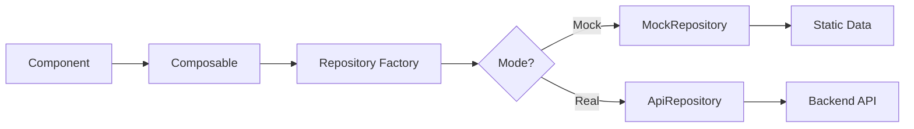

# ダッシュボード API 統合

## 概要

ダッシュボード機能は **Repository パターン**を採用し、データソースの切り替えを透過的に行います。これにより、開発環境でのモックデータと本番環境での実APIを同一のインターフェースで扱えます。

## アーキテクチャ

### Repository パターン

```
modules/dashboard/repositories/
├── DashboardRepository.ts      # インターフェース定義
├── DashboardMockRepository.ts  # モック実装
├── DashboardApiRepository.ts   # 実API実装
└── index.ts                    # Factory & Export
```

### データフロー



## Repository インターフェース

### 基本構造

```typescript
export interface DashboardRepository {
  // 統計データ取得
  getStats(params?: DashboardStatsParams): Promise<DashboardStats[]>
  
  // アクティビティ取得
  getRecentActivities(params?: RecentActivitiesParams): Promise<Activity[]>
  
  // 複合データ取得
  getDashboardData(params?: DashboardRefreshParams): Promise<DashboardData>
  
  // データリフレッシュ
  refreshDashboard(params?: DashboardRefreshParams): Promise<void>
}
```

### データ型定義（業界非依存）

```typescript
// 汎用統計データ
export interface DashboardStats {
  key: string           // 識別子
  labelKey: string      // i18nキー
  icon?: string         // アイコン
  value: number         // 値
  change?: string       // 変化率
  format: 'number' | 'currency' | 'percent' | 'decimal'
}

// 汎用アクティビティ
export interface Activity {
  id: string
  type: string          // カテゴリ（テンプレートで定義）
  title: string
  subtitle?: string
  timestamp: string
  icon?: string
  metadata?: Record<string, any>  // 拡張データ
}
```

## Mock/Real 切り替え

### 環境変数による制御

```env
# .env.development
NUXT_PUBLIC_API_MODE=mock

# .env.production
NUXT_PUBLIC_API_MODE=real
```

### Factory パターン

```typescript
// composables/useDashboardRepository.ts
export function useDashboardRepository(): DashboardRepository {
  const config = useRuntimeConfig()
  const apiMode = config.public.apiMode
  
  if (apiMode === 'mock') {
    return new DashboardMockRepository()
  }
  
  return new DashboardApiRepository()
}
```

## MockRepository 実装

### 特徴
- **業界非依存**: 汎用的なサンプルデータ
- **テンプレート対応**: 外部からデータ注入可能
- **開発効率**: 即座にUIテスト可能

```typescript
export class DashboardMockRepository implements DashboardRepository {
  private mockData: DashboardData
  
  constructor(templateData?: TemplateData) {
    // テンプレートデータがあれば使用、なければデフォルト
    this.mockData = templateData?.dashboard || defaultMockData
  }
  
  async getStats(params?: DashboardStatsParams): Promise<DashboardStats[]> {
    // フィルタリング・変換ロジック
    return this.applyStatsFilters(this.mockData.stats, params)
  }
}
```

## ApiRepository 実装

### エンドポイント設計

```typescript
// RESTful API エンドポイント
GET  /api/v1/dashboard/stats
GET  /api/v1/dashboard/activities
GET  /api/v1/dashboard/data
POST /api/v1/dashboard/refresh
```

### 実装例

```typescript
export class DashboardApiRepository implements DashboardRepository {
  private api: ApiClient
  
  constructor() {
    this.api = useApi()
  }
  
  async getStats(params?: DashboardStatsParams): Promise<DashboardStats[]> {
    const response = await this.api.get('/dashboard/stats', { params })
    return response.data
  }
  
  async getRecentActivities(params?: RecentActivitiesParams): Promise<Activity[]> {
    const response = await this.api.get('/dashboard/activities', { params })
    return response.data
  }
}
```

## パラメータ設計

### 統計データパラメータ

```typescript
export interface DashboardStatsParams {
  period?: 'day' | 'week' | 'month' | 'year'
  dateFrom?: string
  dateTo?: string
  groupBy?: string[]
  metrics?: string[]    // 取得する指標を指定
  filters?: Record<string, any>
}
```

### アクティビティパラメータ

```typescript
export interface RecentActivitiesParams {
  type?: string[]       // アクティビティタイプでフィルタ
  limit?: number        // 取得件数
  offset?: number       // ページネーション
  dateFrom?: string
  dateTo?: string
  userId?: string       // 特定ユーザーのアクティビティ
}
```

## キャッシュ戦略

### Nuxt Data Caching

```typescript
// composables/useDashboardData.ts
export function useDashboardData() {
  const repository = useDashboardRepository()
  
  // Nuxtの組み込みキャッシュを活用
  const { data, refresh } = await useAsyncData(
    'dashboard:stats',
    () => repository.getStats(),
    {
      server: false,      // クライアントのみ
      lazy: true,         // 遅延ロード
      transform: (data) => transformStats(data)
    }
  )
  
  return { data, refresh }
}
```

### 更新戦略

- **定期更新**: `setInterval` で自動更新
- **イベント駆動**: WebSocket でリアルタイム更新
- **手動更新**: ユーザーアクションでリフレッシュ

## エラーハンドリング

### Repository レベル

```typescript
async getStats(params?: DashboardStatsParams): Promise<DashboardStats[]> {
  try {
    const response = await this.api.get('/dashboard/stats', { params })
    return response.data
  } catch (error) {
    // ログ記録
    console.error('Failed to fetch dashboard stats:', error)
    
    // フォールバック
    if (isDevelopment()) {
      return this.getFallbackStats()
    }
    
    throw new DashboardError('STATS_FETCH_FAILED', error)
  }
}
```

### Component レベル

```vue
<script setup lang="ts">
const { data, error, pending } = await useDashboardData()

// エラー表示
if (error.value) {
  useToast().error('ダッシュボードデータの取得に失敗しました')
}
</script>
```

## テンプレート統合

### テンプレートデータ注入

```typescript
// templates/legal-firm/dashboard.ts
export const legalFirmDashboard: TemplateData = {
  stats: [
    { key: 'cases', labelKey: 'legal.stats.cases', ... },
    { key: 'billing', labelKey: 'legal.stats.billing', ... }
  ],
  activities: [
    { type: 'case_update', title: '案件更新', ... }
  ]
}

// 使用時
const repository = new DashboardMockRepository(legalFirmDashboard)
```

## パフォーマンス最適化

### バッチリクエスト

```typescript
// 複数のデータを一度に取得
async getDashboardData(params?: DashboardRefreshParams): Promise<DashboardData> {
  const [stats, activities] = await Promise.all([
    this.getStats(params),
    this.getRecentActivities(params)
  ])
  
  return { stats, activities }
}
```

### 部分更新

```typescript
// 特定のウィジェットのみ更新
async updateWidget(widgetId: string, params: WidgetParams) {
  const data = await this.getWidgetData(widgetId, params)
  // 該当ウィジェットのみ再レンダリング
  updateWidgetState(widgetId, data)
}
```

## セキュリティ考慮事項

### 認証・認可

```typescript
export class DashboardApiRepository {
  async getStats(params?: DashboardStatsParams): Promise<DashboardStats[]> {
    // 認証トークンは自動的に付与される（useApi内で処理）
    const response = await this.api.get('/dashboard/stats', { 
      params,
      // ロールベースのフィルタリングはバックエンドで実施
    })
    return response.data
  }
}
```

### データサニタイゼーション

- XSS対策: HTMLコンテンツは必ずエスケープ
- SQLインジェクション対策: バックエンドでパラメータバインディング
- CORS設定: 信頼できるオリジンのみ許可

## まとめ

ダッシュボードのAPI統合は：

1. **業界非依存**: データ構造が汎用的
2. **Repository パターン**: Mock/Real の透過的切り替え
3. **テンプレート対応**: 業界別データの注入が可能
4. **パフォーマンス重視**: キャッシュとバッチ処理
5. **セキュア**: 認証・認可とデータ検証

これにより、どの業界でも利用可能な柔軟なダッシュボード基盤を実現しています。