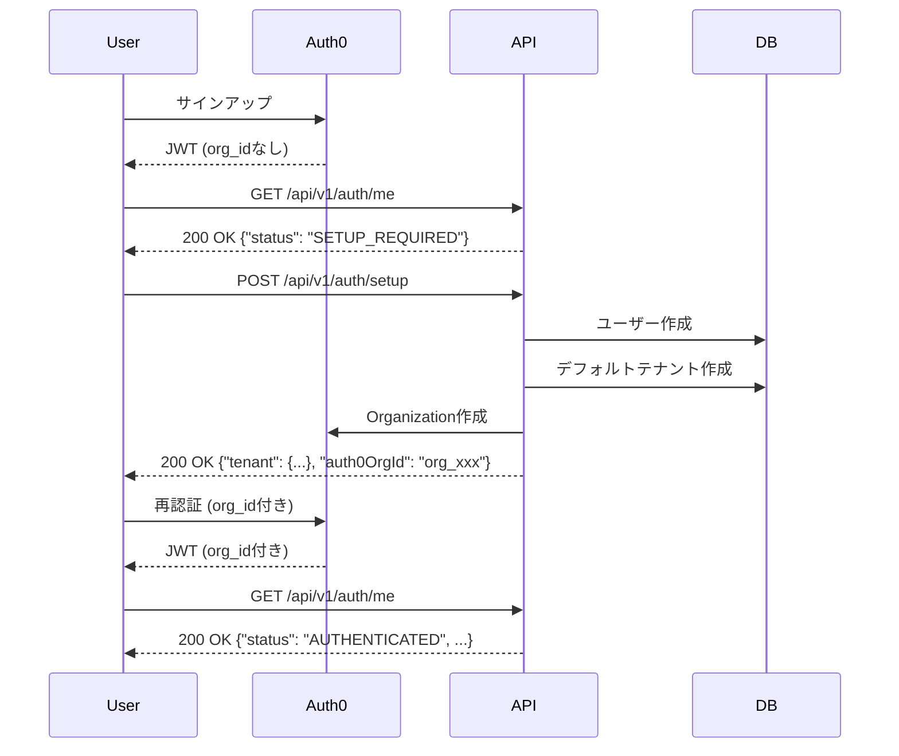
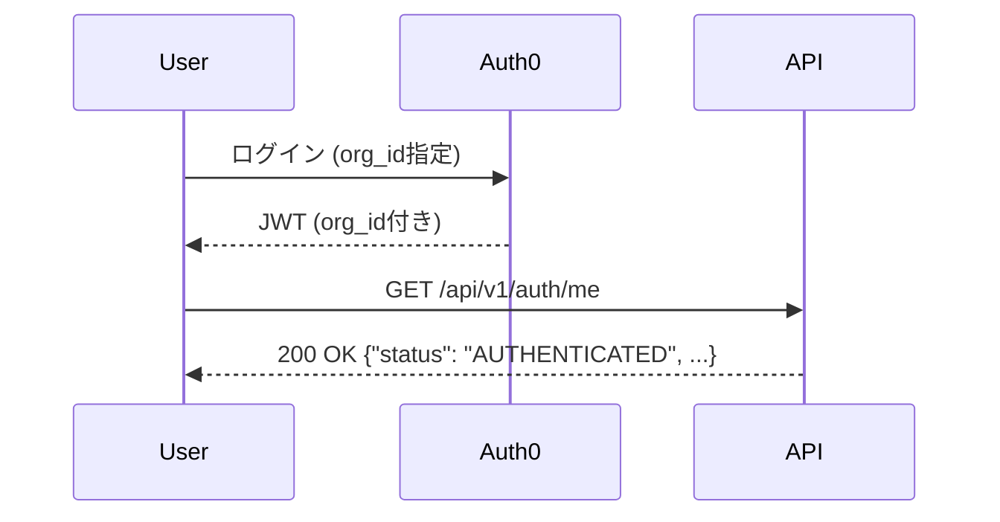

# 統一テナントモデル実装仕様書

## 1. 背景と課題

### 現在の問題点
- **新規ユーザー登録が不可能**: すべてのAPIエンドポイントでorg_id（テナントコンテキスト）が必須
- **ニワトリと卵問題**: テナントがないとログインできず、ログインできないとテナントを作成できない
- **JITプロビジョニング無効**: `UserResolverService`でJIT provisioningが明示的に無効化されている
- **セルフサービス不可**: 管理者による事前設定が必須の状態

### ビジネス要件
- **B2B SaaS対応**: 企業向けマルチテナント機能
- **B2C対応準備**: 将来的な個人ユーザー向け展開
- **セルフサービス登録**: 問い合わせ不要での利用開始
- **スムーズなアップグレード**: 個人利用からチーム利用への自然な移行

## 2. 設計方針

### 統一テナントモデル
すべてのユーザー（個人・チーム・エンタープライズ）が同じ「テナント」構造を使用する。

```kotlin
// 悪い例：タイプによる分岐
if (tenant.type == PERSONAL) { /* 特別処理 */ }

// 良い例：統一的な扱い
tenant.processRequest() // すべてのテナントで同じ
```

### 基本原則
1. **テナント必須**: すべてのユーザーはテナントに所属
2. **デフォルトテナント**: 初回登録時に自動作成
3. **差別なし**: 個人もチームも同じテナント構造
4. **プランで制御**: 機能制限は料金プランで管理

## 3. 認証フロー仕様

### 3.1 初回ユーザー登録フロー



### 3.2 既存ユーザーログインフロー



## 4. エンドポイント仕様

### 4.1 認証エンドポイント

| エンドポイント | メソッド | org_id要件 | 説明 |
|-------------|---------|-----------|------|
| `/api/v1/auth/me` | GET | オプショナル | 現在のユーザー情報取得 |
| `/api/v1/auth/setup` | POST | 不要 | 初回セットアップ |
| `/api/v1/auth/my-tenants` | GET | 不要 | 所属テナント一覧 |
| `/api/v1/auth/switch-tenant` | POST | 任意 | テナント切り替え |

### 4.2 レスポンス仕様

#### GET /api/v1/auth/me (org_idなし)
```json
{
  "status": "SETUP_REQUIRED",
  "auth0Sub": "auth0|xxx",
  "email": "user@example.com",
  "hasDefaultTenant": false
}
```

#### GET /api/v1/auth/me (org_id付き)
```json
{
  "status": "AUTHENTICATED",
  "userId": "xxx",
  "tenantId": "yyy",
  "roles": ["OWNER"],
  "currentTenant": {
    "id": "yyy",
    "name": "田中商事",
    "plan": "FREE"
  }
}
```

#### POST /api/v1/auth/setup
Request:
```json
{
  "tenantName": "田中商事",  // オプション
  "tenantSlug": "tanaka-corp" // オプション
}
```

Response:
```json
{
  "user": {
    "id": "xxx",
    "email": "user@example.com"
  },
  "tenant": {
    "id": "yyy",
    "name": "田中商事",
    "slug": "tanaka-corp",
    "auth0OrgId": "org_xxx"
  },
  "nextAction": "REAUTHENTICATE_WITH_ORG"
}
```

## 5. セキュリティ設定

### 5.1 エンドポイント別アクセス制御

```kotlin
// SecurityConfig.kt での設定
.authorizeHttpRequests { auth ->
    auth
        // org_id不要（セットアップ用）
        .requestMatchers(
            "/api/v1/auth/setup",
            "/api/v1/auth/my-tenants",
            "/api/v1/invitations/*/accept"
        ).hasValidJwtWithoutOrgId()
        
        // org_idオプショナル（状態確認）
        .requestMatchers("/api/v1/auth/me")
        .hasValidJwt()
        
        // org_id必須（業務API）
        .requestMatchers("/api/v1/**")
        .hasValidJwtWithOrgId()
}
```

## 6. 実装タスクリスト

### Phase 1: MVP実装（1週間）
- [ ] **TASK-001**: `TenantAwareJwtAuthenticationConverter`の修正
  - org_idなしJWTのサポート追加
  - `SetupModeAuthentication`クラスの作成
  
- [ ] **TASK-002**: `SecurityConfig`の修正
  - セットアップエンドポイントの許可設定
  - カスタムセキュリティ式の追加
  
- [ ] **TASK-003**: `AuthController`の修正
  - `/api/v1/auth/me`のorg_idオプショナル対応
  - レスポンスの分岐処理
  
- [ ] **TASK-004**: セットアップエンドポイントの実装
  - `/api/v1/auth/setup`の新規作成
  - デフォルトテナント作成ロジック

### Phase 2: 完全実装（1週間）
- [ ] **TASK-005**: `UserResolverService`の修正
  - JITプロビジョニングの有効化
  - セットアップモード時のユーザー作成
  
- [ ] **TASK-006**: Auth0サービスの実装
  - Organization作成API連携
  - ユーザーメタデータ更新
  
- [ ] **TASK-007**: マルチテナント機能
  - `/api/v1/auth/my-tenants`エンドポイント
  - `/api/v1/auth/switch-tenant`エンドポイント
  
- [ ] **TASK-008**: DTOクラスの作成
  - `SetupRequest`, `SetupResponse`
  - `SetupRequiredResponse`
  - `TenantMembershipDto`

### Phase 3: テスト修正（3日）
- [ ] **TASK-009**: `UserOnboardingWorkflowTest`の書き直し
  - 新しい認証フローに対応
  - セットアップフローのテスト
  
- [ ] **TASK-010**: 統合テストの修正
  - `AuthControllerIntegrationTest`
  - `TenantControllerIntegrationTest`
  - `SecurityConfigTest`
  
- [ ] **TASK-011**: E2Eテストの作成
  - 完全な新規登録フロー
  - マルチテナント切り替え

## 7. データベース変更

### 必要な確認事項
```sql
-- tenantsテーブル
ALTER TABLE tenants ADD COLUMN IF NOT EXISTS created_by UUID REFERENCES users(id);
ALTER TABLE tenants ADD COLUMN IF NOT EXISTS plan_id UUID REFERENCES plans(id);

-- tenant_membershipsテーブル
-- roleカラムにOWNER, ADMIN, MEMBER, VIEWERが定義されているか確認
```

## 8. 設定ファイル変更

### application.yml
```yaml
app:
  auth:
    jit-provisioning:
      enabled: true  # false → true に変更
    setup-mode:
      enabled: true  # 新規追加
    default-tenant:
      name-pattern: "{email}'s Workspace"
      slug-pattern: "{email_local}-workspace"
```

## 9. リスク評価

### 技術的リスク
| リスク | 影響度 | 発生確率 | 対策 |
|--------|-------|---------|------|
| Auth0 API制限 | 高 | 低 | Organization作成をキューイング |
| 既存ユーザーへの影響 | 高 | 中 | フィーチャーフラグで段階的導入 |
| JWTサイズ増加 | 低 | 低 | 必要最小限のクレームのみ含める |

### ビジネスリスク
| リスク | 影響度 | 発生確率 | 対策 |
|--------|-------|---------|------|
| 無料ユーザー増加 | 中 | 高 | 使用量制限の実装 |
| 不正利用 | 中 | 低 | レート制限とモニタリング |

## 10. 成功指標

### 技術指標
- [ ] 新規ユーザー登録成功率 > 95%
- [ ] セットアップ完了率 > 90%
- [ ] API応答時間 < 200ms

### ビジネス指標
- [ ] セルフサービス登録率の向上
- [ ] サポート問い合わせの減少
- [ ] 有料プランへの転換率

## 11. ロールバック計画

万が一問題が発生した場合：
1. フィーチャーフラグで新機能を無効化
2. 従来の事前登録方式に戻す
3. Auth0 Organizationの手動作成で対応

## 12. 今後の拡張計画

### 短期（3ヶ月）
- 招待機能の実装
- チーム管理機能
- 料金プラン選択UI

### 中期（6ヶ月）
- SSO対応
- カスタムドメイン
- API公開

### 長期（1年）
- B2C完全対応
- モバイルアプリ
- AIアシスタント統合

---

## 付録A: 用語集

| 用語 | 説明 |
|------|------|
| テナント | ユーザーが所属する組織単位（個人・チーム問わず） |
| org_id | Auth0のOrganization ID、JWT内でテナントを識別 |
| SetupMode | org_idなしでの限定的な認証状態 |
| JITプロビジョニング | Just-In-Time、初回ログイン時の自動ユーザー作成 |
| デフォルトテナント | ユーザー登録時に自動作成される最初のテナント |

## 付録B: 参考資料

- [Auth0 Organizations Documentation](https://auth0.com/docs/organizations)
- [Spring Security JWT Guide](https://spring.io/guides/topicals/spring-security-architecture/)
- [Multi-tenancy Best Practices](https://docs.microsoft.com/en-us/azure/architecture/guide/multitenant)

---

作成日: 2024-09-04
最終更新: 2024-09-04
バージョン: 1.0.0